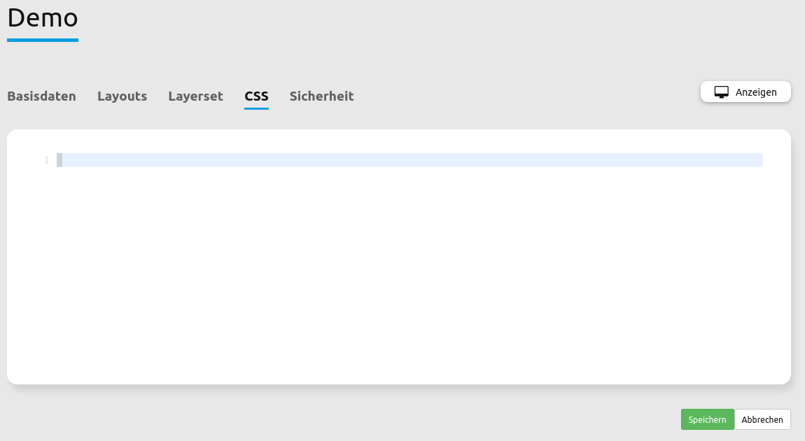

.. _css_de:

CSS-Editor
##########

Mapbender verfügt über einen CSS-Editor zur Anpassung des Stils (Farben, Größen, Icons, ...) einer Anwendung. Über den Editor können CSS-Klassen mit einem alternativen Style versehen werden, welche die Standardklassen überschreiben.

Der CSS-Editor befindet sich in der Applikation im Reiter **CSS**.

.. tip:: Mithilfe von Browser-Entwicklerwerkzeugen ist es möglich, Elemente zu identifizieren, ihre Klassen in den CSS-Editor zu kopieren und dort anzupassen.

Anwendungsbeispiel
==================

Der CSS-Editor ist unter anderem auch zur Funktionserweiterung von Mapbender nützlich. Mit dem angeführten Codeblock kann in Anwendungen mit Menü ein Scrollbalken definiert werden, der auf mobilen Geräten die Bedienbarkeit erhöht.

.. code-block:: css

  // Scrollbar in Toolbox
  .dropdown-menu {
    overflow-y: auto;
    max-height: calc(100vh - 100px);
  }

Die Menü-Funktion kann im **Layouts**-Tab des Backends gefunden werden: Klicken Sie auf das Zahnradsymbol und aktivieren anschließend das Kontrollkästchen **Menü für Schaltflächen generieren**.