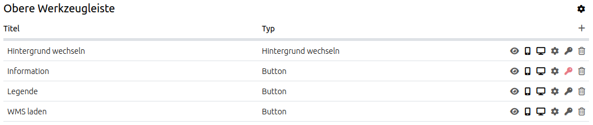

.. _layouts_de:

Layouts
#######

Im diesem Reiter werden die Regionen einer Anwendung definiert, in die Elemente bzw. Funktionen eingebaut werden können. Für unterschiedliche Template-Vorlagen gibt es unterschiedliche Regionen (auch: Bereiche oder Layouts).
Eine Übersicht über alle Elemente gibt es unter :ref:`functions_de`.

Layouts des Fullscreen Templates:

  * Obere Werkzeugleiste (Bereich für die Platzierung von Buttons)
  * Sidepane (Seitenleiste für den Ebenenbaum, Legende, Suche,...)
  * Kartenbereich (Karte, Maßstabsleiste,...)
  * Fußzeile (mit Impressum, Aktivitätsanzeige...)

Layouts des Mobilen Templates:

  * Fußzeile (Bereich für die Platzierung von Buttons)
  * Kartenbereich (Karte, Navigationswerkzeug)
  * MobilePane (Bereich, der über der Karte eingeblendet wird, wenn sich Dialoge wie Themenauswahl, Hintergrundwechsel oder Infoabfrage öffnen)

Das ``+`` -Zeichen rechts oberhalb des Bereichs ermöglicht das Hinzufügen von Elementen. Zuvor öffnet sich eine Dialogmaske, die die Auswahl eines Elements und dessen anschließende Konfiguration ermöglicht.

Alle eingebauten Funktionen lassen sich per Drag & Drop zwischen den Regionen verschieben.

Mit der Ausnahme des Kartenbereichs und der MobilePane lassen sich alle Regionen über das Einstellungsrad in der oberen rechten Ecke individuell konfigurieren. Detaillierte Informationen zu den Templates sind unter :ref:`mapbender_templates_de` zusammengefasst.

Konfigurationsmöglichkeiten der Oberen Werkzeugleiste und Fußzeile
******************************************************************
Die Obere Werkzeugleiste und die Fußzeile bieten folgende Konfigurationsmöglichkeiten über das Einstellungsrad an:

  * Bildschirmtyp (Alle, Mobil, Desktop)
  * Ausrichtung (Links, Rechts, Zentriert. Standard: Links)
  * Checkbox ``Schaltflächen zu Menü zusammenfassen``
  * ``Menütitel``-Textfeld

Bei der Auswahl eines **Bildschirmtyps** wird der Bereich für andere Gerätearten ausgeblendet.

.. note:: Die Auswahl eines Bildschirmtyps ist im Mapbender Mobile Template nicht möglich.

Die **Ausrichtung** bestimmt über die Positionierung der Elemente innerhalb der Bereiche.

Mithilfe der **Checkbox** kann ein Ausklappmenü konfiguriert werden, welches die in den Bereich eingebundenen Elemente umfasst.

Über das **Textfeld** ist es außerdem möglich, dem Ausklappmenü eine Beschriftung zuzuweisen.

.. tip:: **Hinweis**: Das Ausklappmenü ist besonders sinnvoll, wenn die Anwendung für mobile Endgeräte ausgerichtet sein soll. Unter :ref:`CSS_de` findet sich ein Codebaustein, der dem Menü einen Scrollbalken hinzufügt und somit die Bedienbarkeit bei Anwendungen mit vielen Elementen erhöht. 

Sidepane-Konfigurationsmöglichkeiten
************************************
Das Fullscreen Template bietet eine vielseitig konfigurierbare Sidepane an.
Die Ansichtsoptionen für die Sidepane können im Sidepane-Bereich im Mapbender-Backend ausgewählt werden. Dazu genügt ein Klick auf das Einstellungsrad.
Im Anschluss können folgende Optionen konfiguriert werden:

  * Typ
  * Bildschirmtyp
  * Breite (in Pixeln)
  * Position
  * Checkbox ``Geschlossen starten``

.. image:: ../../../figures/de/sidepane_backend.png
     :width: 100%

Die Option **Typ** zeigt die Sidepane-Elemente in unterschiedlichen Ansichten an:

  - ``Akkordeon`` zeigt alle hinzugefügten Elemente in Reitern.

  - ``Buttons`` zeigt alle hinzugefügten Elemente über Buttons.

  - ``Unformatiert`` verzichtet auf Styling-Optionen und zeigt die Elemente direkt und in der im Backend gewählten Reihenfolge untereinander an.

Der **Bildschirmtyp** legt fest, für welche Geräteart (Alle, Mobil oder Desktop) die Sidepane angezeigt werden soll.

Über die **Breite** kann ein Pixelwert definiert werden, der die Breite der Sidepane in der Anwendung verändert.

Die **Position** gibt an, ob die Sidepane am linken oder rechten Bildschirmrand angezeigt wird.

Die Checkbox ``Geschlossen starten`` hält nach Aktivierung die Sidepane bei Anwendungsstart eingeklappt. Sie ist über einen Button in der Anwendung nachträglich aus- & erneut einklappbar.

Element-Buttonleiste
********************
Die Buttonleiste dient der Konfiguration eines Elements. Die Buttons liefern folgende Optionen:

  * aktiv/inaktiv
  * Auf Mobilgeräten anzeigen
  * Auf großen Bildschrimen anzeigen
  * Bearbeiten
  * :ref:`acl_de` Element
  * Löschen

Element aktiv/inaktiv schalten
==============================
Über den Auge-Button kann der Status eines Elements zwischen aktiv und inaktiv geschaltet werden. Ein aktives Element ist im Frontend sichtbar. Ein inaktives Element ist im Frontend nicht sichtbar, es lässt sich jedoch im Backend weiterhin konfigurieren.

Wenn ein oder mehrere Elemente nur für einen bestimmten Bildschirmtyp angezeigt oder ausgeblendet werden soll, nutzen Sie stattdessen die Funktionen des Responsiven Designs.

Responsives Design
==================
Mapbender bietet ein responsives Webdesign zur besseren Übersichtlichkeit an. Elemente können für unterschiedliche Ansichten individuell konfiguriert werden (Mobile Endgeräte, große Bildschirme oder beides).

.. image:: ../../../figures/de/responsive_design_overview.png
     :width: 100%

Alternativ kann das Design auch für ganze Bereiche über die Option **Bildschirmtyp** definiert werden. 

Bearbeiten
==========
Öffnet die individuelle Konfigurationsmaske eines Elements. Diese finden Sie in der Dokumentation des jeweiligen Elements unter :ref:`functions_de`.

Acl Element
===========
Öffnet einen ``Element sichern``-Dialog, der ein explizites Konfigurieren der :ref:`acl_de` Regel ``View`` für Benutzer und Gruppen ermöglicht.

Ein gewähltes Element lässt sich auf diese Weise explizit sichtbar bzw. nicht sichtbar schalten. Standardmäßig ist die elementspezifische Acl-Konfiguration deaktiviert (grauer Schlüssel-Button), sodass pro Element keine berechtigungsabhängigen Einschränkungen gelten.

  #. Wählen Sie den Schlüssel-Button zu dem Element, das nur ausgewählten Benutzern/Gruppen zur Verfügung stehen soll.

  #. Fügen Sie Benutzer oder Gruppen über den ``+``-Button hinzu. Setzen Sie anschließend die view-Berechtigung. Das Element wird so innerhalb der Anwendung abgesichert und nur den gewählten Benutzer(n)/Gruppe(n) zugänglich.

.. image:: ../../../figures/de/fom/acl_secure_element.png
     :width: 100%

Der Schlüssel wird nach erfolgreicher Rechtevergabe rot. Wenn Sie nun den Cursor über den Schlüssel halten, sehen Sie die Namen der berechtigten Nutzer in einem Pop-Up Fenster.

Detaillierte Informationen zu den Sicherheitseinstellungen finden sich unter :ref:`security_de`.

Löschen
==========
Löscht das Element mitsamt der konfigurierten Einstellung aus Front- und Backend. Der Löschvorgang muss im Anschluss bestätigt werden.