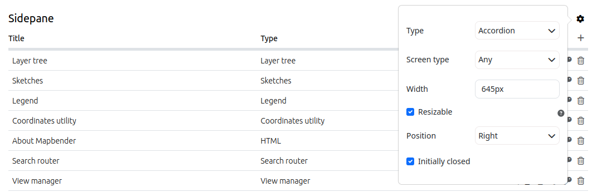
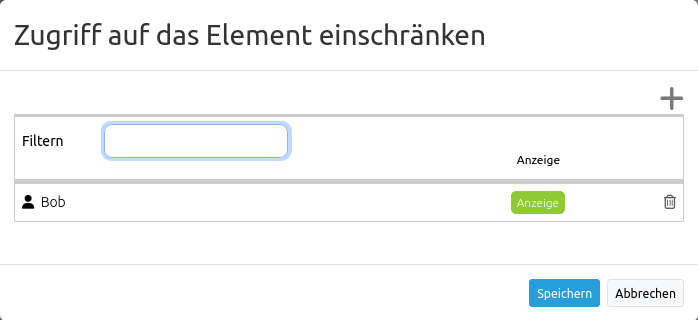

.. _layouts_de:
  
Layouts
#######

 .. |mapbender-button-add| image:: ../../../figures/mapbender_button_add.png

 .. |mapbender-button-edit| image:: ../../../figures/mapbender_button_edit.png

 .. |mapbender-button-key| image:: ../../../figures/mapbender_button_key.png

Im Layouts-Bereich des :ref:`backend_de` einer Anwendung werden die jeweiligen Frontend-Regionen der Anwendung und die in ihnen enthaltenen Elemente aufgelistet.
Eine Übersicht über alle Elemente gibt es unter :ref:`elements_de`.

.. note:: Unterschiedliche Templates können durch unterschiedliche Regionen strukturiert sein.

Layout des Fullscreen Templates:

* Obere Werkzeugleiste (Region für die Platzierung von Buttons, Links, HTML, ...)
* Sidepane (Seitenleisten-Region für den Ebenenbaum, die Legende, die Suche, den Druck, HTML, ...)
* Kartenbereich (Region für die Karte, die Maßstabsleiste, ...)
* Fußzeile (Region für das Impressum, die Aktivitätsanzeige, die Maßstabsauswahl, ...)

Layout des Mobilen Templates:

* Fußzeile (Region für das Copyright, die Aktivitätsanzeige, die Maßstabsauswahl, ...)
* Kartenbereich (Region für die Karte, die Maßstabsleiste, ...)
* MobilePane (Region für Dialoge wie den Ebenenbaum, die Legende, den Hintergrundwechsler, die Infoabfrage, ...)

Der |mapbender-button-add| Button rechts oberhalb des Bereichs ermöglicht das Hinzufügen von Elementen. Nach dem Klick auf den Button öffnet sich eine Dialogmaske, die die Auswahl eines Elements und dessen anschließende Konfiguration ermöglicht.

Alle eingebauten Funktionen lassen sich per Drag & Drop zwischen den Regionen verschieben.

Die Regionen können über den |mapbender-button-edit| Button in der oberen rechten Ecke individuell konfiguriert werden.

Die unterschiedlichen Regionen bieten folgende Konfigurationsmöglichkeiten:

Konfigurationsmöglichkeiten der Oberen Werkzeugleiste und Fußzeile
******************************************************************
Die Regionen der Oberen Werkzeugleiste und der Fußzeile bieten folgende Konfigurationsmöglichkeiten über den |mapbender-button-edit| Button an:

* **Bildschirmtyp** (Alle, Mobil, Desktop. Standard: Alle) Bei dieser Option wird der Bereich für die nicht ausgewählte Geräteart ausgeblendet. *Alle* zeigt die Region auf allen Geräten an.
* **Ausrichtung** (Links, Rechts, Zentriert. Standard: Rechts.): Die Ausrichtung definiert die Positionierung der Elemente innerhalb der Bereiche.
* **Checkbox Schaltflächen zu Menü zusammenfassen**: Konfiguriert ein Ausklappmenü, welches die in den Bereich eingebundenen Elemente umfasst.
* **Menütitel-Textfeld**: Mit dieser Textbox lässt sich dem Ausklappmenü eine Beschriftung zuweisen.

.. tip:: **Hinweis**: Das Ausklappmenü ist besonders sinnvoll, wenn die Anwendung für mobile Endgeräte ausgerichtet sein soll. Unter :ref:`CSS_de` findet sich ein Codebaustein, der die Bedienbarkeit bei Anwendungen mit vielen Elementen erhöht. 

YAML-Konfiguration
==================
Diese Vorlage kann zur **Eigenschaftenkonfiguration** der Oberen Werkzeugleiste in einer YAML-Anwendung verwendet werden:

.. code-block:: yaml

    - name: toolbar
      properties:
        item_alignment: right  # right/left/center
        screenType: all         # desktop/mobile/all
        generate_button_menu: false # true/false
        menu_label: "Menu" # NULL or text

Außerdem kann diese Vorlage verwendet werden, um eine **Eigenschaftenkonfiguration** für die Fußzeile einer YAML-Anwendung vorzunehmen:

.. code-block:: yaml

    - name: footer
      properties:
        item_alignment: right # right/left/center
        screenType: all # all/desktop/mobile
        generate_button_menu: false # true/false
        menu_label: "Menu" # NULL or text

Sidepane-Konfigurationsmöglichkeiten
************************************
Die Ansichtsoptionen für die Sidepane können im Sidepane-Bereich im Mapbender-:ref:`backend_de` ausgewählt werden. Dazu genügt ein Klick auf den |mapbender-button-edit| Button:

* **Typ**: Siehe Funktionsbeschreibung unten.
* **Bildschirmtyp** (Alle, Mobil, Desktop. Standard: Alle) Bei dieser Option wird der Bereich für die nicht ausgewählte Geräteart ausgeblendet. *Alle* zeigt die Region auf allen Geräten an.
* **Breite** (in Pixeln, Standard: 350 px) Definiert über einen Pixelwert die Breite der Sidepane in der Anwendung.
* **Größe veränderbar** (Standard: true): Erlaubt das Verbreitern und Verkleinern der Seitenleiste.
* **Position** (Links, Rechts. Standard: Links) gibt an, ob die Sidepane am linken oder rechten Bildschirmrand angezeigt wird.
* **Geschlossen starten** (Standard: deaktiviert) hält nach Aktivierung die Sidepane bei Anwendungsstart eingeklappt. Sie ist über einen Button in der Anwendung nachträglich aus- & wieder einklappbar.

Die Option **Typ** zeigt die Sidepane-Elemente in unterschiedlichen Ansichten an:

- ``Akkordeon`` zeigt alle hinzugefügten Elemente in Reitern.
- ``Buttons`` zeigt alle hinzugefügten Elemente über Buttons.
- ``Unformatiert`` verzichtet auf Styling-Optionen und zeigt die Elemente direkt und in der im :ref:`backend_de` gewählten Reihenfolge untereinander an.

Die Option **Größe verändern** geht von einer minimalen Breite von 120 px und einem Maximum von 95 % der Bildschirmbreite aus. Diese Werte können über CSS angepasst werden:

.. code-block:: css
   
    .sidePane.resizable {
      min-width: 200px;
      max-width: 500px;
    }

YAML-Konfiguration
==================
Diese Vorlage kann zur **Eigenschaftenkonfiguration** der Sidepane in einer YAML-Anwendung verwendet werden:

.. code-block:: yaml

    - name: sidepane
      properties:
        name: accordion # tabs (für Button) / accordion (für Akkordeon) / NULL (für unformatiert)
        align: right # right/left
        closed: false # true/false
        screenType: all # all/desktop/mobile
        width: "654px"

Element-Buttonleiste
********************
Jedem Element kann ein konfigurierter Button zugewiesen werden. Die Buttonleiste dient der Konfiguration dieser Buttons.
Dabei verfügen die Buttons über folgende Optionen:

.. image:: ../../../figures/mapbender_layouts_button_area.png
    :alt: Buttonleiste der Elemente

* **aktiv/inaktiv**: Ein aktives Element ist in der Anwendung freigeschaltet. Ein inaktives Element kann zwar bearbeitet werden, ist aber in der Anwendung ausgeblendet.
* **Auf Mobilgeräten anzeigen**: Zeigt Elemente nur auf mobilen Geräten an.
* **Auf großen Bildschrimen anzeigen**: Zeigt Elemente nur auf Desktop-Geräten an.
* **Bearbeiten**: Erlaubt die Anpassung des Elements.
* **Zugriff auf das Element einschränken**: Erlaubt die Konfiguration von Element-Sichtbarkeiten bei bestimmten Berechtigungen.
* **Löschen**: Entfernt ein Element vom Back- und Frontend.

Bearbeiten
==========
Öffnet über den |mapbender-button-edit| Button die individuelle Konfigurationsmaske eines Elements. Diese finden Sie in der Dokumentation des jeweiligen Elements unter :ref:`elements_de`.

Zugriff auf das Element einschränken
====================================
Öffnet über den |mapbender-button-key| Button einen **Element sichern**-Dialog, der ein explizites Konfigurieren der :ref:`fom_de` Regel **View** für Benutzer und Gruppen ermöglicht.

Ist dies nicht konfiguriert, hat das Element keine expliziten Zugangsbeschränkungen und sollte allen Benutzern und Gruppen zur Verfügung stehen.

Sofern die **View**-Regel für bestimmte Benutzer oder Gruppen gesetzt ist, können ausschließlich dort Eingetragene auf das Element zugreifen.

Beschränken Sie den Zugriff, indem Sie Benutzer über den |mapbender-button-add| Button hinzufügen. Eine gesetzte Checkbox zeigt an, dass die benötigten Berechtigungen zur Verfügung stehen.

Der Schlüssel wird nach erfolgreicher Rechtevergabe rot. Wenn Sie nun den Cursor über den Schlüssel halten, sehen Sie die Namen der berechtigten Nutzer in einem Pop-Up Fenster.

.. image:: ../../../figures/fom/element_security_key_popup.png
     :width: 75%

Detaillierte Informationen zu den Sicherheitseinstellungen finden sich unter :ref:`fom_de`.

Löschen
=======
Löscht das Element mitsamt der konfigurierten Einstellungen aus Front- und Backend.
