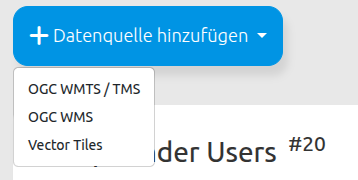
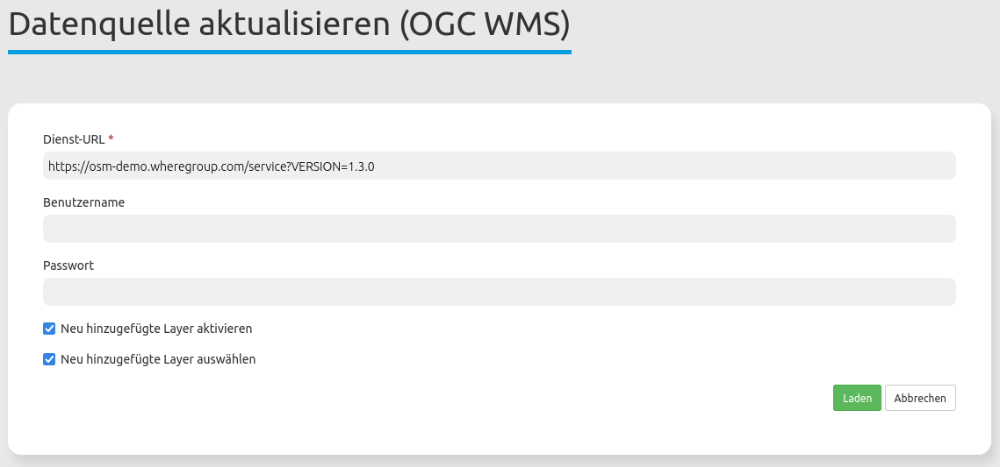
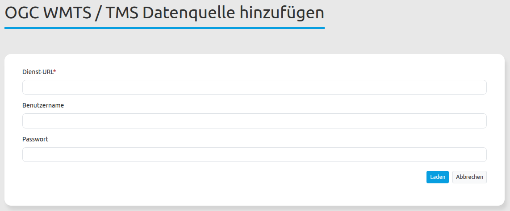
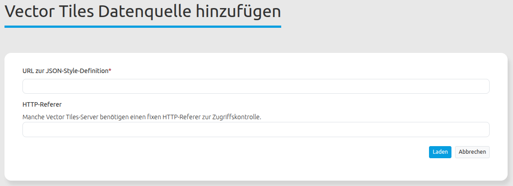

.. _sources_de:

Datenquellen (Sources)
======================

Über den Backend-Menübereich können folgende Datenquellen registriert werden:

* **OGC WMS**: Web Map Service
* **OGC WMTS/TMS**: Web Map Tile Service / Tile Map Service
* **Vector Tiles**

Informationen zum Einbinden von Diensten und die Nutzung in Anwendungen finden Sie im Schnellstart-Kapitel :ref:`de/quickstart:Laden von Datenquellen`.

Datenquelle laden
-----------------

.. tip:: **Hinweis**: Es ist wichtig, dass die Datenquelle vor dem Hochladen auf ihre Richtigkeit überprüft wird. Dies erfolgt über den Aufruf des getCapabilities-Requests im Browser.

Um einen Dienst zu laden, drücken Sie auf |mapbender-button-add| **Datenquelle hinzufügen** und wählen Sie einen Datenquellen-Typ aus.

  .. |mapbender-button-add| image:: ../../figures/mapbender_button_add.png

    
Im Konfigurationsbereich können ja nach Auswahl der Datenquelle Parametern gesetzt werden:

* **Dienst-URL**: URL zum Capabilities-Dokument des Dienstes (z. B. für `OGC WMS Version 1.3.0 <https://osm-demo.wheregroup.com/service?SERVICE=WMS&Version=1.3.0&REQUEST=GetCapabilities>`_)

* **Benutzername / Passwort**: Eingabe von Benutzername und Passwort bei gesicherten Diensten.

  .. image:: ../../figures/de/mapbender_add_source.png
     :width: 100%

Mit einem Klick auf ``Laden`` wird der Dienst registriert.

Nach einer erfolgreichen Dienstregistrierung zeigt Mapbender Informationen zum Dienst in einem Übersichtsfenster an.

Datenquellen-Übersicht
----------------------

Die Bereiche Datenquellen und Freie Instanzen geben eine Übersicht der registrierten Dienste

  .. image:: ../../figures/de/mapbender_sources.png
     :width: 100%

* **Filter**: Filtert die Dienste nach kontextspezifischer Eingabe, berücksichtigt Name, URL, Typ und Beschreibung.
* **Metadaten anzeigen**: Zeigt die Metadaten eines ausgewählten Dienstes an. Öffnet einen neuen Bereich, der in mehreren Reitern Metadaten, Mapbender-Anwendungen mit Zugriff, Kontaktinformationen, Details (z.B. Version) und die Layer des Dienstes ausgibt.
* **Datenquelle aktualisieren**: Aktualisiert die Dienst-Informationen durch erneutes Laden des getCapabilities-Dokuments.
* **Datenquelle entfernen**: Entfernt den Dienst aus Mapbender.

Datenquellen-Information
------------------------

Die Datenquellen-Information gibt Informationen zum Dienst aus.

  .. image:: ../../figures/de/source_overview.png
     :width: 100%

Die folgenden Angaben wurden aus der Dienstbeschreibung ausgelesen:

* Metadaten
* Kontakt
* Detail
* Layers

Unter dem **Anwendungen** findet sich eine Übersicht, in welchen Anwendungen der Dienst eingebunden wurde.

Datenquellen-Kontextmenü
------------------------

Im Metadatendialog eines Dienstes befindet sich ein Kontextmenü. 

  .. image:: ../../figures/de/source_overview.png
     :width: 100%

Es ermöglicht folgende Funktionen:

* **Datenquelle aktualisieren**: Aktualisiert die Dienst-Informationen durch erneutes Laden des getCapabilities-Dokuments.
* **Freie Instanz erzeugen**: Erzeugt eine freie Instanz aus der Datenquelle. Diese wird im Bereich "Freie Instanzen" angezeigt. 
* **Löschen**: Entfernt die freie Instanz aus Mapbender.

Datenquellen aktualisieren
--------------------------
  .. |mapbender-button-update| image:: ../../figures/mapbender_button_update.png

Die Aktualisierung einer Datenquelle erfolgt zunächst über den Aufruf der Seite ``Datenquellen`` im Backend.
Wählen Sie aus der Liste die zu aktualisierende Datenquelle aus. Es ist möglich, die Liste anhand des Suchfelds nach Diensten zu filtern.
Klicken Sie anschließend neben der gewünschten Datenquelle auf den |mapbender-button-update| **Datenquelle aktualisieren**-Button.
Dadurch öffnet sich die Aktualisierungsmaske. Hier können Sie auch die URL oder Benutzername / Passwort des Dienstes anpassen.

.. hint:: Datenquellen lassen sich auch aktualisieren, ohne dass Änderungen vorgenommen wurden. Das Capabilities-Dokument wird neu eingelesen.

Zusätzlich bietet die Maske zwei Checkboxen an:

* **Neu hinzugefügte Layer aktivieren**: Ist der Haken an dieser Checkbox gesetzt, sind durch die Aktualisierung neu geladene Dienst-Layer automatisch in Anwendungen aktiv. Ist der Haken nicht gesetzt, erscheinen neue Layer nicht im Ebenenbaum.
* **Neu hinzugefügte Layer auswählen**: Ist der Haken an dieser Checkbox gesetzt, werden durch die Aktualisierung neu geladene Dienst-Layer automatisch in Anwendungen sichtbar und sind aktiv. Dazu muss allerdings auch ``Neu hinzugefügte Layer aktivieren`` gesetzt sein. Ist ``Neu hinzugefügte Layer auswählen`` nicht gesetzt, erscheint der Layer zwar im Ebenenbaum, ist aber nicht aktiviert.

Falls die Änderungen vorgenommen werden sollen, klicken Sie auf den ``Laden``-Button, um die Datenquelle zu aktualisieren. Dabei wird das getCapabilities-Dokument neu ausgelesen. Die aktualisierte Version wird anschließend in den Konfigurationseinstellungen angezeigt und Änderungen werden in Anwendungen, in denen der Dienst verwendet wird, angewandt.

Datenquellen Typen
==================

WMS
---

  * **type**: muss wms sein
  * **title**: Der Titel der Quelle, wie er im Ebenenbaum angezeigt wird
  * **version**: WMS-Version (Standard: 1.1.1)
  * **url**: URL zum GetCapabilities-XML des Dienstes
  * **format**: Mime-Typ für das angeforderte Bildformat (Standard: image/png)
  * **info_format**: Mime-Typ für das Feature-Info-Format (Standard: text/html)
  * **proxy**: Bool-Wert, ob der Dienst über einen Proxy geleitet werden soll (Standard: false)
  * **tiled**: Bool-Wert, ob die WMS-Daten als Kacheln angefordert werden sollen (Standard: false)
  * **layerorder**: "standard" oder "reverse" (letzteres wird hauptsächlich für QGIS Server verwendet). (Standard: Parameter wms.default_layer_order, der wiederum auf "standard" zurückfällt)
  * **isBaseSource**: Bool-Wert, ob die Quelle als Basisquelle behandelt werden soll
  * **transparent**: Bool-Wert, ob das TRANSPARENT-Flag gesetzt werden soll (Standard: true)
  * **opacity**: int 0 (vollständig transparent)-100 (vollständig undurchsichtig) (Standard: 100)
  * **visible**: Anfangszustand der Wurzelebene. (Standard: true)
  * **toggle**: Anfangszustand des Wurzelordners im Ebenenbaum (Standard: true = Ordner ist erweitert)
  * **allowToggle**: Kann der Benutzer den Wurzelordner ein-/ausklappen? (Standard: true)
  * **minScale**: Mindestmaßstab (1:x), bei dem die Wurzelebene angezeigt wird (Standard: nicht gesetzt)
  * **maxScale**: Höchstmaßstab (1:x), bei dem die Wurzelebene angezeigt wird (Standard: nicht gesetzt)
  * **legendurl**: URL für die Legende der Wurzelebene
  * **layers**: Optionales Objekt zur Anpassung einzelner Sublayer. Der Schlüssel ist beliebig, sollte aber eindeutig sein. Der Wert ist ein Objekt mit den folgenden Einstellungen:
    * **name**: Der Name des Layers, wie im <Name>-Tag des Layers im GetCapabilities-XML
    * **title**: Der Titel des Layers, wie er im Ebenenbaum angezeigt wird
    * **visible**: Anfangszustand des Layers. (Standard: true)
    * **toggle**: Anfangszustand des Ordners im Ebenenbaum (Standard: false = Ordner ist eingeklappt)
    * **allowToggle**: Kann der Benutzer den Ordner ein-/ausklappen? (Standard: true)
    * **minScale**: Mindestmaßstab (1:x), bei dem dieser Layer angezeigt wird (Standard: nicht gesetzt)
    * **maxScale**: Höchstmaßstab (1:x), bei dem dieser Layer angezeigt wird (Standard: nicht gesetzt)
    * **legendurl**: URL für die Legende dieses Layers
    * **layers**: Sublayer, Array mit derselben Struktur wie die Layer auf der obersten Ebene

WMTS/TMS
--------

Der Web Map Tile Service (WMTS) ist ein Standard-Geodienst, der die Bereitstellung und den Abruf digitaler Karten in Form von Kacheln ermöglicht.Tile Map Service (TMS) ist eine Spezifikation für gekachelte Webkarten, die eine einfache, REST-ähnliche URL-Struktur zur Bereitstellung von Kartendaten verwendet. TMS schließt die Lücke zwischen dem einfachen OpenStreetMap-Standard und dem komplexen Web Map Service, indem es leicht zugängliche Kachel-URLs und die Unterstützung verschiedener Koordinatenreferenzsysteme bietet.

Laden einer WMTS/TMS Quelle
+++++++++++++++++++++++++++

* **Dienst-URL**: URL zum Capabilities-Dokument des Dienstes (z. B. für `OpenStreetMap WMTS <https://osm-demo.wheregroup.com/wmts/1.0.0/WMTSCapabilities.xml>`_)

* **Benutzername / Passwort**: Eingabe von Benutzername und Passwort bei gesicherten Diensten.    

YAML
++++

* **type**: muss wmts oder tms sein
* **url**: URL zum GetCapabilities-XML des Dienstes. Beachten Sie, dass dieses Dokument für jede Seitenansicht heruntergeladen wird (anders als bei Datenbank-WMTS-Quellen, bei denen diese Informationen im Cache gespeichert werden)
* **title**: Der Titel der Quelle, wie er im Ebenenbaum angezeigt wird
* **basesource (alias: isBaseSource)**: Bool-Wert, ob die Quelle als Basisquelle behandelt werden soll
* **opacity**: int 0 (vollständig transparent)-100 (vollständig undurchsichtig)
* **selected (alias: visible)**: Anfangszustand der Wurzelebene. (Standard: true)
* **allowSelected**: Kann der Benutzer den Zustand der Wurzelebene im Ebenenbaum ändern? Wenn sowohl selected als auch allowSelected false sind, wird der Layer ignoriert. (Standard: true)
* **toggle**: Anfangszustand des Wurzelordners im Ebenenbaum (Standard: true = Ordner ist erweitert)
* **allowToggle**: Kann der Benutzer den Wurzelordner ein-/ausklappen? (Standard: true)
* **layers**: Optionales Objekt zur Anpassung einzelner Sublayer. Der Schlüssel sollte der Wert des <ows:Identifier>-Attributs im GetCapabilities-Dokument (für WMTS) oder der URL-Suffix des Layers für TMS sein. Beispiel: Wenn die URL des Capability-Dokuments https://osm-demo.wheregroup.com/tms/1.0.0/ ist und der href des Layers im TileMap-Tag als https://osm-demo.wheregroup.com/tms/1.0.0/osm/webmercator definiert ist, lautet der Layer-Schlüssel osm/webmercator.
* **title**: Der Titel des Layers, wie er im Ebenenbaum angezeigt wird
* **active**: Wenn false, wird der Layer ignoriert und steht in der Anwendung überhaupt nicht zur Verfügung (Standard: true)
* **selected (alias: visible)**: Anfangszustand des Layers. (Standard: true)
* **allowSelected**: Kann der Benutzer den Zustand im Ebenenbaum ändern? Wenn sowohl selected als auch allowSelected false sind, wird der Layer ignoriert, als ob active auf false gesetzt wäre. (Standard: true)

Vector Tiles
------------

Vector Tiles sind ein Format zur Übertragung von geografischen Vektordaten in Kachelform, das eine flexible und performante Darstellung interaktiver Karten direkt im Browser ermöglicht.

Laden einer Vector Tiles Quelle
+++++++++++++++++++++++++++++++

* **URL zur JSON-Style-Definition**: URL zur Mapbox Style Spec JSON-Datei (z. B. `bm_web_col <https://sgx.geodatenzentrum.de/gdz_basemapde_vektor/styles/bm_web_col.json>`_)

* **HTTP-Referer**: Einige Dienste erfordern einen bestimmten HTTP-Referer-Header, um Anfragen zu akzeptieren. Geben Sie hier die entsprechende URL ein, wenn der Dienst dies verlangt.

YAML
++++  

* **type**: muss vector_tiles sein
* **title**: Der Titel der Quelle, wie er im Ebenenbaum angezeigt wird
* **jsonUrl**: URL zur Mapbox Style Spec JSON-Datei
* **basesource (alias: isBaseSource)**: Bool-Wert, ob die Quelle als Basisquelle behandelt werden soll
* **opacity**: int 0 (vollständig transparent)-100 (vollständig undurchsichtig) (Standard: 100)
* **selected (alias: visible)**: Anfangszustand des Layers. (Standard: true)
* **allowSelected**: Kann der Benutzer den ausgewählten Zustand ändern? (Standard: true)
* **toggle**: Anfangszustand des Wurzelordners im Ebenenbaum (Standard: true = Ordner ist erweitert)
* **allowToggle**: Kann der Benutzer den Wurzelordner ein-/ausklappen? (Standard: true)
* **minScale**: Mindestmaßstab (1:x), bei dem die Quelle angezeigt wird (Standard: nicht gesetzt)
* **maxScale**: Höchstmaßstab (1:x), bei dem die Quelle angezeigt wird (Standard: nicht gesetzt)
* **featureInfo**: Ist FeatureInfo standardmäßig aktiviert? (Standard: true)
* **featureInfoAllowToggle**: Kann der Benutzer den FeatureInfo-Zustand umschalten? (Standard: true)
* **featureInfoPropertyMap**: Wenn nicht leer, werden nur die angegebenen Eigenschaften in der FeatureInfo angezeigt. Als YAML-Array angeben. Der Schlüssel ist der Name des Feldes, der optionale Wert ist die Übersetzung. Beispiel:

  .. code-block:: yaml

     class
     name
     layer: Layer-Name

* **hideIfNoTitle**: Verstecke Features mit leerem Titel in der FeatureInfo (Standard: true)
* **featureInfoTitle**: Eigenschaft/Eigenschaften des Features, die als Titel über der Tabelle angezeigt werden. ${property} wird durch den Wert der Eigenschaft ersetzt. Wenn nicht angegeben, wird der erste nicht-leere Wert aus "label", "name" und "title" verwendet.
* **printScaleCorrection**: Auflösungskorrektur für den Druck. Standardwert ist 1.0. Höhere Werte führen zu mehr Details und kleineren Beschriftungen; niedrigere Werte zu weniger Details und größeren Beschriftungen.
* **legendEnabled (alias: legend)**: Soll eine Legende für diese Quelle angezeigt werden? (Standard: false)
* **legendPropertyMap**: Wenn nicht leer, werden nur die angegebenen Layer in der Legende angezeigt. Als YAML-Array angeben. Der Schlüssel ist die Layer-ID aus dem "layers"-Feld im Style-JSON; der optionale Wert ist die Übersetzung. Beispiel:

  .. code-block:: yaml

    Stadt
    Stationen
    Verkehr: Öffentlicher Verkehr

* **bbox**: Begrenzungsrahmen (Array xmin, ymin, xmax, ymax) für die Quelle

