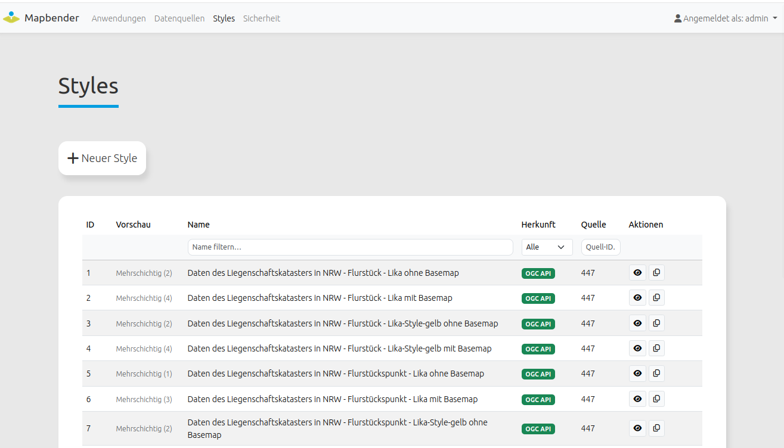
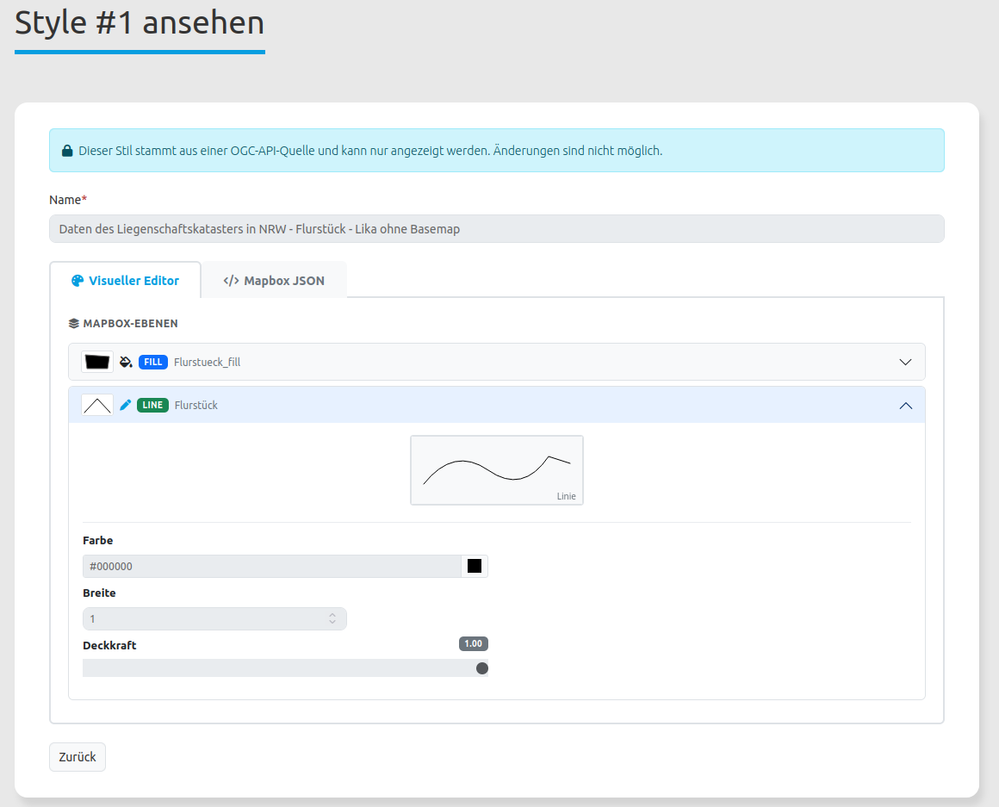
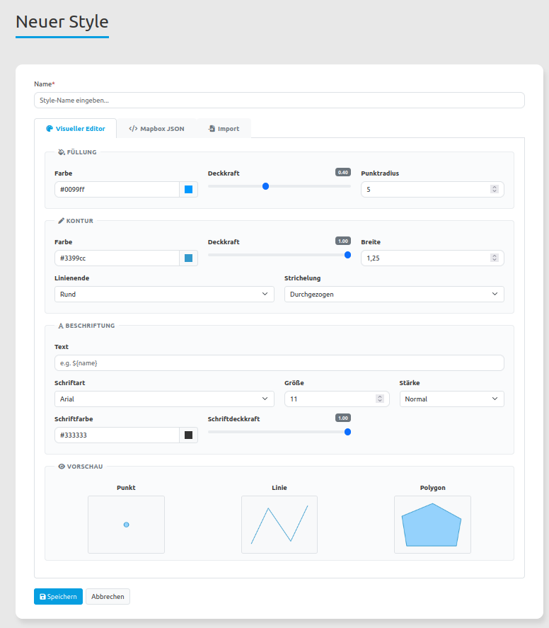
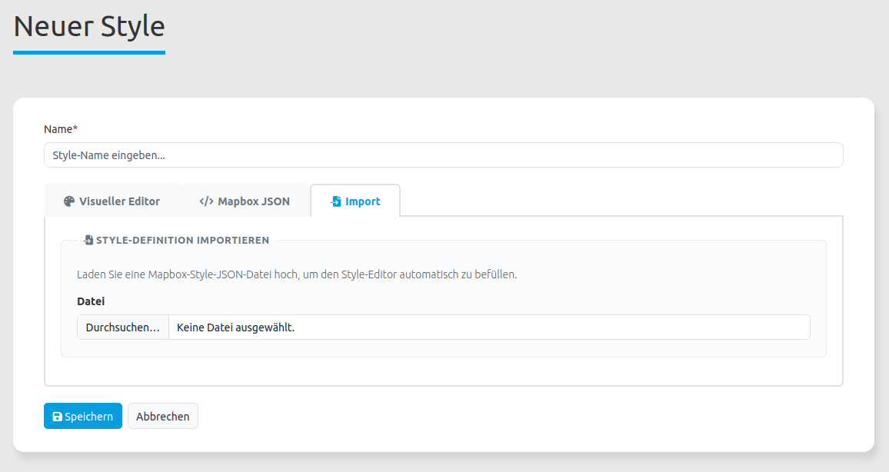

.. _styles_de:

Stile
=====

Vektor-Daten benötigen eine Stil-Definition (Style), um in einem individuellen Stil dargestellt zu werden. 

Dieser Stil muss in Mapbender registriert werden und kann dann Vektor-Datenquellen zugewiesen werden.

Sie können Stile hochladen oder auch Stile in Mapbender erzeugen. Collections von OGC API - Features Diensten können auf Stile zur Darstellung der Daten verweisen. Diese Stile werden beim Laden des Dienstes, direkt in Mapbender registriert werden.. 

Supported Styles are:

* Mapbox Style https://docs.mapbox.com/style-spec/guides/

Stile können angezeigt und kopiert werden.   
  

Stil mit dem Style-Generator erstellen
--------------------------------------

Der Style-Generator stellt Standardwerte für einen Stil bereit. Sie können diese Werte ändern. Sie können die Farbe, Opazität, Linienstil und Breite ändern. Sie können auch eine Beschriftung für den Stil definieren. Die Beschriftung kann auf ein Attribut über ${name} verweisen.

Es muss ein Name für den neuen Stil angegeben werden.
    

            
Stile laden
-----------

Es muss ein Name für den neuen Stil angegeben werden und auf die Mapbox-Style-JSON-Datei verwiesen werden.
        
.. tip:: Sie können ihren gewünschten Stil mit QGIS erzeugen und als Mapbox-Style-JSON-Datei exportieren. Anschließend kann der Stil in Mapbender geladen werden und zur Darstellung von Vektordaten verwendet werden. Das QGIS-Plugin GeoCatBridge kann für das Exportieren von Stilen verwendet werden.

    
