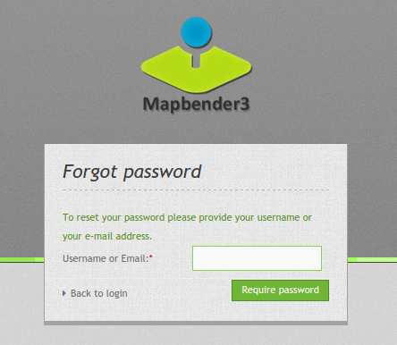
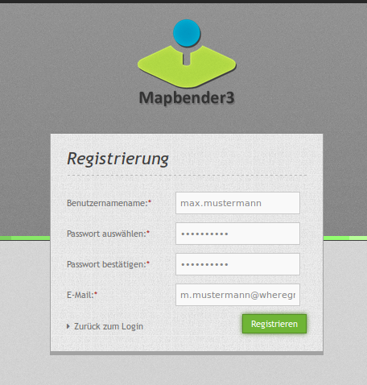
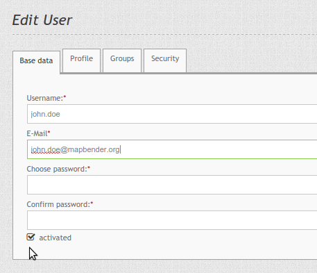

Benutzer
========

Benutzer werden als FOM\\UserBundle\\Entity\\User implementiert und im
Datenbank Repository gespeichert. Die Entität hält nur die notwendigen
Informationen über einen Nutzer vor, komplexere Benutzerdaten sollten in
Benutzerprofilen hinterlegt werden (TBD).

Das Bundle enthält alle Mittel um Benutzer durch einen Administrator zu
verwalten als auch das eigene Registrieren eines Nutzes sowie das
Zurücksetzen des eigenen Passwortes.

Der Benutzer mit der ID 1 ist besonders, da dieser Benutzer bei der
Installation erstellt wird und immer alle Rechte hat. Falls alle Stricke
reißen, können Sie mit diesem Benutzer alles verwalten. Und falls Sie gar
die Anmeldedaten vergessen haben sollten, können Sie über ein app/console
Kommando den Benutzer zurücksetzen: fom:user:resetroot.

Password vergessen
------------------

Falls ein Benutzer sein Passwort vergessen hat, kann er in der Login-Maske
über den Link "Passwort vergessen" ein neues Passwort anfordern. Dazu gibt
er dann seinen Benutzernamen oder seine E-Mail Adresse an.

Danach bekommt der Benutzer eine E-Mail mit einem Link, die zu der Seite
führt, um das Passwort zurückzusetzen. Der Link ist danach nicht mehr
gültig.

Die Funktionalität kann in der config.yml ausgeschaltet werden.

.. code-block:: yaml

                fom_user:
                    reset_password: true # true/false

Registrierung
-------------

Benutzer können sich an Mapbender3 selbst registrieren. Dafür stellt man in
der config.yml die Einstellung fom_user:selfregister auf true.

.. code-block:: yaml

                fom_user:
                    selfregister: false # true/false

Im Login-Dialog erscheint der "Register" Link. Der Benutzer wird zu einer
Maske geführt, in der er seinen Namen, sein Passwort und seine E-Mail
Adresse angeben kann.

Danach erhält er eine Bestätigungsmail, mit der er seine Anmeldung
abschließen kann. Bis zu diesen Zeitpunkt ist er als inaktiver Nutzer in
Mapbender3 hinterlegt.

Aktivieren von Nutzern
----------------------

Seit Mapbender 3.0.5.3. Benutzer können von Administratoren mit mindestens
der ACL-Rolle "operator" aktiviert oder deaktiviert werden. Dazu dient der
Schalter im Edit User Dialog.

Ein Benutzer mit Administrationsrechten kann sich selbst nicht aktivieren
oder deaktivieren.

Ein Benutzer, der deaktiviert ist, kann sich nicht mehr am Mapbender3
anmelden, bis er wieder aktiviert wird.
           
.. image:: ../../../../en/bundles/FOM/UserBundle/user_account_is_disabled.png
           
Benutzer, die sich selbst registriert haben, aber die Freischaltungsmail
noch nicht bestätigt haben, können so von einem Administrator per Hand
freigeschaltet werden.

Login Fehler
------------

Fehlerhafte Logins werden mit der Meldung "Login fehlerhaft"
kommentiert. Aus Sicherheitsgründen wird nicht genannt, ob es am falschen
Loginnamen oder falschen Passwort liegt. Login Fehler schließen den Account
nicht dauerhaft aus. Vielmehr wird der Account für eine bestimmte Zeit
ausgeschlossen (gelockt).

Die config.yml ermöglicht die Anpassung des Verhaltens:

.. code-block:: yaml

   fom_user:

       # Allow to create user log table on the fly if the table doesn't exits.
       # Default: true
       auto_create_log_table: true
       
       # Time between to check login tries
       login_check_log_time: "-5 minutes" 
       
       # Login attemps before delay starts
       login_attempts_before_delay: 3
       
       # Login delay after all attemps are failed
       login_delay_after_fail: 2 # Seconds
   

* **auto_create_log_table:** Angabe zur Rückwärtskompatibilität (Default: true).
* **login_check_log_time:** Angabe zur Bereinigung der Login-Failure Tabelle (Default: -5 minutes)
* **login_attempts_before_delay:** Anzahl der Login Versuche, bevor das Login-Delay greift (Default: 3)
* **login_delay_after_fail:** Länge des Login-Delays in Sekunden (Default: 2).
