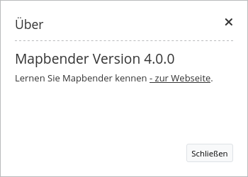
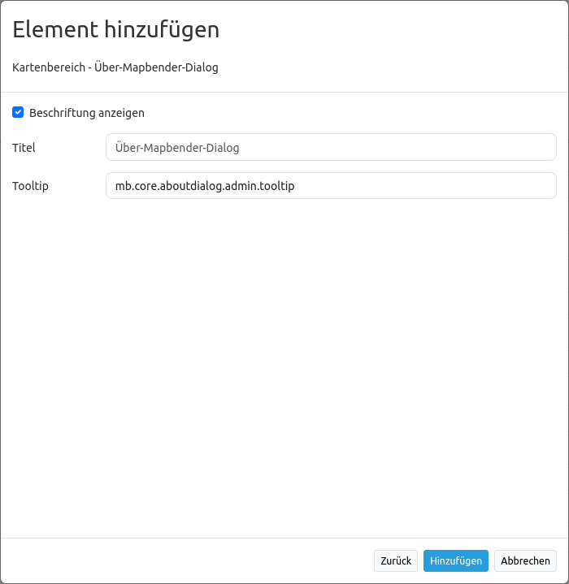

.. _about_dialog:

About Dialog (Über-Dialog)
********************************

Dieses Element rendert einen `Button <../elements/button.html>`_, der einen Dialog über Mapbender anzeigt.
Bisher wird die Mapbender Version angezeigt. Der Button befindet sich in der unteren rechten Ecke in der Fußzeile oder der oberen rechten Ecke in der Toolbar, abhängig von der Zuweisung im Layout. In Zukunft kann auch die Lizenz 
oder kundenspezifische Daten angezeigt werden.

Konfiguration
=============

* **Beschriftung anzeigen (Show label):** Schaltet Text neben dem About Dialog Button ein/aus.
* **Title:** Text, der neben dem About Dialog Button angezeigt wird.
* **Tooltip:** Text, der erscheint wenn der Mauszeiger längere Zeit über dem Button gehalten wird. 

``YAML-Definition:``

.. code-block:: yaml

   tooltip: 'Über Mapbender3'   # Text des Tooltips
   label: true                  # false/true, um den Button zu beschriften. Der Standardwert ist true.
   icon: 'abouticon'            # Symbol für den Button

Class, Widget & Style
======================

* **Class:** Mapbender\\CoreBundle\\Element\\AboutDialog
* **Widget:** mapbender.mbAboutDialog
* **Style:** mapbender.elements.css

HTTP Callbacks
==============

about
-----

Ruft Inhalte des Dialogs auf.

JavaScript API
==============

Keine.

JavaScript Signals
==================

Keine.

