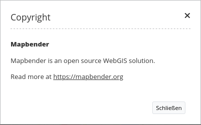

.. _copyright:

Copyright
************

Dieses Element zeigt die Nutzungsbedingungen ("Terms of use") in einem Dialog an.

Konfiguration
=============

.. image:: ../../../../../figures/de/copyright_configuration.png
     :scale: 80

* Automatisches Öffnen (Autoopen): Schaltet ein/aus, ob das Copyright Fenster beim Start der Anwendung automatisch geöffnet werden soll (Standard: Ausgeschaltet)
* Title: Titel des Elements. Der Titel wird neben dem Button angezeigt.
* Tooltip: Text, der als Tooltip angezeigt wird. Dieser wird angezeigt, wenn der Mauszeiger längere Zeit über dem Button verweilt. Er wird außerdem als Kopfzeile im Copyright Fenster verwendet.
* Content: Inhalt des Copyright Fensters. Dieser wird angezeigt, wenn das Element per Click aktiviert wird (oder bei Start der Anwendung wenn die "automatisches Öffnen" Option aktiviert wurde)

YAML-Definition:

.. code-block:: yaml

   tooltip: "Copyright"             # Text des Tooltips
   width: 200px                     # Copyright Breite, Standard ist '200px'
   anchor: 'inline'/'left-top'/     # Copyright Ausrichtung, Standard ist 'left-bottom'
     'left-bottom'/'right-top'/     # Benutzen Sie inline z.B. für die Sidebar
     'right-bottom'                 
   position: array('0px','0px')     # Copyright Position, Standard ist: x=0px, y=0px
   copyrigh_text: "© XXX # 2013"    # Erstellen Sie ihren Text für das Copyright
   copyright_link: "Terms of use"   # Titel für einen Link zu den Nutzungsbedingungen ("Terms of use"), Standard ist 'Terms of use'
   dialog_title: "Terms of use"     # Titel für den Dialog, Standard ist 'Terms of use'
   dialog_content: "Terms of use (Content)"  # Inhalt der Nutzungsbedingungen ("Terms of use"), Standard ist 'Terms of use (Content)'
   link_url: ''/'http://example.de' # URL der Nutzungsbedingungen "Terms of use (Content)" als Webseite
   link_type: ''/'dialog'/'url'     # Benutzen Sie '' für einen Link, um Komponenten der Nutzungsbedingungen "Terms of use" zu verstecken
                                    # Benutzen Sie 'dialog' um die Nutzungsbedingungen "Terms of use (Content)" als Dialog anzuzeigen.
                                    # Benutzen Sie 'url' um die Nutzungsbedingungen "Terms of use (Content)" als Webseite aufzurufen.

Class, Widget & Style
======================

* Class: Mapbender\\CoreBundle\\Element\\Copyright
* Widget: mapbender.element.copyright.js
* Style: mapbender.elements.css

HTTP Callbacks
==============

Keine.

JavaScript API
==============

Keine.

JavaScript Signals
==================

Keine.
