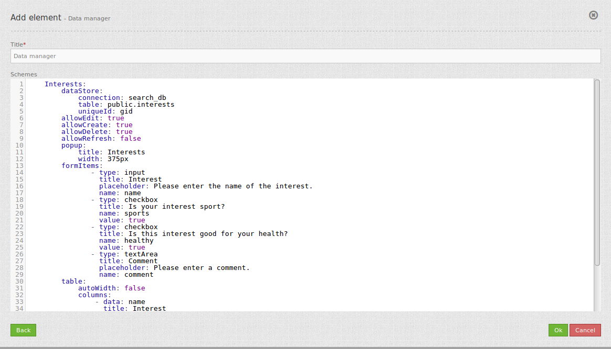

.. _data_manager:

Data Manager
************

Das Data Manager-Element ermöglicht die Bearbeitung von Daten ohne Geometrie. Derzeit kann über eine YAML-Definition (wie beim Element Digitizer) eine Erfassungsmaske für Daten aufgebaut werden.

Der Data Manager bietet verschiedene Funktionalitäten an:

  * Erstellen von Dateneinträgen
  * Löschen von Dateneinträgen
  * Editieren von Dateninformationen

Vergleichbar mit der Digitalisierung können für die Erfassung von Sachdaten komplexe Formulare generiert werden. 

.. image:: ../../../../../figures/datamanager/data_manager.png
     :scale: 90

Konfiguration
=============

* **Title:** Titel des Elements.
* **Schemes:** YAML-Definition für das Element.

Der Data Manager benötigt einen Zugriff auf die Datenbank, in der die zu editierenden Tabellen liegen. Sie müssen dazu einen Datenbankzugriff konfigurieren. Mehr zu diesem Thema finden Sie unter http://doc.mapbender3.org/de/book/database.html. 

DataStore in der parameters.yml
===============================

Zusätzlich benötigt der Data Manager einen Eintrag eines "dataStores" in der parameters.yml. Auf diesen wird in der YAML-Konfiguration des Element selbst verwiesen. Innerhalb der Definition kann festgelegt werden, welche Felder für den Data Manager zur Verfügung stehen.

Auszug aus der **parameters.yml** für ein einfaches Beispiel:

.. code-block:: yaml

            parameters:
                [...]

                # datastore connection
                dataStores:
                    interests:
                    connection: search_db
                    table: interests_datastore
                    uniqueId: gid
                    fields: [name, sports, healthy, comment, username] # Tabellenfelder, die genutzt werden dürfen

YAML-Definition:
================

Die Definition des Data Managers wird in einer YAML Syntax durchgeführt. Hier definieren Sie die Datenbankverbindung, die editierbaren Felder, das Formular für die Anzeige und andere Verhaltensweisen.

.. code-block:: yaml

    Interessen:
	    dataStore: 
	        connection: search_db
	        table: public.interests_datastore       # Name der Tabelle
	        uniqueId: gid
	    allowEdit: true
	    allowCreate: true
	    allowDelete: true
	    allowRefresh: false
	    popup:
	        title: Interessen
	        width: 375px
	    formItems:    
	           - type: input
	             title: Interesse
	             placeholder: Bitte geben Sie eine Interesse an.
	             name: name
	           - type: checkbox
	             title: Ist deine Interesse eine Sportart?
	             name: sports
	             value: true
	           - type: checkbox
	             title: Ist die Interesse gut für deine Gesundheit?
	             name: healthy
	             value: true
	           - type: textArea
	             title: Bemerkung
	             placeholder: Hier können Sie eine Bemerkung abgeben.
	             name: comment
	    table:                      # Tabellenkonfiguration
	        autoWidth: false
	        columns:
	            - data: name
	              title: Interesse
	        info: true
	        lenghtChange: false
	        ordering: true      
	        pageLength: 10
	        paging: true
	        processing: true
	        searching: true

* **dataManager:** Datenbankverbindung (vordefiniert in der parameters.yml).
* **Allow create:** Erlaubt die neue Erstellung von Dateneinträgen. Standardmäßig ausgewählt.
* **Allow edit:** Erlaubt das Bearbeiten von Daten. Standardmäßig ausgewählt. 
* **Allow delete:** Erlaubt das Löschen von Dateneinträgen. Standardmäßig ausgewählt.
* **Allow refresh:** Erlaubt das Aktualisieren von Dateneinträgen ohne die ganze Anwendung neu laden zu müssen. Standardmäßig nicht ausgewählt.

SQL für die Demo Tabelle
------------------------

.. code-block:: yaml

    Create table public.interests_datastore (
	    gid serial PRIMARY KEY,
	    name varchar,
	    sports boolean,
	    healthy boolean,
	    comment varchar, 
	    user_name varchar,
      group_name varchar,
      modification_date date
	);
  
	INSERT INTO interests_datastore (name, sports, healthy, comment) VALUES ('reading',false,false,'nice');   
  INSERT INTO interests_datastore (name, sports, healthy, comment) VALUES ('yoga',true,true,'nice');   
  INSERT INTO interests_datastore (name, sports, healthy, comment) VALUES ('surfing',true,true,'needs water');   
  INSERT INTO interests_datastore (name, sports, healthy, comment) VALUES ('swimming',true,true,'needs water');   
  INSERT INTO interests_datastore (name, sports, healthy, comment) VALUES ('painting',false,false,'needs water');   

Definition der Objekttabelle
--------------------------------

Der Data Manager stellt eine Objekttabelle bereit. 
Über diese kann das Bearbeitsformular geöffnet und die Dateneinträge sortiert werden. 
Die Breite der einzelnen Spalten kann optional in Prozent oder Pixeln angegeben werden.

.. code-block:: yaml

              - dataStore: 
			        connection: search_db
			        table: public.interests_datastore
			        uniqueId: gid               # Data Manager Name
                allowCreate: true
                allowEdit: true
                allowDelete: true
                allowRefresh: false
			    table:                      # Tabellenkonfiguration
			        autoWidth: false
			        columns:
			            - data: name
			              title: Interesse
			        info: true
			        lenghtChange: false
			        ordering: true          # Erlaubt das Sortieren der Tabelleneinträge. Standard ist true.
			        pageLength: 10          # Anzahl der Einträge, die auf einer Seite gezeigt werden sollen.
			        paging: true            # Erlaubt das Einteilen der Tabelleneinträge auf mehrere Seiten. Standard ist true. 
			        processing: true 
			        searching: true         # Erlaubt die Suche nach Tabelleneinträgen. 

Für die Darstellung der Tabelle können verschiedene Elemente definiert werden. 
Alle Elemente, die genutzt werden können, finden sich unter: 
https://datatables.net/reference/option/ 

Definition Popup
----------------

.. code-block:: yaml
              
                dataStore:  
			        connection: search_db
			        table: public.interests
			        uniqueId: gid
                ...
			    popup:
			        title: Interessen
			        width: 375px
                ...

Class, Widget & Style
=====================

* **Class:** Mapbender\DataSourceBundle\Element\DataManagerElement
* **Widget:** datamanager.element.js
* **Style:** sass\element\data.manager.element.scss

HTTP Callbacks
==============

Keine.

JavaScript API
==============

Keine.

JavaScript Signals
==================

Keine.
