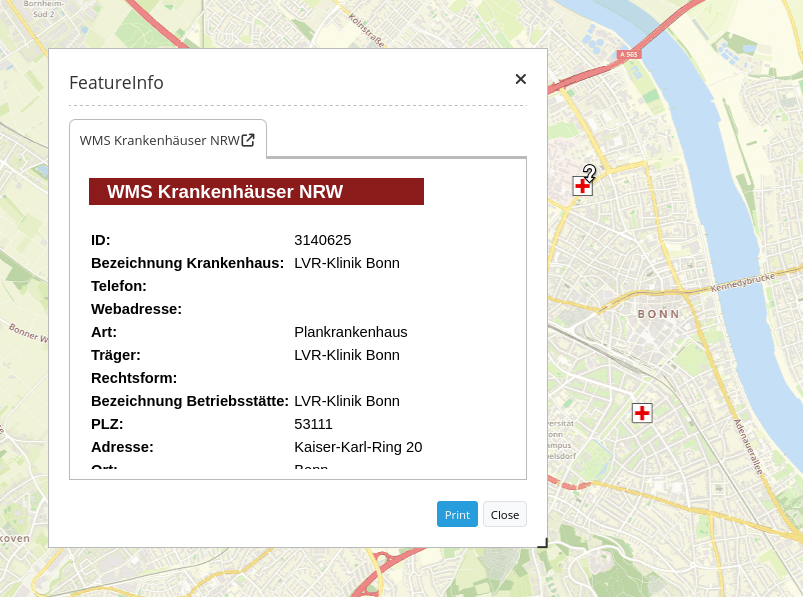

.. _feature_info:

Feature Info (Information)
**************************

Dieses Element stellt die Infoabfrage bereit, die mit WMS Services funktioniert.

Konfiguration
=============

.. image:: ../../../../../figures/de/feature_info_configuration.png
     :scale: 80

* Automatisches Öffnen (Autoopen): Schaltet ein/aus, ob das Informationsfenster beim Start der Anwendung automatisch geöffnet werden soll (Standard: Ausgeschaltet)
* Print Result: Ermöglicht den Druck der angezeigten Informationen. 
* Title: Titel des Elements. Dieser wird in der Layouts Liste angezeigt und ermöglicht, mehrere Button-Elemente voneinander zu unterscheiden. Der Titel wird außerdem neben dem Button angezeigt, wenn “Beschriftung anzeigen” aktiviert ist.
* Tooltip: Text, der angezeigt wird, wenn der Mauszeiger eine längere Zeit über dem Element verweilt.
* Target: Zielelement (Titel(ID)) des Buttons, das bei Anklicken des Buttons ausgelöst wird.
* Type: Auwahl, ob die Info als Element oder Dialog angezeigt werden soll.   
* Display: Anzeige der Information als Tabs oder in Accordionform.
* Width/ Height: Größe des Infofeldes
* nur valide zeigen: Parameter hängt sehr vom Format des GetFeatureInfo Responses ab. Beispiel UMN: Solange ein Template korrekte HTML Head und Body Elemente definiert (z.B. über die Angabe einer Headers und Footers Datei), interpretiert Mapbender3 das Resultat als valide. Fehlen diese Head und Body Angaben, so gilt dies für Mapbender3 als nicht valide. Bitte stellen Sie sicher, dass die GetFeatureInfo Antworten valides HTML zurückgeben.

YAML-Definition:

.. code-block:: yaml

   tooltip: Feature Info   # Text des Tooltips
   target: ~               # ID des Kartenelements
   autoOpen: false         # true, wenn die Infoabfrage beim Start der Anwendung geöffnet wird, der Standardwert ist false.
   deactivateOnClose: true # true/false um die Funktion nach dem Schließen des Ergebnisfensters zu deaktivieren, der Standardwert ist true
   width: 700              # Breite des Dialogs, Standardwert: 700 px
   height: 700             # Höhe des Dialog, Standardwert: 500 px
   printResult: false      # Anzeige eines Links, über den die Infoabfrage ausgedruckt werden kann. Standardwert ist false.
   showOriginal: null      # Der Original css-Stil des Ergebnisses wird angezeigt. Standardwert ist false.
   onlyValid: null         # Standardwert ist false.

Für das Element wird ein Button verwendet. Siehe unter :doc:`button` für die Konfiguration. Der folgende Screenshot zeigt ein Beispiel für einen FeatureInfo Button, der als aktiviert angezeigt wird, so lange der FeatureInfo Dialog geöffnet ist.

.. image:: ../../../../../figures/feature_info_button.png
     :scale: 80

   

Class, Widget & Style
============================

* Class: Mapbender\\CoreBundle\\Element\\FeatureInfo
* Widget: mapbender.element.featureInfo.js
* Style: mapbender.elements.css

HTTP Callbacks
==============

Keine.

JavaScript API
==============

activate
--------

Aktiviert das Modul, welches dann auf einen Mausklick wartet, um die Infoabfrage zu öffnen.

deactivate
----------
Deaktiviert das Modul.

JavaScript Signals
==================

Keine.
