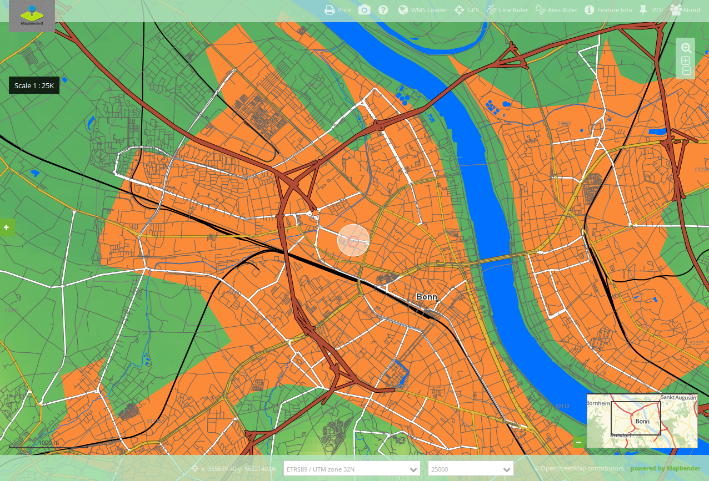

.. _gpspostion:

GPS-Position
***********************

Dieses Elememt stellt einen Button bereit, der zu ihrer aktuellen Position navigiert und zeigt ein Symbol an dieser Position an. Der Maßstab wird dabei nicht verändert, außer durch Aktivierung der Einstellung ``zoom to accuracy (zoom to accuracy on first position)``. 

Konfiguration
=============

.. image:: ../../../../../figures/de/gps_position_configuration.png
     :scale: 80

* **Beschriftung anzeigen (Show label):** Schaltet die Beschriftung des Buttons an/aus.
* **Title:** Titel des Elements. Dieser wird in der Layouts Liste angezeigt und ermöglicht, mehrere Button-Elemente voneinander zu unterscheiden. Der Titel wird außerdem neben dem Button angezeigt, wenn "Beschriftung anzeigen" aktiviert ist.
* **Tooltip:** Text, der angezeigt wird, wenn der Mauszeiger eine längere Zeit über dem Element verweilt.
* **Icon:** Symbol des Buttons, basierend auf einer CSS Klasse.
* **Target:** ID des Kartenelements, auf das sich das Element bezieht.
* **Average:** berechnet den Mittelwert der unter Average angegebenen letzten empfangenen GPS Koordinaten, Standard ist 1.
* **Refreshinterval:**  Aktualisierungsintervall in ms. Der Standardwert ist 5000 ms.
* **Follow:** Standard ist false, true positioniert die Karte bei jeder empfangenen GPS Koordinate neu.
* **Center on first position:** true zentriert die Karte auf die erstermittelte Position.
* **Zoom to accuracy:** Zoomt auf die ermittelte Koordinate nach Messgenauigkeit.
* **Zoom to accuracy on first position:** Zoomt auf die ermittelte Koordinate nach Messgenauigkeit bei erster ermittelten Position.

YAML-Definition:
----

.. code-block:: yaml

    tooltip: GPS-Position  # Text des Tooltips
    label: true            # false/true, um den Button zu beschriften. Der Standardwert ist true.
    icon: gpsposition      # Symbol für den Button
    target: map            # ID des Kartenelements
    autoStart: false       # true, wenn diese Funktion beim Start der Anwendung geöffnet werden soll, der Standardwert ist false.
    refreshinterval: 5000  # Aktualisierungsintervall in ms. Der Standardwert ist 5000 ms.
    follow: true           # Standard ist false, true positioniert die Karte bei jeder empfangenen GPS Koordinate neu. Sollte nur mit WMS Diensten im gekachelten Modus verwendet werden, da sonst bei jeder Neupositionierung ein neuer Kartenrequest geschickt wird
    average: 1             # berechnet den Mittelwert der unter average angegebenen letzten empfangenen GPS Koordinaten, Standard ist 1
    centerOnFirstPosition: true  # Zentriert die Karte auf die erstermittelte Position
    zoomToAccuracy: false   # Zoomt auf die ermittelte Koordinate nach Messgenauigkeit
    zoomToAccuracyOnFirstPosition: true # Zoomt auf die ermittelte Koordinate nach Messgenauigkeit bei erster ermittelten Position

Class, Widget & Style
======================

* **Class:** Mapbender\\CoreBundle\\Element\\GpsPosition
* **Widget:** mapbender.element.gpsPostion.js
* **Style:** mapbender.element.gpsPosition.css

HTTP Callbacks
==============

Keine.

JavaScript API
==============

Keine.

JavaScript Signals
==================

Keine.
