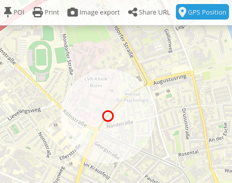

.. _gpspostion:

GPS-Position
***********************

Dieses Elememt stellt einen Button bereit, der zu ihrer aktuellen Position navigiert und zeigt ein Symbol an dieser Position an. Der Maßstab wird nicht verändert.

Konfiguration
=============

.. image:: ../../../../../figures/gps_position_configuration.png
     :scale: 80

YAML-Definition:

.. code-block:: yaml

   tooltip: GPS-Position  # Text des Tooltips
   label: true            # false/true, um den Button zu beschriften. Der Standardwert ist true.
   icon: gpsposition      # Symbol für den Button
   target: map            # ID des Kartenelements
   autoStart: false       # true, wenn diese Funktion beim Start der Anwendung geöffnet werden soll, der Standardwert ist false.
   refreshinterval: 5000  # Aktualisierungsintervall in ms. Der Standardwert ist 5000 ms.
   follow: true           # Standard ist false, true positioniert die Karte bei jeder empfangenen GPS Koordinate neu. Sollte nur mit WMS Diensten im gekachelten Modus verwendet werden, da sonst bei jeder Neupositionierung ein neuer Kartenrequest geschickt wird
   average: 1             # berechnet den Mittelwert der unter average angegebenen letzten empfangenen GPS Koordinaten, Standard ist 1

Class, Widget & Style
======================

* Class: Mapbender\\CoreBundle\\Element\\GpsPosition
* Widget: mapbender.element.gpsPostion.js
* Style: mapbender.element.gpsPosition.css

HTTP Callbacks
==============

Keine.

JavaScript API
==============

Keine.

JavaScript Signals
==================

Keine.
