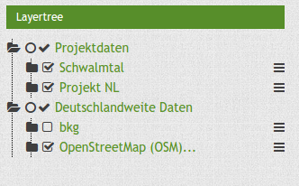
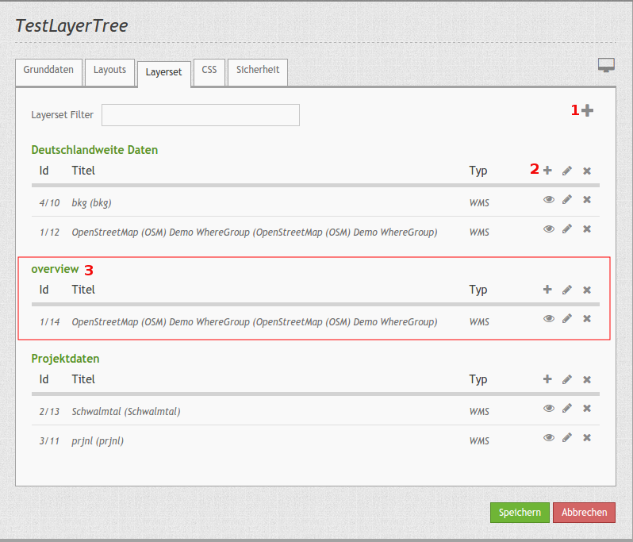
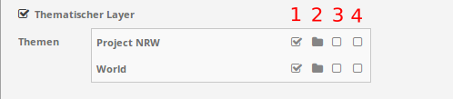

.. _layertree:

Layertree - Table of Content (Layerbaum)
********************************************************

Der Layerbaum zeigt die Layer und die Service-Ordner an. Im Layerbaum können einzelne Layer in der Karte aktiviert und deaktiviert werden. 
Hier kann auch die Infoabfrage für einzelne Layer aktiviert oder deaktiviert werden. 
Die Reihenfolge der Service können geändert und Layer via drag & drop verschoben werden.

Seit Version 3.0.5 erlaubt der Layertree die Anzeige mehrerer Layersets, die als weitere Strukturebene im Baum angezeigt werden. Der folgende Screenshot zeigt das an einem exemplarischen Beispiel:

..
   .. image:: ../../../../../figures/layertree/layertree_pre305.png
        :scale: 80

Konfiguration
=============

Um die unterschiedlichen Layersets im Layertree nutzen zu können, sind
verschiedene Anpassungen notwendig. Diese betreffen die:

#. Einrichtung verscheidener Layersets,
#. Einrichtung in der Karte zur Anzeige der Layersets,
#. Einrichtung des Layertrees selbst.

In dem folgenden Beispiel sind zwei Layersets mit jeweils zwei Instanzen definiert:

* Projektdaten: mit den Instanzen "Schwalmtal" und "Projekt NL".
* Deutschlandweite Daten: mit den Instanzen "bkg" und "OpenStreetMap (OSM)".

Konfiguration der Layersets
---------------------------

Die Layersets werden wie gewohnt in der Applikation unter dem Reiter
Layerset definiert. Die Instanzen sind weiterhin die Referenzen auf die
einzelnen WMS Dienste. Hier werden neue Layersets erstellt und dort die
einzelnen Instanzen hinzugefügt. Das dritte Layerset "overview" wird – wie
gehabt – für die Anzeige der Übersichtskarte verwendet.

Konfiguration der Karte
-----------------------

Der zweite Schritt ist die Konfiguration der `Hauptkarte <../elements/map.html>`_ . Hier
gibt man an, welche Layersets in der Kartenansicht verwendet werden
sollen. Der Layerset "overview" wird beispielsweise nicht in der Hauptkarte
angezeigt.  In diesem Schritt wird auch die Reihenfolge definiert, in der
die Layersets im Layertree und in der Karte erscheinen sollen. Daher können
diese per Drag & Drop verschoben werden ("Projektdaten" über den
"Deutschlandweiten Daten"). Bitte achten Sie darauf, dass die weiter oben
definierten Themen die darunter liegenden überdecken können.

.. image:: ../../../../../figures/layertree/de/layertree_configuration_map.png
           :scale: 80

* **Title:** Titel des Elements. Dieser wird in der Layouts Liste angezeigt und ermöglicht, mehrere Button-Elemente voneinander zu unterscheiden. Der Titel wird außerdem neben dem Button angezeigt, wenn "Beschriftung anzeigen" aktiviert ist.
* **Layersets:** Vorher konfiguriertes Layerset zur Anzeige der Hauptkarte (main map).
* **DPI:** Maßeinheit für die Auflösung, Standard ist 72.
* **SRS:** Spatial Reference System, Koordinatenbezugssystem beim Start der Anwendung. Zwei Arten der SRS Definition werden unterstützt: EPSG: CODE oder EPSG:CODE|MEIN SRS TITEL.
* **Map units:** Einheiten der Karte in Meter, Degrees, Feet, Miles oder Inches, Standard ist "degrees" (Grad).
* **Max. Extent:** Maximaler Kartenbereich (BBOX mit min/max x/y, die Ausschnitt definiert).
* **Start Extent:** Bereich der Karte, der beim Starten der Anwendung angezeigt wird (BBOX mit min/max x/y, die Ausschnitt definiert).
* **Scales (csv):** festgelegte Zoomstufen, die durch Drehen des Mausrads oder bei stufenweisem Zoomen für den Maßstab genutzt werden (werden durch Komma separiert).
* **Max. resolution:** auto, bestimmt die Auflösung der Karte.
* **OL image path:** OpenLayers Bilderpfad, unter dem die Bilder abgespeichert werden (bundles/mapbendercore/mapquery/lib/openlayers/img).
* **Other SRS:** weitere auswählbare Projektionen unter denen die Karte noch angezeigt werden kann (werden durch Komma separiert). Zwei Arten der SRS Definition werden unterstützt: EPSG: CODE oder EPSG:CODE|MEIN SRS TITEL.

Konfiguration des Layertrees
----------------------------

Der letzte Schritt ist die Konfiguration des Layertrees selbst. Die in der
Main Map angegebenen Instanzen können im Layertree noch genauer definiert
werden.

.. image:: ../../../../../figures/layertree/de/layertree_configuration.png
           :scale: 80
      

* **Title:** Titel des Elements. Dieser wird in der Layouts Liste angezeigt und ermöglicht, mehrere Button-Elemente voneinander zu unterscheiden. Der Titel wird außerdem neben dem Button angezeigt, wenn "Beschriftung anzeigen" aktiviert ist.
* **Target:** ID des Kartenelements, auf das sich das Element bezieht.
* **Type:** Anzeige als Dialog- oder Blockelement, Standard ist Dialog.
* **Displaytype:** akkordeonartige Anzeige oder Liste. Standard ist Liste.
* **Titlemaxlength:** Angabe der maximalen Zeichenzahl für den Titel der einzelnen Layer.
* **Menu:** Auswahl von Buttons, die dem Benutzer im Ebenenbaum zur Verfügung gestellt werden können: remove layer (Layer aus der Anwendung entfernen), opacity (Deckkraft der einzelnen Layer verändern), zoom to layer (auf die BBOX des Layers zoomen), metadata (Metadaten des Layers anzeigen).

* **Nicht aufklappbare Ordner ausblenden:** Kartenbenen, die nicht mehrere Layer enthalten werden ausgeblendet.
* **Visibility bei Ordnern ausblenden:** Deckkraft der Ebenen wird nicht angezeigt und kann nicht verändert werden.
* **Info Ausblenden:** Informationsabfrage wird deaktiviert.
* **Thematische Layer:** Ist diese Option ausgeschaltet, benutzt der Layertree nicht mehr die konfigurierten Layersets und zeigt die einzelnen Instanzen in der Hauptebene an.
  
Für die thematischen Layer sind weitere Optionen möglich. Der folgende Screenshot zeigt die vier Möglichkeiten der Anpassung.

* **(1)** Thema anzeigen: Ist diese Option gesetzt, wird der Layerset als zusätzliche Ebene angezeigt. Ist diese Option nicht gesetzt, werden die enthaltenen Layer-Instanzen in der Hauptebene angezeigt.
* **(2)** Thema geöffnet / geschlossen: Ist diese Option gesetzt (Symbol des geöffneten Ordners), ist das Thema im Layertree automatisch ausgeklappt. 
* **(3)** Thema Dienste Sichtbarkeit: Ist diese Option gesetzt, wird im Layertree die Schaltfläche "Dienste anzeigen / ausblenden" hinzugefügt.
* **(4)** Thema Layer-Sichtbarkeit: Ist diese Option gesetzt, wird im Layertree die Schaltfläche "Alle Layer anzeigen" hinzugefügt.

Die beiden zusätzlichen Schaltflächen werden in dem folgenden Screenshot dargestellt:

.. image:: ../../../../../figures/layertree/layertree_buttons.png
           :scale: 80

* **(1)** Die Schaltfläche "Dienste anzeigen / ausblenden": Hiermit können alle untergeordneten Dienste (Instanzen) sichtbar geschaltet werden oder die Darstellung wieder in den vorkonfigurierten Ursprungszustand zurückgesetzt werden.
* **(2)** Die Schaltfläche "Alle Layer anzeigen": Hiermit können alle untergeordneten Dienste (Instanzen) sichtbar geschaltet werden.

YAML-Definition:
----

.. code-block:: yaml
                
  title: layertree             # Titel des Layerbaums
  target: ~                    # ID des Kartenelements
  type: ~                      # Typ des Layerbaums
  displaytype: tree            # In 3.0 gibt es nur den Baum (Tree), in Zukunft wird auch eine Liste angeboten.
  useAccordion: false          # akkordeonartige Anzeige. Standard ist false
  autoOpen: false              # true, wenn der Layerbaum beim Start der Anwendung geöffnet werden soll, der Standardwert ist false.
  titleMaxLength: 20           # Maximale Länge des Layertitels, Standard ist 20
  showBaseSource: true         # Anzeige des Basislayers, der Standardwert ist true
  showHeader: true             # zeigt eine Überschrift, die die Anzahl der Services zählt, der Standardwert ist true
  menu: [opacity,zoomtolayer,metadata,removelayer]  # zeigt ein Kontextmenü für den Layer an (wie Opazität, Zoom auf Layer, Anzeige des Metadatendialogs, Layer entfernen), der Standardwert ist menu: [] 

..
   .. image:: ../../../../../figures/layertree/layertree_configuration_pre305.png
        :scale: 80

Optional kann ein Button für dieses Element verwendet werden. Siehe unter :doc:`button` für die Konfiguration. 
Der Layerbaum kann auch als Element definiert werden. Dann wird der Layerbaum in einem frame wie der Sidebar angezeigt.

..
   YAML-Definition:

   .. code-block:: yaml    

    title: layertree             # Titel des Layerbaums
    target: ~                    # ID des Kartenelements  
    type: ~                      # Typ des Layerbaums, element oder dialog
    autoOpen: false              # true, wenn der Layerbaum beim Start der Anwendung geöffnet werden soll, der Standardwert ist
    displaytype: tree            # In 3.0 gibt es nur den Baum (Tree), in Zukunft wird auch eine Liste angeboten.
    titlemaxlength: 20           # Maximale Länge des Layertitels, Standard ist 20  
    showBaseSource: true         # Anzeige des Basislayers, der Standardwert ist true
    showHeader: true             # zeigt eine Überschrift, die die Anzahl der Services zählt, der Standardwert ist true
    menu: [opacity,zoomtolayer,metadata,removelayer]  # zeigt ein Kontextmenü für den Layer an (wie Opazität, Zoom auf Layer, Anzeige des Metadatendialogs, Layer entfernen), der Standardwert ist menu: []
    hideInfo: null               #
    hideNotToggleable: null      #
    hideSelect: null             #
    themes: {  }                 #   

Class, Widget & Style
======================

* **Class:** Mapbender\\CoreBundle\\Element\\Layertree
* **Widget:** mapbender.element.layertree.js
* **Style:** mapbender.elements.css

HTTP Callbacks
==============

Keine.

JavaScript API
==============

open
----------

Öffnet den Layerbaum (layertree)

reload
----------

JavaScript Signals
==================

Keine.

