.. _ldap:

LDAP
****

Das LDAP Modul ermöglicht es, LDAP Benutzer und Gruppen in Mapbender zu verwenden. Mit diesen Benutzern und Gruppen können Anwendungen und Elemente abgesichert werden.

Die LDAP-Funktionalität gilt für die hier beschriebenen LDAP-Konfigurationen. Andere Konfigurationen der Benutzer und Gruppen können womöglich direkt unterstützt werden, das konnte aber in der Gesamtheit noch nicht nachgeprüft werden.

Installation und Einrichtung
============================

Die LDAP-Komponente ist Teil von Mapbender und nutzt Symfony für den Zugriff auf das LDAP.

Einrichtung LDAP
----------------

Die Einrichtung ist zuerst auf der LDAP-Seite notwendig. Das Modul funktioniert nur mit einer bestimmten, aber generell guten Konfiguration eines LDAP.

Das Beispiel:

* Gegeben sei eine Domäne com.wheregroup. (dc=wheregroup, dc=com).
* In dieser sind zwei Organisational Units vergeben: groups und user (ou=groups und ou=user)

Der folgende Screenshot zeigt die beispielhafte Implementierung dieser LDAP Struktur. Benutzer und Gruppen wurden schon angelegt und werden im Folgenden erläutert.

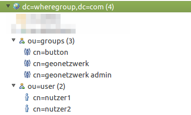

**Benutzer:**

Neue Benutzer werden mit den Objektklassen
* inetOrgPerson und
* top

angelegt. Dabei werden – je nach LDAP-Konfiguration – automatisch die Objektklassen

* organisationalPerson und
* person

vergeben.

Verschiedene Attribute können danach ausgefüllt werden. Verpflichtend ist die Angabe:

* sn=nutzer1 (Nachname)

Optional ist:

* userPassword

Der folgende Screenshot zeigt einen beispielhaften Nutzer "nutzer2": ``cn=nutzer2,ou=user,dc=wheregroup,dc=com``

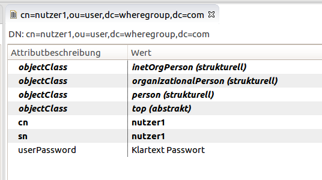

**Gruppen:**

Neue Gruppen werden mit den Objektklassen

* groupOfNames und
* top

angelegt.

Hier können dann unter dem mehrfach vorkommenden Attribut "member" die einzelnen Benutzer der Gruppe hinzugefügt werden, zum Beispiel:

* ``member=cn=nutzer2,ou=user,dc=wheregroup,dc=com``

Der folgende Screenshot zeigt die Beispielnutzer "nutzer1" und "nutzer2", die der Gruppe "geonetzwerk" hinzugefügt wurden:

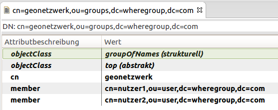

Diese Struktur kann:

* um Gruppen,
* um Benutzer,
* und Benutzern in mehreren Gruppen

erweitert werden.

Einrichtung Mapbender
---------------------

Der Zugriff auf das LDAP wird in der parameters.yml des Mapbender konfiguriert, hier müssen entsprechende Werte eingetragen werden:

* ldap_host: Host des LDAP Systems
* ldap_port: Port des LDAP Systems
* ldap_version: Version des LDAP Systems
* ldap_user_base_dn: ou=users            # Name der Organisational Unit, in der die Benutzer hinterlegt sind.
* ldap_user_name_attribute: uid          # Attribut, das den Benutzernamen beschreibt.
* ldap_role_base_dn: ou=groups           # Name der Organisational Unit, in dem die Gruppen hinterlegt sind.
* ldap_role_name_attribute: cn           # Attribut, das den gewünschten Gruppennamen beschreibt.
* ldap_role_user_attribute: memberUid    # Attribut, welches prüft, ob der Benutzer Gruppenzugehörigkeiten besitzt.
* ldap_role_user_id: username / dn       # Attribut, welches Gruppenzugehörigkeiten auf Namenskategorie prüft. Zwei Möglichkeiten: username = Benutzername oder dn = Distinguished Name
* ldap_bind_dn: dn                       # Distinguished Name des Nutzers, der für die Operationen auf das LDAP zugreifen möchte (Authentifizierung)
* ldap_bind_pwd: password                # Passwort des Nutzers, der für die Operationen auf das LDAP zugreifen möchte (Authentifizierung)
* ldap_user_search_filter:               # Optionaler Suchfilter für LDAP.

Ein Beispiel:

.. code-block:: yaml

    # Host of the LDAP Directory.
    ldap_host: 127.0.0.1
    # Port number (default: 389).
    ldap_port: 389
    # LDAP Version (default: 3)
    ldap_version: 3
    # Where to find users to authenticate with?:
    ldap_user_base_dn: ou=user,dc=wheregroup,dc=com
    # Attribute that represents the typed-in username in login-form
    ldap_user_name_attribute: cn
    # Where are user-roles stored?:
    ldap_role_base_dn: ou=groups,dc=wheregroup,dc=com
    # Which attribute represents the user-role?:
    ldap_role_name_attribute: cn
    # Which attribute identifies the current user?:
    ldap_role_user_attribute: member
    # Which value is stored in user_attribute? Username = Username, dn = Distinguished Name:
    ldap_role_user_id: dn
    # User who connects to the LDAP (with DN):
    ldap_bind_dn: cn=admin,dc=wheregroup,dc=com
    # User password:
    ldap_bind_pwd: geheim
    # An optional filter:
    ldap_user_search_filter: (objectclass=top)

Nutzung
=======

Mapbender-Benutzer
------------------

Es gibt weiterhin einen Mapbender-Benutzer, den root-Acccount.

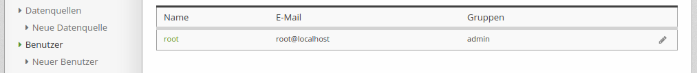

Anmeldung
---------

Man kann sich entweder als lokaler root-Account oder als Benutzer im LDAP anmelden. Bei dieser Konfiguration reicht als Anmeldename der Benutzername (bspw. nutzer1).

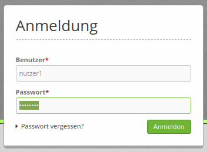

Anwendungen absichern
---------------------

Anwendungen können gegen LDAP Nutzer und Gruppen abgesichert werden. Der folgende Screenshot zeigt die "Anwendung1", für die der lokale Nutzer "root" und die LDAP-Gruppe "Geonetzwerk" owner sind und der LDAP-Nutzer "nutzer3" nur View-Rechte besitzt.

*Anmerkung*: Gruppen werden in Mapbender aus technischen Gründen immer mit dem Syntax ROLE_ GROUP_ erweitert. Die LDAP-Gruppe "GEONETZWERK" wird in Mapbender als "ROLE_GROUP_GEONETZWERK" angezeigt.

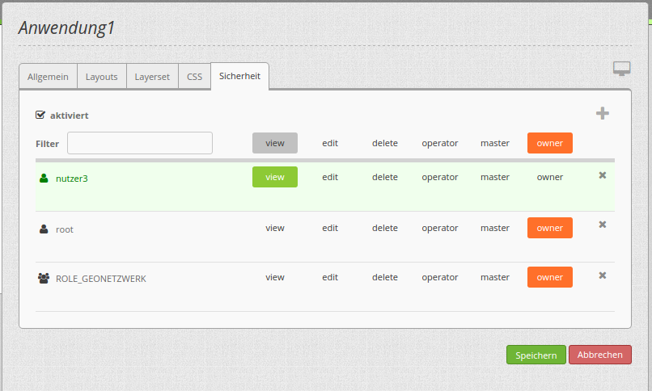

Über den "Benutzer/Gruppe hinzufügen"-Dialog können Benutzer und Gruppen hinzugefügt werden. Standardmäßig erscheinen die Einträge aus dem LDAP erst, wenn mindestens drei Buchstaben in der Suche eingegeben worden sind.

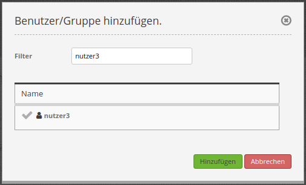

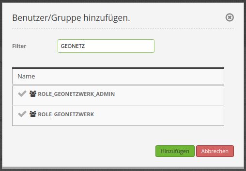

Elemente absichern
------------------

Die Absicherung von Elementen in einer Anwendung geschieht ähnlich. Voraussetzung ist, dass der Benutzer die Anwendung überhaupt sehen darf.

Die Absicherung von Elementen ist eine Whitelist. Benutzer, die dort eingetragen sind, dürfen das Element sehen, alle anderen nicht.

Im folgenden Beispiel ist die Schaltfläche "Legende" dem Benutzer "nutzer1" freigeschaltet.

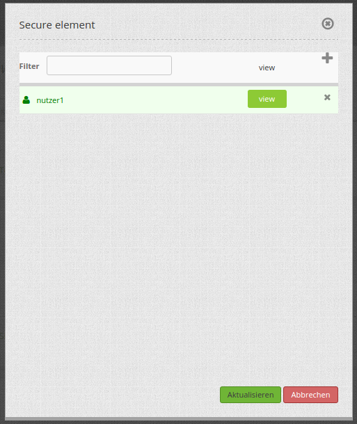

Auf die gleiche Art und Weise können Gruppen hinzugefügt werden.

Die Anwendung listet die geschützten Elemente mit einem roten Schlüsselsymbol auf. Beim Schweben mit der Maus über den Schlüssel wird die Liste der Nutzer und Gruppen angezeigt, die auf dieses Element zugreifen können.

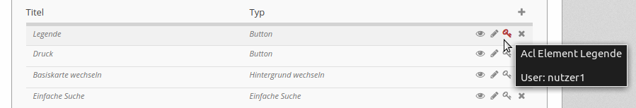

Resultat: Der "nutzer1" kann auf die Anwendung zugreifen (aus seiner Mitgliedschaft in der Rolle "Geonetzwerk") und hat Zugriff auf den Legende-Button.

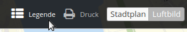

Technische Integration des LDAP-Moduls
--------------------------------------

Zunächst müssen bei einer Integration des LDAP-Moduls die Installationshinweise unter https://doc.mapbender.org/de/installation/installation_ubuntu.html beachtet werden.

Darüber hinaus findet sich eine Anleitung zur technischen Integration des LDAP-Moduls in einem Readme-File auf GitHub:
https://github.com/mapbender/ldapIntegrationBundle/blob/master/README.md
