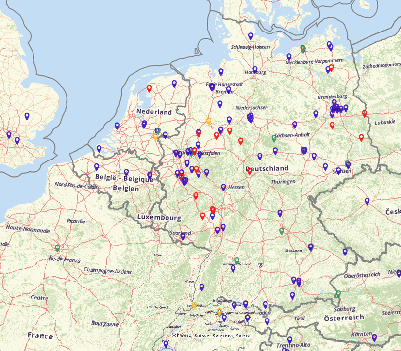
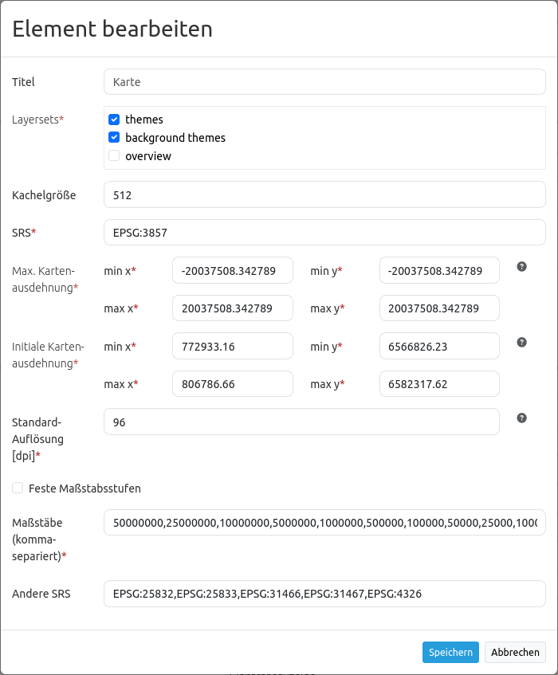
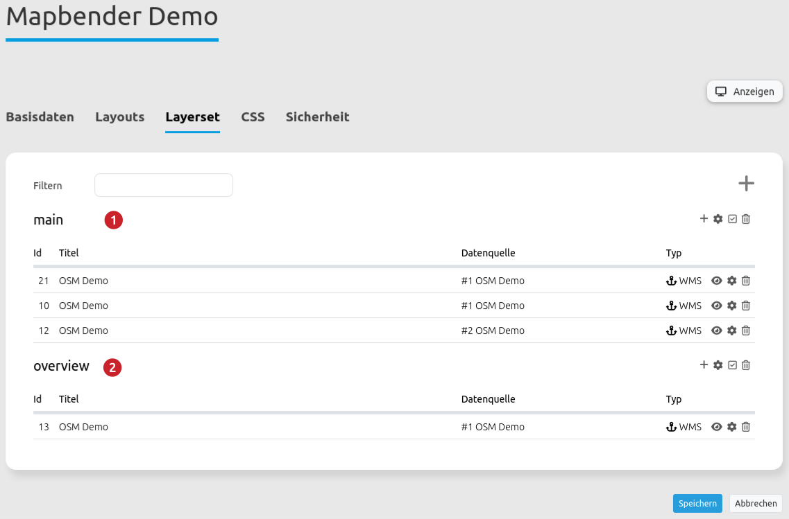
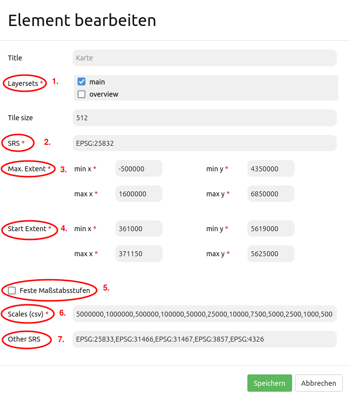

.. _map:

Map (Karte)
***********************

MapQuery/OpenLayers basierte Karte.
Es müssen die Einheiten, der Start und der Max Bereich (extent), die Maßstäbe und die unterstützten Projektionen angegeben werden.

Konfiguration
=============

* **Title:** Titel des Elements. Dieser wird in der Layouts Liste angezeigt. Der Titel wird außerdem neben dem Button angezeigt, wenn "Beschriftung anzeigen" aktiviert ist.
* **Layersets:** Vorher konfiguriertes Layersets zur Anzeige der Hauptkarte (Thematische Karte, Hintergrundkarte).
* **DPI:** Maßeinheit für die Auflösung, Standard ist 72.
* **SRS:** Spatial Reference System, Koordinatenbezugssystem beim Start der Anwendung. Zwei Arten der SRS Definition werden unterstützt: EPSG: CODE oder EPSG:CODE|MEIN SRS TITEL.
* **Map units:** Einheiten der Karte in Meter, Degrees, Feet, Miles oder Inches, Standard ist "degrees" (Grad).
* **Tile size:** Größe der Tiles bei gekachelten Diensten.
* **Delay before tiles:** Für zukünftige Nutzung von WMS-T bei zeitlichen Parametern (findet z.Z. noch keine Anwendung).
* **Max. Extent:** Maximaler Kartenbereich (BBOX mit min/max x/y, die Ausschnitt definiert).
* **Start Extent:** Bereich der Karte, der beim Starten der Anwendung angezeigt wird (BBOX mit min/max x/y, die Ausschnitt definiert).
* **Scales (csv):** festgelegte Zoomstufen, die durch Drehen des Mausrads oder bei stufenweisem Zoomen für den Maßstab genutzt werden (werden durch Komma separiert).
* **Max. resolution:** auto, bestimmt die Auflösung der Karte.
* **OL image path:** OpenLayers Bilderpfad, unter dem die Bilder abgespeichert werden (bundles/mapbendercore/mapquery/lib/openlayers/img).
* **Other SRS:** weitere auswählbare Projektionen unter denen die Karte noch angezeigt werden kann (werden durch Komma separiert). Zwei Arten der SRS Definition werden unterstützt: EPSG: CODE oder EPSG:CODE|MEIN SRS TITEL.

Konfigurationsbeispiel
======================
Die Hauptkarte (Main Map) wird in der Anwendung unter Layouts im Content integriert. Über das +-Zeichen kann das Element hinzugefügt werden.

.. image:: ../../../../../figures/de/add_content.png
     :scale: 80

Als Hauptkarte (Main Map) können alle Layersets definiert werden, die vorher in der Anwendung unter Layersets festgelegt wurden. Für dieses Konfigurationsbeispiel sind das folgende Layersets:

Die Layersets sind im Konfigurationsdialog des Kartenelements unter *Layersets* (1) sichtbar. Hier können auch mehrere gleichzeitig ausgewählt werden. Diejenigen Layersets, die nicht ausgewählt wurden, können als Overview fungieren.

Im Feld *SRS* (2) wird das Koordinatensystem definiert, welches beim Öffnen der Karte verwendet wird. In diesem Beispiel wurde das Koordinatensystem ETRS89/ UTM Zone 32N gewählt. Der EPSG Code lautet 25832. Wenn andere Koordinatensysteme in der Anwendung zur Auswahl stehen sollen, werden diese bei *Other SRS* (6) angegeben. Auch hier wird der EPSG Code verwendet. Es können mehrere EPSG Codes, durch ein Komma getrennt, angegeben werden. In diesem Beispiel wurden zusätzlich folgende EPSG Codes verwendet: 25833 (ETRS89/ UTM Zone 33N), 31466 (DHDN / 3-degree Gauss-Krüger Zone 2), 31467 (DHDN / 3-degree Gauss-Krüger Zone 3), 3857 (WGS 84 / Pseudo-Mercator), 4326 (WGS 84). In der Anwendung kann mithilfe des Elements SRS Auswahl zwischen den hier definierten Koordinatensystemen gewechselt werden. Wie dieses Element eingebunden wird, wird in der Dokumentation `hier <../elements/srs_selector.rst>`_ beschrieben.

Das Feld *Max. Extent* (3) gibt den maximalen Kartenbereich an, der vom Nutzer der Anwendung gesehen werden kann. Alles was außerhalb dieser Angabe liegt, kann durch den Anwender nicht gesehen werden. Das Feld *Start Extent* (4) gibt den Startbereich an, der beim Öffnen der Anwendung zu sehen ist. Im Konfigurationsbeispiel wird das Stadtgebiet von Bonn angezeigt.

Im Feld *Scales (csv)* (5) werden die Maßstäbe angegeben, die in der Anwendung genutzt werden können. Soll der Anwender beispielsweise zwar eine Übersichtskarte sehen können, jedoch keine näheren Details, kann der Maßstab auf die gewünschte Zahl begrenzt werden. Zwischen den Maßstäben, die in diesem Feld definiert werden, kann mithilfe des Elements Maßstabsauswahl gewechselt werden. Wie dieses Element eingebunden werden kann, wird in der Dokumentation `hier <../elements/scale_selector.rst>`_ beschrieben. Auch mit dem Element Navigationswerkzeug kann zwischen den Maßstäben gewechselt werden, die in der Main Map definiert wurden. Wie dieses Element integriert werden kann, wird in der Dokumentation `hier <../elements/zoom_bar.rst>`_ beschrieben.

YAML-Definition:
----------------

.. code-block:: yaml

   layerset: null             # verweist auf ein Layerset, definiert zuerst das layerset und verweist darauf
   dpi: 72                    # Auflösung, Standard ist 72
   srs: "EPSG:4326"           # Koordinatenbezugssystem. Zwei Arten der SRS Definition werden unterstützt:
                                - "EPSG:CODE" oder
                                - "EPSG:CODE|MEIN SRS TITEL"
   units: "degrees"           # Einheiten in Grad oder Meter, Standard ist "degrees" (Grad)
   extents: array(
       max: array(0, 40, 20, 60) 
       start: array(5, 45, 15, 55)) # Kartenbereich (extent)
   scales: "25000000,10000000,5000000,1000000,500000" # eine CSV-Liste für den Maßstab
   maxResolution: "auto"      # Auflösung, im Moment wird nur auto unterstützt, bitte ändern Sie es nicht.
   otherSrs: array(
      "EPSG:31466",
      "EPSG:31467",
      "EPSG:25832")           # andere Koordinatenbezugssystem. Zwei Arten der SRS Definition werden unterstützt:
                                - ["EPSG:CODE","EPSG:CODE"] or
                                - ["EPSG:CODE|MEIN SRS TITEL","EPSG:CODE|MEIN SRS TITEL"]
   imgPath: "bundles/mapbendercore/mapquery/lib/openlayers/img"   # Pfad der Bilder (images)
   tileSize: 256             # Kachelgröße
   wmsTileDelay: 2500        # Delay bei WMS-T (findet z.Z. noch keine Anwendung)

Kontrolle über URL-Parameter
============================

Ebenen sichtbar machen
------------------------

Sie können die ID der Ebene mit der ID <layerid> und des Dienstes <serviceid> in der URL als parameter übergeben, um einen Layer in der Startansicht zu aktivieren.

.. code-block:: php

  ?visiblelayers=<serviceid>/<layerid>

Es können mehrere Layer Komma separiert übergeben werden.

Die Werte für layerid und serviceid sind spezifisch für eine
Anwendung. Daher bekommen die Werte für layerid und serviceid in der
jeweiligen Anwendung und zwar im Layerset und dort in einem Layer. Jeder
Layer besitzt ein Icon mit drei Punkten auf der rechten Seite. Klicken Sie
auf die drei Punkte des Layers und ein Popupfenster erscheint.

.. image:: ../../../../../figures/wms_instance_layer_id.png
     :scale: 80

Der erste Wert nenn die interne SourceID und SourceLayerId (31-591). Der
zweite Wert listet die InstanceID und InstanceLayerId, die wir im weiteren
nutzen wollen (73-836).

Nutzen Sie diese Werte für den "visibleLayers" Parameter in der URL und
trennen Sie beide Werte mit einem Schrägstrich.

Zum Beispiel: http://localhost/mapbender/application/myapp?visiblelayers=73/836

Wenn Sie zwei per Voreinstellung nicht sichtbare Layer haben, fügen Sie
beide Werte von layerid und serviceid in die URL und trennen diese mit einem Komma.

Zum Beispiel: http://localhost/mapbender/application/myapp?visiblelayers=73/836,73/840

Punkte übergeben
------------------------

Sie können einen oder mehrere Punkte in der URL übergeben. Jeder Punkt verfügt dabei über die folgenden Parameter:

- Punkt (point): Koordinatenpaar, die Werte werden mit Komma getrennt (zwingend)
- Beschriftung (label): Beschriftung, die angezeigt werden soll (optional)
- Maßstab (scale): Maßstab, in dem der Punkt angezeigt werden soll (optional. Die Angabe ist nur bei der Anzeige eines Punktes sinnvoll)

Wenn Sie mehr als einen Punkt im Aufruf übergeben, zoomt die Karte auf 150% der Gesamt-Boundingbox.

Format für die Übergabe eines Punktes:

.. code-block:: php

   ?poi[point]=363374,5621936&poi[label]=Label&poi[scale]=5000

Für die Übergabe vieler Punkte wird das folgende Format verwendet:

.. code-block:: php

   ?poi[0][point]=363374,5621936&poi[0][label]=Label%201&poi[1][point]=366761,5623022&poi[1][label]=Label%202

Rechteck (BBOX) übergeben
------------------------------------------------

Es kann ein Rechteck (BBOX) beim Start übergeben werden. Es wird dann auf dieses Rechteck gezoomt. Der Aufruf sieht wie folgt aus:

.. code-block:: php

   ?bbox=364286,5622263,365979,5622806

Maßstab übergeben
------------------

Es kann der gewünschte Maßstab aus der Liste der verfügbaren Maßstäbe übergeben werden.

.. code-block:: php

   ?scale=1000

SRS (Projektion) übergeben
----------------------------------

Es kann eine gewünschte Projektion für den Start der Anwendung übergeben werden.

.. code-block:: php

   ?srs=EPSG:4326

Center - zentrieren der Anwendung
------------------------------------------------

Es kann eine Koordinate beim Start übergeben werden, die in der Anwendung zentriert werden soll. Sie benötigen zusätzlich die Angabe der Projektion.

.. code-block:: php

   ?center=364286,5622263

Weitere Startparameter
--------------------------

Die Elemente WMS Loader und WMC Loader stellen ebenfalls parameter zur Verfügung, die beim Start einer Anwendung übergeben werden können. Schauen Sie sich für nähere Informationen die Dokumentation dieser Elemente an.

Class, Widget & Style
============================

* **Class:** Mapbender\\CoreBundle\\Element\\Map
* **Widget:** , mapquery//lib//openlayers//OpenLayers.js, mapquery//lib//jquery//jquery.tmpl.js, mapquery//src//jquery.mapquery.core.js, proj4js//proj4js-compressed.js, mapbender.element.map.js
* **Style:** mapbender.elements.css, mapquery//lib//openlayers//theme//default//style.css

HTTP Callbacks
==============

Keine.

JavaScript API
==============

center
----------
<>

highlight
----------
<>

layer
----------
<>

appendLayer
--------------------
<>

insert
----------
<>

rebuildStacking
--------------------
<>

move
----------
Bewegt den Layer nach oben (direction == true) oder nach unten (direction == false) im gleichen Level in der Layerhirarchie.

zoomIn
----------
<>

zoomOut
----------
<>

zoomToFullExtent
--------------------
<>

zoomToScale
--------------------
<>

panMode
----------
<>

addPopup
----------
<>

removePopup
--------------------
<>

removeById
----------
<>

layerById
----------
Sucht nach einem MapQuery Layer mit der Mapbender ID. Gibt einen Layer zurück oder Null, wenn kein Layer gefunden wird.

scales
----------
<>

setMapProjection
--------------------
<>

getAllSrs
----------
<>

ready
----------
<>

JavaScript Signals
==================

Keine.
