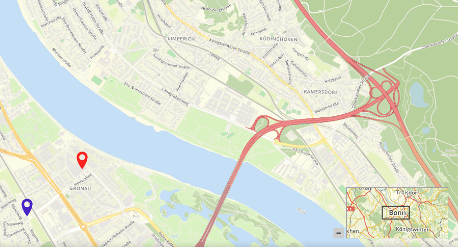

.. _overview:

Overview (Übersicht)
***********************

Mit diesem Element kann eine Übersichtskarte erstellt werden, ähnlich wie in OpenLayers.
Es kann die Größe des Übersichtsfensters und die Position bestimmt werden. In der Übersicht wird ein vorher definiertes Layerset angezeigt.
Die Übersichtskarte kann fixiert sein, oder sie ist zoomfähig, d.h. wenn in der Hauptkarte gezoomt wird, wird dies auch in der Übersicht angezeigt.
Es kann auch definiert werden, ob die Übersichtskarte nach dem Öffnen der Applikation minimiert oder maximiert ist.

Konfiguration
=============

Die Übersichtskarte muss in der Konfiguration unterhalb der Karte (map) platziert werden.

.. image:: ../../../../../figures/overview_configuration_dependency_map.png
   :scale: 80

Der Konfigurationsdialog:

.. image:: ../../../../../figures/de/overview_configuration.png
     :scale: 80

* **Maximieren:** definiert, ob die Applikation beim Start maximiert ist, der Standardwert ist true.
* **Fixieren:** Bereich der Übersichtskarte kann fixiert werden, der Standardwert ist true.
* **Title:** Titel des Elements. Dieser wird in der Layouts Liste angezeigt und ermöglicht, mehrere Button-Elemente voneinander zu unterscheiden. Der Titel wird außerdem neben dem Button angezeigt, wenn "Beschriftung anzeigen" aktiviert ist.
* **Tooltip:** Text, der angezeigt wird, wenn der Mauszeiger eine längere Zeit über dem Element verweilt.
* **Layerset:** vorher definiertes Layerset, das angezeigt werden soll.
* **Target:** ID des Kartenelements, auf das sich das Element bezieht. 
* **Anchor:** Ausrichtung der Übersicht, Standard ist 'right-top' (rechts oben).
* **Width/ Height:** Breite und Höhe der Übersichtskarte.

YAML-Definition:
----------------

.. code-block:: yaml

   tooltip: 'Overview'              # Text des Tooltips
   target: ~                        # ID des Kartenelements
   layerset: ~                      # vorher definiertes Layerset, das angezeigt werden soll.
   width: 200                       # Breite der Übersicht
   height: 100                      # Höhe der Übersicht
   anchor: 'inline'/'left-top'/     # Ausrichtung der Übersicht, Standard ist 'right-top' (rechts oben)
     'left-bottom'/'right-top'/     # Benutzen Sie inline z.B. für die Sidebar
     'right-bottom'   
   position: array('0px','0px')     # Position der Übersicht in Relation zum Anker, Standard: x=0px, y=0px
   maximized: true                  # true/false ob die Applikation beim Start maximiert ist, der Standardwert ist true
   fixed: true                      # true/false um den Übersichtsbereich zu fixieren, der Standardwert ist true

Class, Widget & Style
============================

* **Class:** Mapbender\\CoreBundle\\Element\\Overview
* **Widget:** mapbender.element.overview.js
* **Style:** mapbender.element.overview.css

HTTP Callbacks
==============

Keine.

JavaScript API
==============

Keine.

JavaScript Signals
==================

Keine.
