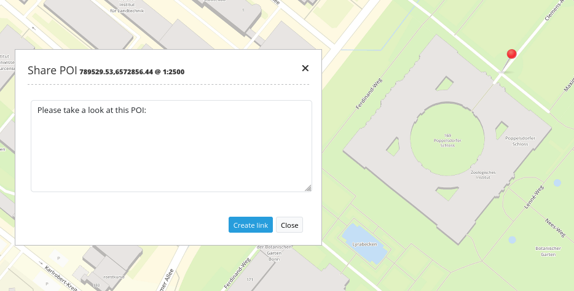
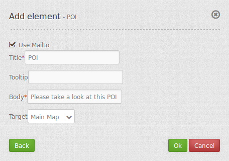

.. _poi:

POI (Treffpunkt)
**************************

Generiert POI-URLs (Treffpunkt-URLS), verwendbar für das Verschicken per eMail.

     

Konfiguration
=============

     

YAML-Definition:

.. code-block:: yaml

    target: map                             # only mapp-element is possible
    body: 'Setzen Sie per Klick einen Treffpunkt'  # definieren Sie einen Text für den Dialog

Class, Widget & Style
============================

* Class: Mapbender\CoreBundle\Element\POI
* Widget: mapbender.mbPOI

JavaScript API
==============

defaultAction
-------------

Ein Dialog wird geöffnet und wartet auf den nächsten Klick in der Karte, um einen POI Standort zu selektieren.
