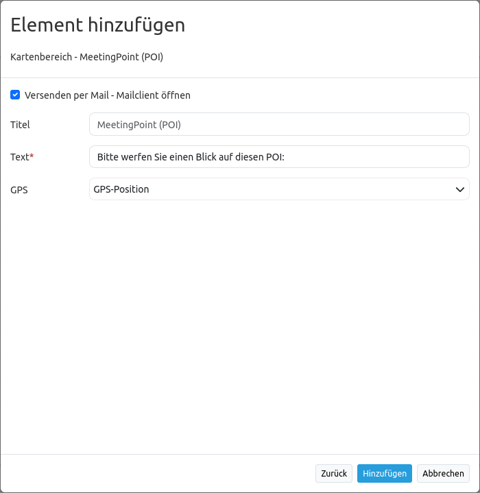

.. _poi:

POI (Treffpunkt)
**************************

Generiert POI-URLs (Treffpunkt-URLS), verwendbar für das Verschicken eines Koordinatenpunkts per eMail. Dabei wird der übermittelte Punkte in das Koordinatensystem der Karte projeziert und angezeigt.

.. image:: ../../../../../figures/de/poi.png
     :scale: 80
     

Konfiguration
=============

     

* **Title:** Titel des Elements. Dieser wird in der Layouts Liste angezeigt und ermöglicht, mehrere Button-Elemente voneinander zu unterscheiden. Der Titel wird außerdem neben dem Button angezeigt, wenn "Beschriftung anzeigen" aktiviert ist.
* **Tooltip:** Text, der angezeigt wird, wenn der Mauszeiger eine längere Zeit über dem Element verweilt.
* **Body:** Dialogtext der nach dem Setzen eines POI angezeigt wird. 
* **Target:** definiert das Kartenelement, auf dem der POI gesetzt wird.
* **Use Mailto:** nach dem Klick auf die Karte kann der POI Standort per Mail verschickt werden. 

YAML-Definition:
----

.. code-block:: yaml

    target: map                             # only mapp-element is possible
    body: 'Setzen Sie per Klick einen Treffpunkt'  # definieren Sie einen Text für den Dialog

Class, Widget & Style
============================

* **Class:** Mapbender\CoreBundle\Element\POI
* **Widget:** mapbender.mbPOI

JavaScript API
==============

defaultAction
-------------

Ein Dialog wird geöffnet und wartet auf den nächsten Klick in der Karte, um einen POI Standort zu selektieren.
