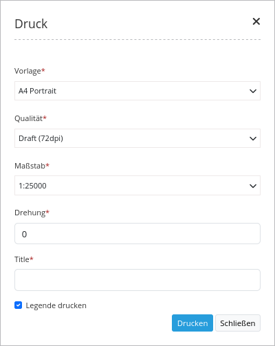
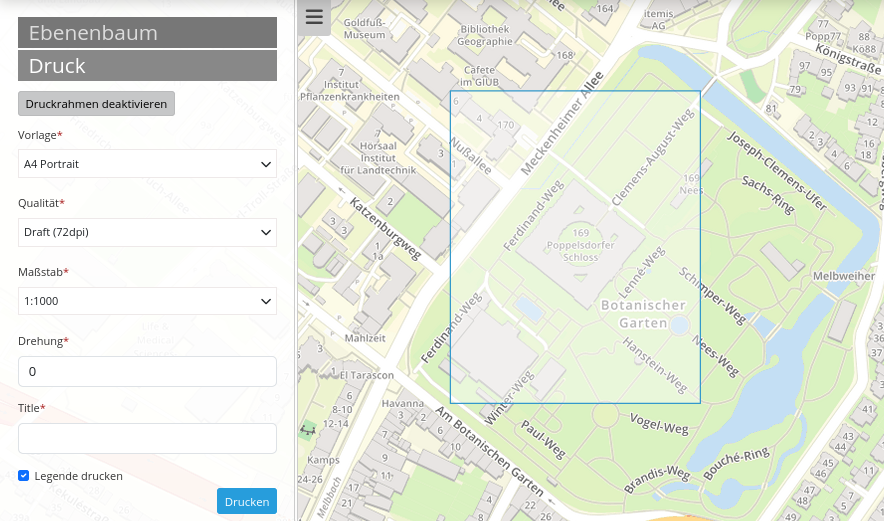
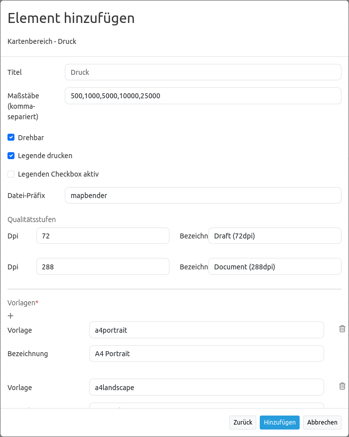
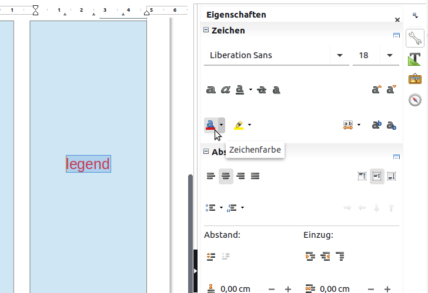
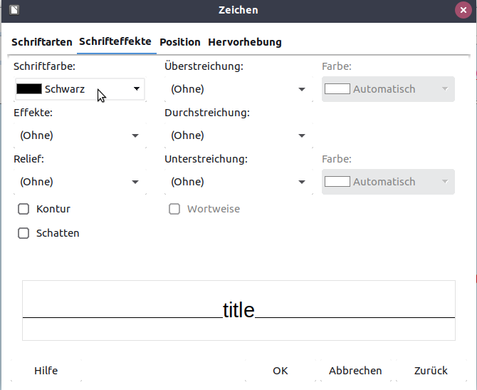
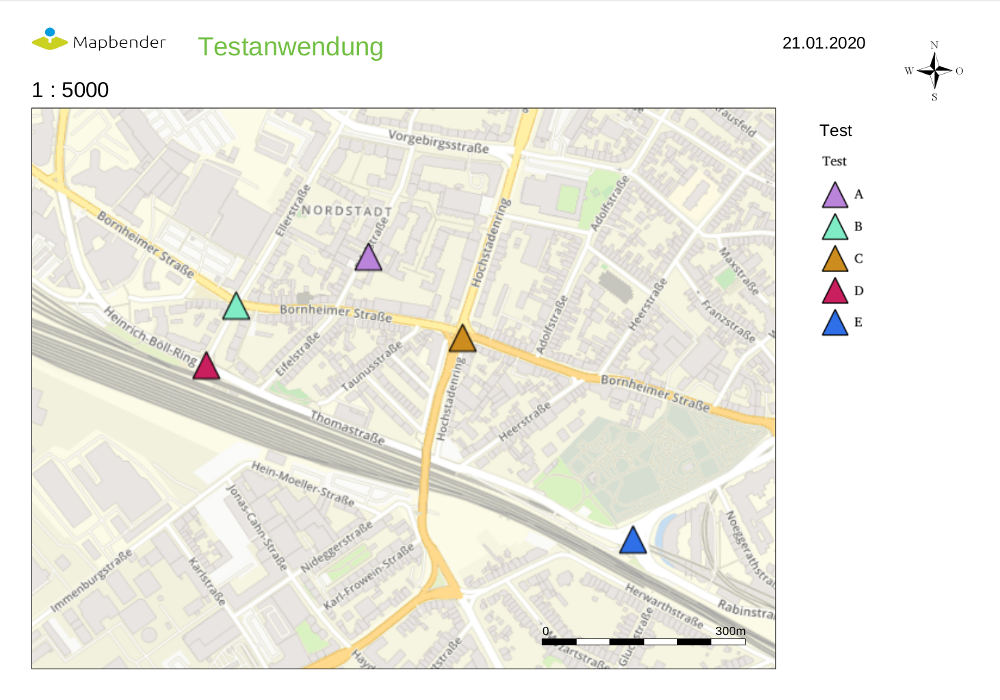

PrintClient (Druck)
*******************

Mapbender3 bietet einen PDF Druck, der einen definierten Bereich der Karte ausdruckt. Hierbei stehen dem Client verschiedene Auswahlmöglichkeiten zur Verfügung:

 * Auswahl Maßstab,
 * Auswahl Qualität,
 * Drehung des Ausschnitts,
 * Ausdruck Legende.
 * Optional können freie Textfelder definiert werden (z.B. Titel, Kommentar, Bemerkung), die mit in den Druck übergeben werden.

Der Druck greift auf Druckvorlagen zu, die individuell angepasst werden können. In den Druckvorlagen können Bereiche für Datum, Maßstab (Text und Maßstabsbalken), Übersichtskarte und Nordpfeil definiert werden.

Mapbender3 bringt bereits eine Kollektion von Druckvorlagen (LibreOffice Draw Dateien in den Formaten A4 bis A0) mit, die individuell angepasst werden können.

Der PrintClient kann sowohl als Dialog als auch als Element in der Sidebar verwendet werden. Wenn er sich in der Sidebar befindet, müssen Sie zuerst den Druckrahmen aktivieren, um den Druck starten zu können. Wenn Sie fertig sind, müssen Sie den Druckrahmen wieder deaktivieren, damit die Karte wieder wie gehabt genutzt werden kann (im Dialog geschieht dies alles durch das Öffnen und Schließen des Dialogfensters).

             
Konfiguration
=============

Das Element kann über einen Button aufgerufen werden oder in der Sidepane (Seitenleiste) verwendet werden. Siehe unter :doc:`button` für die Konfiguration.

* **Titel**: Titel des Elements. Dieser wird in der Layouts Liste angezeigt und ermöglicht, mehrere Button-Elemente voneinander zu unterscheiden. Der Titel wird außerdem neben dem Button angezeigt, wenn "Beschriftung anzeigen" aktiviert ist.
* **Target**: Zielelement (ID des Kartenelements). 
* **Type**: element oder dialog, default ist dialog
* **Maßstabsstufen (Scales)**: Maßstäbe, die in der Selectbox ausgewählt werden können. Wenn keine Maßstäbe angegeben werden, kann ein beliebiger Maßstab in einem Textfeld definiert werden.
* **Drehbar**: definiert, ob der Ausdruck gedreht werden kann, der Standardwert ist true
* **Legende drucken**: ob auch die Legende der Karte gedruckt werden soll, der Standardwert ist false
* **Legenden Checkbox aktiv**: Soll die Legenden-Checkbox beim Start aktiv sein
* **File prefix**: Definition des Dateinames für das PDF
* **Qualitätsstufen**: Qualität in dpi-Werten definieren und die dazugehörige Beschriftung angegeben
* **Template**: Verweis auf die Druckvorlage (z.B. a4potrait).
* **Beschriftung (Label)**: Beschriftung des Feldes (z.B. Potrait A4).

* **Optionale Felder (optional field)**:
  
  * **title**: Name des optionalen Feldes, der Standardwert ist null (keine optionalen Felder sind definiert).
  * **label**: Beschriftung des optionalen Feldes.
  * **options**: { required: true } : Typ des optionalen Feldes, muss true oder false sein.
    
* **Replace pattern**: Kartenaufruf kann verändert werden. Angaben können angefügt oder verändert werden, wie beispielsweise map_resolution (für MapServer).

  
YAML-Definition:
----------------

.. code-block:: yaml

    target: map                    # ID des Kartenelements
    type: dialog                   # element oder dialog, default ist dialog
    templates:
        - { template: a4portrait, label: A4 Portrait}	# Vorlagen (template): Vorlagename, Vorlagedateiname ohne Dateierweiterung (Mapbender sucht die Datei a4portrait.odg und a4portrait.pdf), die Vorlagedateien befinden sich in app/Resources/MapbenderPrintBundle
        - { template: a4landscape, label: A4 Landscape} 	# Vorlagebeschriftung im Druckdialog
    scales: [5000, 10000, 25000]   # Maßstäbe definieren, die in der Selectbox ausgewählt werden können. Wenn keine Maßstäbe angegeben werden, kann ein beliebiger Maßstab in einem Textfeld definiert werden.
    quality_levels:				   # die Qualität in dpi definieren und die dazugehörige Beschriftung angegeben
        - { dpi: 72 , label: Draft (72dpi)}		# die erste Angabe ist der dpi Wert, die zweite Angabe ist die Beschriftung
        - { dpi: 288,  label: Document (288dpi)}	# es können weitere dpi-Werte angegeben werden
    rotatable: true                             	# true/false ob der Ausdruck gedreht werden kann, der Standardwert ist true
    legend: true                   # true/false, der Standardwert ist false
    legend_default_behaviour: false # true/false, Legenden Checkbox standardmäßig ausgewählt
    file_prefix: mapbender3        # Definition des Dateinames für das PDF (wird zusammengesetzt zu file_prefix_date.pdf)
    optional_fields:               # es können optional weitere Felder definiert werden (z.B. Titel-Feld)
        title:                     # Name des optionalen Feldes, der Standardwert ist null (keine optionalen Felder sind definiert)
            label: Titel           # Beschriftung des optionalen Feldes
            type: text             # Typ des optionalen Feldes
            options:                            
                required: true     # erforderlich: true or false
        comment1:
            label: Kommentar 1
            options: { required: false }
        comment2:
            label: Kommentar 2
            options: { required: false }
        bearbeiter:
            label: Bearbeiter
            options: { required: true }
    replace_pattern:               # Für den Druck kann der Kartenaufruf verändert werden. 
            -                      # Es können zusätzliche Parameter hinzugefügt werden (wie map_resolution für MapServer)
                default: { 288: '&map_resolution=288' }
            -
                pattern: 'stadtplan.xml'        # oder es können für den Druck optimierte Dienste angefordert werden.
                replacement: { 288: 'stadtplan_4.xml' }

Class, Widget & Style
======================

* Class: Mapbender\\CoreBundle\\Element\\PrintClient
* Widget: mapbender.element.printClient.js

File location
=============
**northarrow**
Das Bild des Nordpfeils ("North arrow") befindet sich unter **app/Resources/MapbenderPrintBundle/images/**. Sie können das Bild des Nordpfeils auch durch ein anderes Bild ersetzen.

**print templates**
Die Vorlagen befinden sich unter **app/Resources/MapbenderPrintBundle/templates/**. Sie können eigene Druckvorlagen erstellen.

Erstellen eines individuellen Vorlage
=====================================
Um eine individuelle Druckvorlage zu erstellen, kopieren Sie eine vorhandene Druckvorlage (ODG-Datei) und bearbeiten diese. Sie können auch eine neue Libre Office Draw-Datei erzeugen. Die Vorlage kann feste Objekte wie ein Logo, ein Copyright oder Druckinformationen beinhalten. Zusätzlich muss eine Ebene für die dynamischen Elemente wie die Karte, die Übersichtskarte, der Nordpfeil, der Maßstab, das Datum und optionale Felder erstellt werden. Die dynamische Ebene ist eine zusätzliche nicht druckbare Ebene in der Libre Office Draw-Datei. Fügen Sie die Ebene in Libre Office Draw folgendermaßen hinzu: **Menü: Einfügen -> Ebene... -> definieren Sie einen Namen für die Ebene und wählen Sie die Option nicht druckbar**.

.. image:: ../../../../../figures/print_template_odg.png
     :scale: 80

Definieren Sie Bereiche für die Karte, den Nordpfeil, den Maßstab, das Datum und mehr sowie für optionale Felder. 

Die folgenden Bereiche liegen standardmäßig vor:

* map (Karte)
* overview (Übersichtskarte)
* scale (Maßstabsangabe in der Form 1:1000)
* scalebar (Maßstabsleiste)
* date (Datum in der Form 10.10.2014)
* northarrow (Nordpfeil)
* extent_ur_y, extent_ur_x, extent_ll_x, extent_ll_y (Koordinaten des Druckbereichs)
* dynamic_image (dynamisches Bild - gekoppelt an die Gruppe)
* dynamic_text (dynamischer Text - gekoppelt an die Gruppe)

Sie könne optionale Felder über die Element-Konfiguration definieren (wie Titel, Kommentar, Bearbeiter). Diese müssen Sie dann auch in die Open Office Draw Datei einfügen. Die dynamisch erstellten Text müssen in der ODG-Datei auf dem nicht druckbaren Bereich abgelegt werden, so dass Sie nicht im Vorlage-PDF ausgegeben werden.

Bei der Erstellung dynamischer Texte müssen die jeweiligen Objekte den passenden Namen haben, z.B. das Kommentarfeld **comment1** muss auch in der Vorlage **comment1** heißen. Zum Bennenen der Objektfelder reicht es nicht den Textinhalt anzupassen. Die Felder müssen selektiert und über **Menü Ändern --> Name...** angepasst werden. 

.. image:: ../../../../../figures/de/print_template_name.png
    :scale: 80

Exportieren Sie die Vorlage als PDF unter dem gleichen Namen wie die ODG-Datei. Verwenden Sie den Namen ohne Dateierweiterung in der Druck yml-Definition.

Das Druck-Skript liest die Informationen (Position, Größe, Schriftgröße, Ausrichtung) aus der ODG-Datei aus und verwendet ebenfalls das PDF-Dokument mit den festen Objekten. Aus beiden und den aktuellen Karten wird dann eine PDF-Druckdatei erstellt.

Druck von Elementen vor dem Kartenbild
========================================

Damit beim Druck der Kartenbereich möglichst groß ist und wenig Platz durch weiße oder leere Bereiche verloren geht können Elemente vor das Kartenbild gelegt werden. Besonders hilfreich ist dies vorallem bei großen Druckformaten, wie DIN A1, die einen verhältnissmäßig breiten weißen Rand aufweisen. 

Für die Nutzung dieser Funktion müssen die Templates angepasst und transparente PDF-Vorlagen erzeugt werden. 

Templates anpassen:

* Elemente neu anordnen, am besten vor weißem Hintergrund

  - Anordnung der Elemente im Vordergrund

    + Rechtsklick Anordnen -> Ganz nach vorne

  - Anordnung Karte = ganz nach hinten

    + Rechtsklick Anordnen -> Ganz nach hinten

* Alles selektieren

  - STRG + A drücken

* Selektion als PDF drucken

  - Exportieren als PDF

  - Bereich Auswahl statt Alle

Legende auf der ersten Seite
=============================

Neben dem Kartenbereich kann die Legende auf der ersten Seite der Druckvorlage integriert werden. Standardmäßig ist dieser Bereich nicht in den Druckvorlagen vorhanden. Für die Integration der Legende wird die Libre Office Draw-Druckvorlage angepasst. Fügen Sie ein neues dynamisches Feld mit dem Namen "legend" auf der nicht druckbaren Ebene ein und platzieren Sie es an der gewünschten Stelle. Die Bezeichnung des Feldes zu "legend" wird über **Menü: Ändern -> Name…** verändert. Sobald das Element platziert und benannt wurde, wird Ihnen an dieser Stelle im Druck die Legende angezeigt. Abschließend müssen Sie die ODG-Datei als PDF exportieren und im gleichen Ordner abspeichern. Die Legende auf der ersten Seite kann wie folgt aussehen:

.. image:: ../../../../../figures/print_client_example_legend.png
     :scale: 80

Logo auf der Legendenseite
=============================

Sofern die Legende weiterhin auf einer zusätzlichen Seite erzeugt werden soll, können Sie auf dieser zweite Seite ebenfalls ein Logo einbinden. Dies erfolgt über das dynamische Element "legendpage_image" Hierfür fügen Sie ein neues Feld in der nicht druckbaren Ebene ein, das Sie über **Menü: Ändern -> Name...** in "legendpage_image" umbenennen und an gewünschter Stelle platzieren. Das Logo oder Bild, welches Sie dort einfügen möchten, speichern Sie im Ordner **app/Resources/MapbenderPrintBundle/images/** unter dem Namen "legendpage_image.png" ab.
Das erzeugte PDF kann beispielsweise aus folgenden beiden Seiten bestehen:

.. image:: ../../../../../figures/print_client_example_legendpage_image.png
     :scale: 80
Auf der zweiten Seite erscheint das eingefügte Logo.

Farbige Texte
==============

Der Text der Druckvorlage kann vielfältig angepasst werden. Neben der Schriftgröße, besteht die Möglichkeit die Farbe des Textes zu verändern. Erzeugen Sie hierfür ein Textfeld über **Menü: Einfügen -> Textfeld**. Tragen Sie den gewünschten Text ein. Möchten Sie diesen Text als dynamisches Element einbinden, fügen Sie dieses auf Ihrer vorher festgelegten nicht druckbaren Ebene ein und benennen es entsprechend. Hier wurde als Beispiel das dynamische Element "title" gewählt. Um den Text oder den Platzhalter zu färben, markieren Sie den Text innerhalb des Textfeldes (hier: "title"). Die Änderung der Farbe können Sie entweder rechts neben Ihrer Vorlage unter dem Reiter **Eigenschaften -> Zeichen** vornehmen.

Oder Sie öffnen über **Rechtsklick auf den markierten Text -> Zeichen ...** das Dialogfeld Zeichen und verändern die Farbe unter **Schrifteffekte -> Schriftfarbe**.

Die Veränderung der Farbe des dynamischen Feldes "title" in blau kann im Druck wie folgt aussehen:

Analog zu der Veränderung der Schriftfarbe, wird auch die Veränderung der Schriftgröße durchgeführt.

Dynamische Bilder und dynamische Texte
=======================================

Gruppenabhängig können in der Druckausgabe unterschiedliche Bilder oder Beschreibungen (z.B. Logo und Bezeichnung der Gemeinde) ausgegeben werden. Hierzu gibt es die Platzhalter "dynamic_image" und "dynamic_text". Beide Elemente können in der ODG-Druckvorlage in die nicht druckbare Ebene eingefügt, benannt (**Menü: Ändern -> Name...**) und entsprechend platziert werden. Sobald diese Bereiche im Drucklayout vorliegen wird nach einem Bild mit dem Namen der Gruppe gesucht und dieses im Bereich "dynamic_image" ausgegeben. Hierbei wird die Höhe zur Orientierung verwendet und die Breite entsprechend angepasst. Die verschiedenen Bilder je Gruppe werden im Ordner **app/Resources/MapbenderPrintBundle/images/** unter dem jeweiligen Namen der Gruppe abgelegt (z.B. Name der Gruppe ist "Gruppe 1", dann lautet der Name des Bildes Gruppe 1.png). Unter "dynamic_text" wird die Beschreibung der Gruppe ausgegeben.
Ein gruppenabhängiger Druck könnte bei einer Gruppe namens "Gruppe 1" wie folgt aussehen:

.. image:: ../../../../../figures/print_client_example_groups.png
     :scale: 80
Zur Nutzung dieser Funktion müssen Sie vorher Gruppen erstellen und den Anwendungen die jeweiligen Gruppen zuordnen. Die Funktionsweise der Gruppen- und Benutzerverwaltung finden Sie in der Mapbender3 Dokumentation im Mapbender3 Quickstart unter:
https://doc.mapbender3.org/de/book/quickstart.html

Konfiguration des Elements
==========================

Gehen Sie in der Administration von Mapbender3 zu Ihrer Anwendung und erzeugen Sie ein Element **Druck** (Beachten Sie: Das Element kann über einen Button aufgerufen werden oder in der Sidepane (Seitenleiste) verwendet werden).
