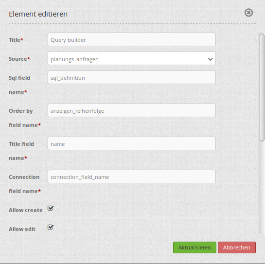
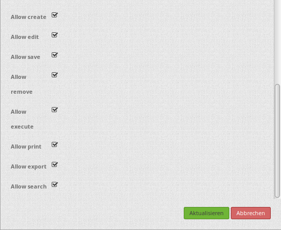
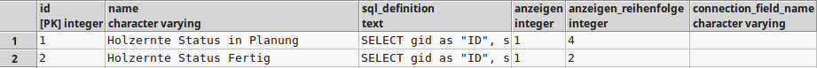
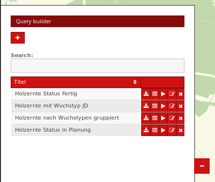
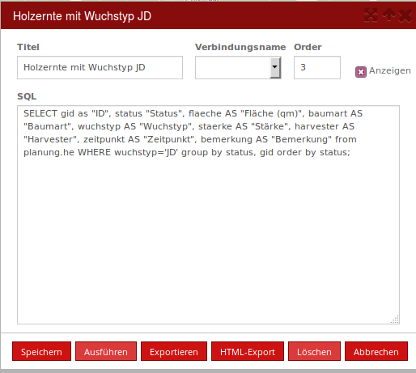
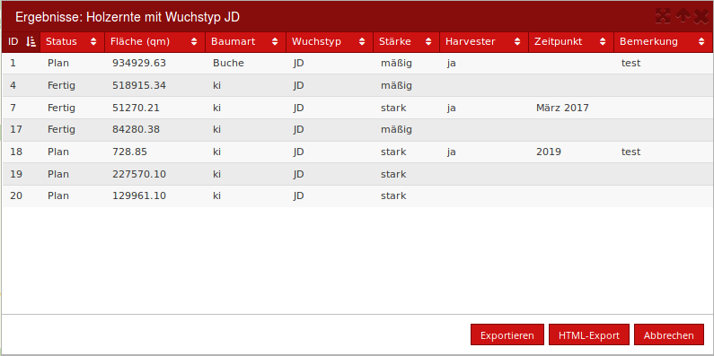

.. _query_builder:

Query Builder 
**************

Der QueryBuilder ist ein Abfragewerkzeug und ermöglicht das Einbinden, Anzeigen und Editieren von SQL-Abfragen und deren Ergebnissexport über die Anwendungsoberfläche. 
Die SQL-Abfragen können in Mapbender3: 

* neu erstellt,
* editiert, 
* gespeichert,
* gelöscht, 
* ausgeführt,
* gedruckt,
* exportiert und
* gesucht

werden. 
In der Konfiguration des Elements können die jeweiligen Berechtigungen für die Abfragemöglichkeiten vergeben werden.

Konfiguration
=============

Das Element kann in der Sidepane eingebettet werden.

* **Title:** Titel des Elements. Dieser wird in der Layouts Liste angezeigt und ermöglicht, mehrere Elemente voneinander zu unterscheiden.
* **Source:** Datenbankquelle (wird in der parameters.yml vordefiniert, z.B. mapbender_sqls)
* **SQL field name:** Tabellenspalte mit der SQL-Abfrage (z.B. sql_definition)
* **Order by field name:** Tabellenspalte für die Angabe der Reihenfolge in der SQL-Abfragetabelle (z.B. anzeigen_reihenfolge) 
* **Title field name:** Tabellenspalte mit dem Namen der SQL-Abfrage. Wird später in der SQL-Abfragetabelle als Titel angezeigt (z.B. name)   
* **Connection field name:** Tabellenspalte mit der Datenbankquelle der SQL-Abfrage (z.B. connection_field_name)  
* **Allow create:** Aktivieren erlaubt die neue Erstellung von SQL-Abfragen. Standardmäßig nich ausgewählt. 
* **Allow edit:** Aktivieren erlaubt die Bearbeitung der SQL-Abfragen. Standardmäßig nich ausgewählt.

* **Allow save:** Aktivieren erlaubt das Speichern von Veränderungen der SQL-Abfragen. Standardmäßig nich ausgewählt.
* **Allow remove:** Aktivieren erlaubt das Löschen von SQL-Abfragen. Standardmäßig nich ausgewählt.
* **Allow execute:** Erlaubt das Ausführen der SQL-Abfragen. Standardmäßig ausgewählt.
* **Allow print:** Erlaubt das Drucken der Ergebnisse von SQL-Abfragen. Standardmäßig ausgewählt.
* **Allow export:** Erlaubt das Exportieren der Abfrageergebnisse. Standardmäßig ausgewählt. 
* **Allow search:** Aktivieren erlaubt das Suchen nach SQL-Abfragen/Abfrageergebnisse. Standardmäßig nich ausgewählt.

Erstellen einer Datenbankverbindung
------------------------------------

Das Abfragewerkzeug benötigt einen Zugriff auf die Datenbank, in der die zu editierenden Tabellen liegen. 
Für die Nutzung der Funktion muss daher eine Datenbankverbindung und eine DataStore-Verbindung zu dieser Datenbank in der parameters.yml eingerichtet werden.
Mehr zu dem Thema Datenbankzugriff finden Sie unter http://doc.mapbender3.org/de/book/database.html

Konfigurationsbeispiel für die parameters.yml: 

.. code-block:: yaml

    ...
    database2_driver:   pdo_pgsql
    database2_host:     localhost
    database2_port:     5432
    database2_name:     search_db
    database2_path:     ~
    database2_user:     postgres
    database2_password: [geheim]
    
    ...
    # ans Ende der Datei den folgenden Verbindungsabschnitt übertragen                
    # für den DataStore in der parameters.yml
    ...

    dataStores:
        mapbender_sqls:
            connection: search_db
            table: search_db.mapbender_sqls
            uniqueId: id
            #filter: anzeigen = '1'   #optional kann fur die spätere Anzeige ein Filter eingebunden werden

Nachdem diese Verbindung eingetragen wurde kann in der Datenbank eine Administrationstabelle für die Abfragedefinitionen erstellt werden, 
die dann über das Abfragewerkzeug im Mapbender3 abgefragt wird. 

Administrationstabelle für die Abfragedefinitionen und Metadaten
-------------------------------------------------------------------

Für die Abfrage wird in der Datenbank eine Tabelle zur Speicherung und Organisation der SQL-Abfragen benötigt. 

Diese Administrationstabelle kann über den folgenden SQL-Befehl in einer bestehenden Datenbank angelegt werden: 

.. code-block:: yaml

    CREATE TABLE abfragen
    ( 
      id serial NOT NULL,   
      name character varying,  -- Name der Abfrage/ Titel
      sql_definition text,     -- SQL Befehl für die Abfrage
      anzeigen integer,        -- Angabe, ob Abfrage in der Liste erscheinen soll
      anzeigen_reihenfolge integer, -- Reihenfolge der Abfrageanzeige
      CONSTRAINT pk_abfragen_id PRIMARY KEY (id)
    )
    WITH (
      OIDS=TRUE
    );

Für die beispielhafte Nutzung können zudem die folgenden Demodaten mit dazugehörigen SQL-Abfragen eingebunden werden. 
Die SQL-Befehle für das Anlegen der abgefragten Tabellen finden Sie in der Doku zum Digitizer-Element. 

.. code-block:: yaml
                
    INSERT INTO abfragen (name, sql_definition, anzeigen, anzeigen_reihenfolge) VALUES ('Point', 'SELECT * FROM public.poi;', NULL, 2);
    INSERT INTO abfragen (name, sql_definition, anzeigen, anzeigen_reihenfolge) VALUES ('Polygon', 'SELECT * FROM public.polygon;', NULL, 3);
    INSERT INTO abfragen (name, sql_definition, anzeigen, anzeigen_reihenfolge) VALUES ('Line', 'SELECT * FROM public.line;', NULL, 4);
    INSERT INTO abfragen (name, sql_definition, anzeigen, anzeigen_reihenfolge) VALUES ('Interests', 'SELECT * FROM public.interests;', NULL, 1);

+------------+---------------------------------+----------------------+
|    name    |         sql_definition          | anzeigen_reihenfolge |
+============+=================================+======================+
|    Point   | SELECT * FROM public.poi;       |          2           |
+------------+---------------------------------+----------------------+
|  Polygon   | SELECT * FROM public.lines;     |          3           |
+------------+---------------------------------+----------------------+
|    Line    | SELECT * FROM public.polygons;  |          4           |
+------------+---------------------------------+----------------------+
| Interests  | SELECT * FROM public.interests; |          1           |
+------------+---------------------------------+----------------------+

Nachdem nun die Administrationstabelle angelegt wurde und bereits Demodaten enthält müssen Sie nun das Element in die Sidepane der Mapbender3-Anwendung einbinden. 
Dazu können Sie die beschriebenen Einstellungen in dem Punkt "Konfiguration" übernehmen. 

Funktionen 
-----------

Nach der Einbettung in der Seitenleiste werden die Abfragen in einer Liste angezeigt und über Buttons können alle aktivierten Funktionen genutzt werden. 
Simultan zu dem Funktionsumfang in Mapbender3 können die Abfragen weiterhin direkt in der Datenbank editiert und angepasst werden. 

Die Buttons in der Tabelle rechts neben einem Eintrag haben folgende Funktionen: 

* **Exportieren:** Die Abfrageergebnisse der ausgewählten SQL-Abfrage werden als EXCEL-Tabelle exportiert.
* **HTML-Export:** Die Abfrageergebnisse der ausgewählten SQL-Abfrage werden im HTML-Format exportiert. Es öffnet sich ein neuer Dialog mit der tabellarischen Anzeige der Ergebnisse.
* **Ausführen:** Die Abfrageergebnisse der ausgewählten SQL-Abfrage werden in einem Dialogfeld angezeigt. Die Ergebnisse können in der Tabelle auf- und absteigend sortiert werden. Über die Buttons Exportieren und HTML-Export können sie exportiert werden. 
* **Ändern:** Die SQL-Abfrage kann editiert werden (Vgl. oben: neue SQL-Abfrage). 
* **Löschen:** Die Abfrage wird gelöscht. 

Der *Plus-Button* oben erlaubt dem Benutzer eine **neue SQL-Abfrage** zu erstellen. 

Dabei müssen der Titel, der Verbindungsname zu der Datenbank und die Sortierungsnummer angegeben werden. Optional kann das Kästchen *Anzeigen* aktiviert werden. 
In das große Eingabefeld kann nun eine SQL-Abfrage geschrieben werden. Durch *Speichern* wird die Abfrage gespeichert und diese kann in der Liste ausgewählt werden. 
Über den Klick auf *Ausführen* öffnet sich ein Dialogfeld mit den Ergebnissen der Abfrage. Hier kann getestet werden, ob die Abfrage funktioniert und alle Ergebnisse korrekt angezeigt werden. 

Durch *Exportieren* und *HTML-Export* können die Ergebnisse exportiert werden. 

Über den *Löschen-Button* wird die Abfrage gelöscht und über *Abbrechen* kann die Erstellung abgebrochen werden. 

Unter diesem Button befindet sich die **Suche**, über die eine Abfrage aus der Liste gesucht werden kann. 

YAML-Definition:
-----------------

.. code-block:: yaml
                
 title: Abfragen                              # Titel des Elements. Dieser wird in der Layouts Liste angezeigt und ermöglicht, mehrere Elemente voneinander zu unterscheiden.
  configuration:
    source: mapbender_sqls                          # Datenbankquelle (wird in der parameters.yml vordefiniert).
    allowedSchemas: {  }                      # Optionale Angabe: Erlaubt die Angabe von einzelnen Datenbankschematas der source für die Abfrage, z.B. public.
    allowRemove: true                         # Aktivieren erlaubt das Löschen von SQL-Abfragen. Standardmäßig false.
    allowEdit: true                           # Aktivieren erlaubt die Bearbeitung der SQL-Abfragen. Standardmäßig false.
    allowExecute: true                        # Erlaubt das Ausführen der SQL-Abfragen. Standardmäßig true.
    allowSave: true                           # Aktivieren erlaubt das Speichern von Veränderungen der SQL-Abfragen. Standardmäßig false.
    allowCreate: true                         # Aktivieren erlaubt die neue Erstellung von SQL-Abfragen. Standardmäßig false
    allowExport: true                         # Erlaubt das Exportieren der Abfrageergebnisse im EXCEL Format. Standardmäßig true.
    allowHtmlExport: true                     # Erlaubt das Exportieren der Abfrageergebnisse im HTML Format. Standardmäßig true.
    allowPrint: true                          # Erlaubt das Drucken der Ergebnisse von SQL-Abfragen. Standardmäßig true.
    allowUserPublishing: true                 # Erlaubt das Veröffentlichen der Ergebnisse von SQL-Abfragen.
    idFieldName: id                           # Tabellenspalte mit der ID der SQL-Abfrage.
    sqlFieldName: sql_definition              # Tabellenspalte mit der SQL-Abfrage.
    orderByFieldName: anzeigen_reihenfolge    # Tabellenspalte für die Angabe der Reihenfolge in der SQL-Abfragetabelle, in dem Beispiel "order".
    connectionFieldName: connection_field_name      # Tabellenspalte mit der Datenbankquelle der SQL-Abfrage.
    titleFieldName: name                      # Tabellenspalte mit dem Namen der SQL-Abfrage. Wird später in der SQL-Abfragetabelle als Titel angezeigt, in dem Beispiel "title".
    tableColumns:                             # Spalten mit Beschriftung für die Anzeige der SQL-Abfragetabelle in der Anwendung.
      -
        data: name
        title: Title
    allowSearch: true                         # Aktivieren erlaubt das Suchen nach SQL-Abfragen/Abfrageergebnisse. Standardmäßig nich ausgewählt.

Class, Widget & Style
======================

* **Class:** Mapbender\DataSourceBundle\Element\QueryBuilderElement
* **Widget:** mapbender.element.QueryBuilderElement.js
* **Style:** mapbender.elements.css

HTTP Callbacks
==============

Keine.

JavaScript API
==============

Keine.

JavaScript Signals
==================

Keine.
