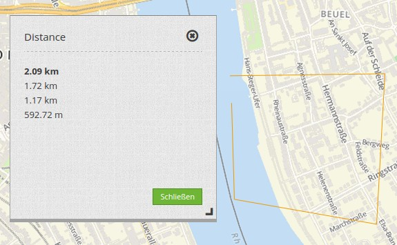
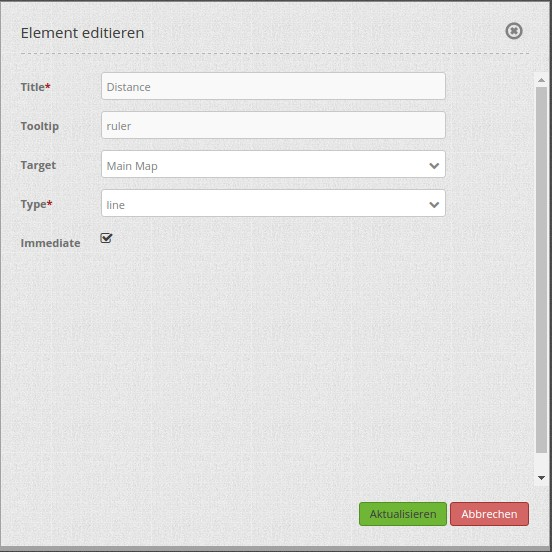

.. _ruler:

Line/Area Ruler (Längen und Flächen berechnen)
**********************************************
 
Mit dem Lineal wird eine Linie oder eine Fläche gezeichnet, deren Länge oder Flächeninhalt berechnet wird. Durch die Auswahl eines Typs wird bestimmt, ob das Element Linien oder Flächen misst. Jedes eingebundene Ruler-Element kann nur entweder Linien oder Flächen messen. 

Konfiguration
=============

* **Title:** Titel des Elements. Dieser wird in der Layouts Liste angezeigt und ermöglicht, mehrere Button-Elemente voneinander zu unterscheiden. Der Titel wird außerdem neben dem Button angezeigt, wenn "Beschriftung anzeigen" aktiviert ist.
* **Tooltip:** Text, der angezeigt wird, wenn der Mauszeiger eine längere Zeit über dem Element verweilt.
* **Target:** ID des Kartenelements, auf das sich das Element bezieht.
* **Type:** Typ des Elements, entweder 'line' oder 'area' (misst nur einzelne Linien oder addiert diese zu einer Fläche).
* **Immediate:** Auswahl, ob die errechneten Längen sofort angezeigt werden oder erst nach dem Klick angezeigt werden. 

YAML-Definition:
----------------

.. code-block:: yaml

   tooltip: "ruler"   # Text des Tooltips
   target: ~          # ID des Kartenelements
   type: 'line'       # Wählen Sie Typ 'line' oder 'area'
   immediate: 'false' # true: Zeige die errechneten Längen sofort an. false: Die errechneten Längen werden erst nach Klick angezeigt. Default: False.

Für das Element wird ein Button verwendet. Zu der Konfiguration des Buttons besuchen sie die Dokumentationsseite unter :doc:`button`.
Für die Nutzung von beiden Funktionen (Flächen- und Linien messen) in einer Anwendung brauchen Sie zwei Buttons, die in einer Gruppe sind. 

Class, Widget & Style
=====================

* **Class:** Mapbender\\CoreBundle\\Element\\Ruler
* **Widget:** mapbender.element.ruler.js, subclasses mapbender.element.button.js
* **Style:** mapbender.elements.css

HTTP Callbacks
==============

Keine.

JavaScript API
==============

activate
--------

Aktiviert das Modul, welches auf Mausklicks in der Karte wartet und dann die Messung startet.

deactivate
----------
Deaktiviert das Modul.

JavaScript Signals
==================

Keine.
