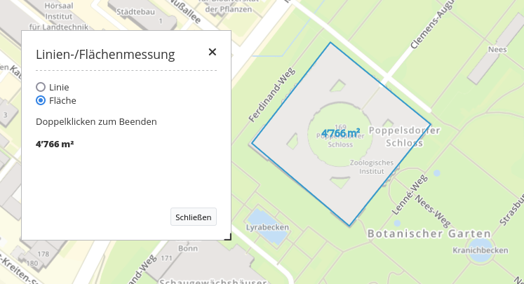
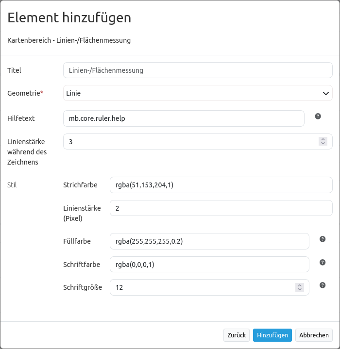

.. _ruler:

Line/Area Ruler (Längen und Flächen berechnen)
***************
 
Mit dem Lineal wird eine Linie oder eine Fläche gezeichnet, deren Länge oder Flächeninhalt berechnet wird.

Konfiguration
=============

Für das Element wird ein Button verwendet. Siehe unter :doc:`button` für die Konfiguration.

* Title: Titel des Elements. Dieser wird in der Layouts Liste angezeigt und ermöglicht, mehrere Button-Elemente voneinander zu unterscheiden. Der Titel wird außerdem neben dem Button angezeigt, wenn "Beschriftung anzeigen" aktiviert ist.
* Tooltip: Text, der angezeigt wird, wenn der Mauszeiger eine längere Zeit über dem Element verweilt.
* Target: Zielelement (Kartenelement (ID)) 
* Type: Typ des Elements, entweder 'line' oder 'area' (misst nur einzelne Linien oder addiert diese zu einer Fläche)

YAML-Definition:

.. code-block:: yaml

   tooltip: "ruler"   # Text des Tooltips
   target: ~          # ID des Kartenelements
   type: 'line'       # Wählen Sie Typ 'line' oder 'area'

Class, Widget & Style
=====================

* Class: Mapbender\\CoreBundle\\Element\\Ruler
* Widget: mapbender.element.ruler.js, subclasses mapbender.element.button.js
* Style: mapbender.elements.css

HTTP Callbacks
==============

Keine.

JavaScript API
==============

activate
--------

Aktiviert das Modul, welches auf Mausklicks in der Karte wartet und dann die Messung startet.

deactivate
----------
Deaktiviert das Modul.

JavaScript Signals
==================

Keine.
