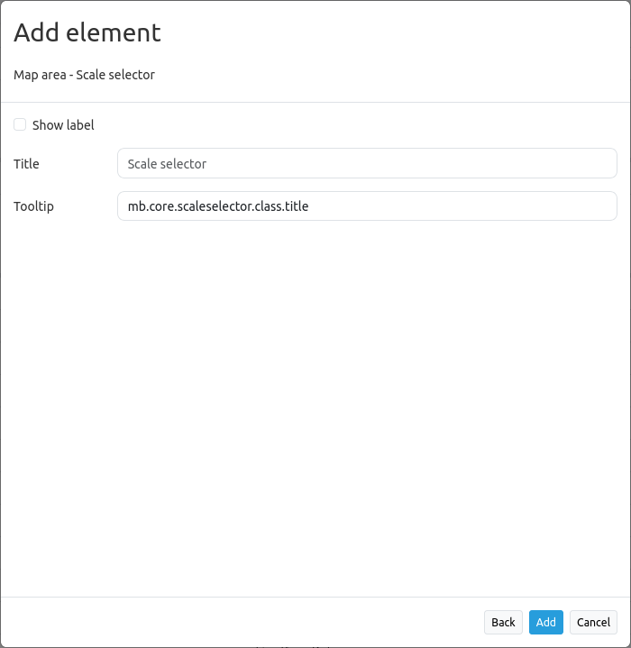

.. _scale_selector:

Scale Selector (Maßstabsauswahl)
************************************************

Dieses Element zeigt eine Auswahlbox mit Maßstäben an. Der Kartenmaßstab ändert sich, wenn ein neuer Wert der Auswahlbox ausgewählt wurde

Beachten Sie: Die Auswahlbox zeigt nur Maßstäbe an, die vorher für das Map Element angegeben wurden.

.. image:: ../../../../../figures/scale_selector.png
     :scale: 100

Konfiguration
=============

YAML-Definition:

.. code-block:: yaml

   tooltip: "Scale"  # Text des Tooltips
   target: ~         # ID des Kartenelements
   label: false      # false/true, um die Maßstabsauswahl zu beschriften. Der Standardwert ist false.
   

Class, Widget & Style
============================

* Class: Mapbender\\CoreBundle\\Element\\ScaleSelector
* Widget: mapbender.element.scaleselector.js
* Style: mapbender.elements.css

HTTP Callbacks
==============

Keine.

JavaScript API
==============

Keine.

JavaScript Signals
==================

Keine.
