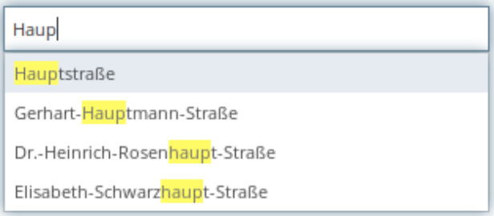

.. _search_digitizer:

Suche über Element Digitalisierung (Digitizer)
**********************************************
Das Digitizer-Element ermöglicht den Aufbau von Erfassungsoberflächen und enthält eine Einfeldsuche auf der Trefferliste.
In Zusammenhang mit der Digitalisierung können für die Erfassung von dazugehörigen Sachdaten sehr komplexe Formulare und eine komplexe Suche auf der Tabelle generiert werden. Mehr zu dem Element findet sich unter `Digitizer <digitizer.html>`_ .

Erweiterte Suche in Tabellen (search)
=====================================

Im Folgenden werden die einzelnen Bestandteile für die Suche über den Digitizer erklärt, die die Grundstruktur ausmachen und die in dem Formular eingebettet werden können.

Die erweiterte Suche (Parameter search) auf der Datenbanktabelle ist zusätzlich zu der simplen Suche (Parameter inlineSearch) in der Trefferliste möglich.

Für eine komplexere Suche können weitere Parameter angegeben werden, die das Finden bestimmter Fachinformationen in der Tabelle erleichtern.

Vorteil dieser Suche ist vor allem, dass das Koordinatensystem während der Suche geändert werden kann. Dies ist nicht bei dem `SearchRouter <search_router.html>`_ möglich. 

.. image:: ../../../../../figures/digitizer_search.png
     :scale: 50 %

YAML-Definition für die Suche im Element digitizer in der Textarea unter schemes
--------------------------------------------------------------------------------

.. code-block:: yaml

  poi_search:
    label: 'Punktsuche (nach Name und Typ)'
    featureType:
      connection: search_db
      table: public.poi
      geomType: point
      geomField: geom
      srid: 4326
      uniqueId: gid
    popup:
      title: 'Ergebnis Punktsuche'
      width: 400px
    zoomScaleDenominator: 500
    maxResults: 1000
    displayOnSelect: true
    searchType: all
    showExtendSearchSwitch: false
    oneInstanceEdit: false
    allowLocate: false
    allowDigitize: true
    allowEditData: false
    allowDelete: false
    allowChangeVisibility: false
    allowCustomerStyle: false
    showVisibilityNavigation: false
    useContextMenu: true
    displayPermanent: true
    displayOnInactive: true
    inlineSearch: false
    toolset: {  }
    search:
      mandatory:
        type: .+
        title: .+
      form:
        - type: select
          name: type
          value: A
          sql: |
            SELECT
              DISTINCT type,
              type
            FROM poi
            ORDER by type ASC  
          connection: search_db
        - type: select
          name: title
          placeholder: Punktname
          allowClear: true
          multiple: true
          language: de
          minimumInputLength: 1
          ajax:
            delay: 100
            connection: search_db
            sql: |
              SELECT  "name"
              FROM    "poi"
              -- Search only in one district, not everywear
              WHERE   "type" LIKE '$type'
              -- Try to find by 'name%' and '%%name%'
              AND (
                LOWER ("name") LIKE LOWER ('$title%')
                OR LOWER ("name") LIKE LOWER ('%%$title%')
              )
              -- Group street names
              GROUP BY "name"
              -- Sort by 'name%' first not '%%name%'
              ORDER BY LOWER ("name") LIKE LOWER ('$title%') DESC
              -- Max results count
              LIMIT 15
      conditions:
        - type: sql
          operator: and
          code: |
            "type" like '$type'
        - type: sql-array
          operator: OR      
          key: title
          code: |
            "name" LIKE '$value%' OR "name" LIKE '%%$value%'
    view:
      type: table
      settings:
        info: true
        processing: false
        ordering: true
        paging: true
        pageLength: 12
        selectable: true
        autoWidth: false
        order: [[1, "asc"]]
    tableFields:
      name:
        label: Punktname
        width: 60%
      type:
        label: Typ
        width: 40%
        align: right
    styles:
      default:
        graphic: true
        strokeWidth: 2
        strokeColor: '#648296'
        fillColor: '#7b9fb7'
        fillOpacity: 0.7
        fillWidth: 2
        pointRadius: 10
      select:
        strokeWidth: 3
        strokeColor: '#000000'
        fillOpacity: 1
        fillColor: '#435e70'
        fillWidth: 5
        label: '${name} ${type}'
        pointRadius: 15
      ...

* **mandatory:** Pflichtangabe, können bei der Abfrage definiert werden. Bei dem Beispiel muss z.B. erst eine Angabe des Typs und Punktnamen erfüllt sein, bevor ein Treffer in der Liste angezeigt wird. Möglich sind hier reguläre Ausdrücke, wie .+ (beide Abfragen müssen mind. eine Angabe haben, die mind. 1 oder mehr Zeichen enthält). 
* **multiple:** Auswahl mehrerer Suchbegriffe erlauben, z.B. mehrere Straßen [true/false]

.. [funktioniert noch nicht]* **maximumSelectionSize**: Maximale Angabe von Suchbegriffen [numeric] bei der Angabe von multiple: true.
* **minimumInputLength:** Minimale Anzahl an Zeichen für den Start der Suchanfrage. [numeric]
* **delay:** Wartezeitraum, bis die Suchanfrage abgeschickt wird (in Milisekunden), erleichtert Suche bei langsamen Tippen. [true/false]
* **sql:** Angabe einer SQL-Abfrage für die Suchfelder. Eine saubere und durchdachte SQL-Abfrage bewirkt die Ausgabe der Treffer in einer sinvollen Reihenfolge, z.B. erst Treffer, die den Suchbegriff an erster Stelle haben und nicht mitten im Treffer. Nutzung von **name** im SQL möglich.
* **name:** Variable, die in der SQL-Abfrage genutzt werden kann, z.B. $post_ortsname. Dadurch ist die SQL-Abfrage gegen Angriffe von Außen besser abgesichert.
* **value:** Vorgabewert aus den Werten in der Spalte, der bei keiner aktiven Angabe eines Wertes für die Suche genutzt wird.
* **formatSearching:** Platzhalter, während die Suche läuft.

Suchbedingungen (conditions)
----------------------------

Bedingungen (conditions) für Abfragen können fest vergeben werden. 
* **type:** Abfragetyp für die Bedingung [sql, php]
* **operator:** SQL-Verbindungstyp von Abfragen [AND, OR]
* **code:** Angabe von Code, der erfüllt werden muss bei einer Abfrage zu dem angegebenen Schlüsselwert (key)
* **key:** Schlüsselwert für die Abfrage, der im Codebereich referenziert wird

.. code-block:: yaml

  poi:
      ...
      inlineSearch: false
      search:
        ...
        conditions:
          - type: sql
            operator: and
            code:  |
               "type" like '$type'
          - type: sql-array
            key: name
            code:  |
               "name" LIKE '$value%' OR "name" LIKE '%%$value%'
            operator: OR
      ...

YAML-Definition für das Element "digitizer" in der Sidepane in der mapbender.yml
================================================================================

Dieser Codeabschnitt zeigt, wie das Digitizer Element in eine auf einer
YAML-Datei basierende Anwendung eingebaut werden kann.

.. code-block:: yaml

                sidepane:
                    digitizer:
                        class: Mapbender\DigitizerBundle\Element\Digitizer
                        title: Digitalisation
                        target: map
                        schemes:
                            ...

Class, Widget & Style
=====================

* Class: Mapbender\\DigitizerBundle\\Element\\Digitizer
* Widget: mapbender.element.digitizer.js
* Style: sass\\element\\digitizer.scss

