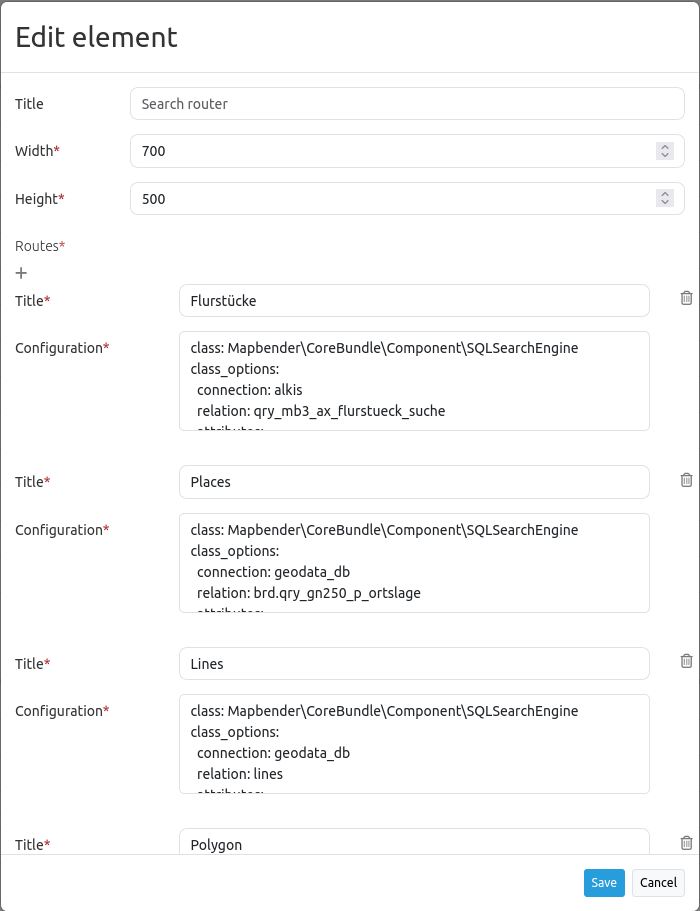

.. _search_router:

Search Router
***********************

Dieses Element ist eine Such-Frontend Oberfläche für Suchmaschinen-Module. Zur Zeit wird eine generische SQL Suchmaschine unterstützt, weitere Entwicklungen werden folgen (z.B. Lucene Suche)

Konfiguration
=============

Für das Element wird ein Button verwendet. Siehe unter :doc:`button` für die Konfiguration.

YAML-Definition:

.. code-block:: yaml

   target: map  # für die Ergebnisanzeige
   asDialog: true  # true, false im Dialog rendern
   timeoutFactor:  2  # timeout Faktor (multipliziert mit automatischem Verschiebungfaktor), um die automatische Vervollständigung direkt nach dem Start der Suche zu verhindern
   routes:      # Sammlung von Suchrouten
       demo_a:  # maschinenlesbarer Name
           title: Demo A  # von Menschen lesbarer Name
           class: Mapbender\CoreBundle\Component\SQLSearchEngine  # aktuelle Suchmaschine
           class_options:  # die class-options werden zur Suchmaschine weitergeleitet
               connection: ~  # verwendeter DBAL Verbindungsname, verwenden Sie ~ für den Standardnamen
               relation: test.demo_a  # ausgewählte Relation, Sie können Unterabfragen verwenden
               attributes: [id, name]  #  Array von Spalten, die ausgewählt werden können, Ausdrücke (expressions) sind möglich
               geometry_attribute: geom  # Name der Geometriespalte für die Suchanfrage
           form:  # Suchformularkonfiguration
               the_name:  # Feldname, verwenden Sie Relationsspaltennamen für die Abfrage oder anderes für geteilte Felder (siehe unten)
                   type: text  # Feldtyp, normalerweise Text oder Integer
                   options:  # Feld Optionen
                       required: true  # für HTML5 erforderliche Attribute, Standard ist true
                       attr:  # HTML Attribute
                           data-autocomplete: on  # Datenvervollständigung, Standard ist on (eingeschaltet)
                   split: [name, zusatz]  # optionales Feld, kann geteilt werden
                   autocomplete-key: id  # Spaltenname, der als automatisch vervollständigter Schlüssel zurückgegeben wird, anstatt eines Spaltenwertes
           results:
               view: table  #  nur aktuelle Ergebnisansicht
               headers:  #    Hash des Tabellen-Headers und die entsprechenden Ergebnisspalten
                   id: ID  # Spaltenname -> Header Beschriftung
                   name: # Name
               callback:  #  Was soll beim Klick/Mousover passieren
                   event: click  # Ergebniszeileereignis, auf das gehört werden soll (Klick oder Mouseover)
                   options:
                       buffer: 10  # Wert des Puffers für die Geometrie des Ergebnisses, bevor gezoomt wird
                       minScale: ~  # Maßstabsbeschränkung für das Zoomen
                       maxScale: ~

Class, Widget & Style
=====================

* Class: Mapbender\\CoreBundle\\Element\\SearchRouter
* Widget: mapbender.element.searchRouter.js, mapbender.element.searchRouter.Feature.js, mapbender.element.searchRouter.Search.js
* Style: mapbender.element.searchRouter.css

HTTP Callbacks
==============

<route_id>/autocomplete
-----------------------

Automatisch vervollständigter Ajax Endpunkt für die vorgegebene Suchroute. Die Autovervollständigung  wird unter Verwendung von Backbone.js eingesetzt. Das Autovervollständigung-Modul ist implementiert in mapbender.element.searchRouter.Search.js.

<route_id>/search
-----------------

Automatisch vervollständigter Ajax Endpunkt für die vorgegebene Suchroute. Die Suche  wird unter Verwendung von Backbone.js eingesetzt. Das Such-Modul ist implementiert in mapbender.element.searchRouter.Search.js.

JavaScript API
==============

open
----
Wenn das Modul als Dialog konfiguriert wird: open.

close
-----
Wenn das Modul als Dialog konfiguriert wird: close.

JavaScript Signals
==================

Keine.
