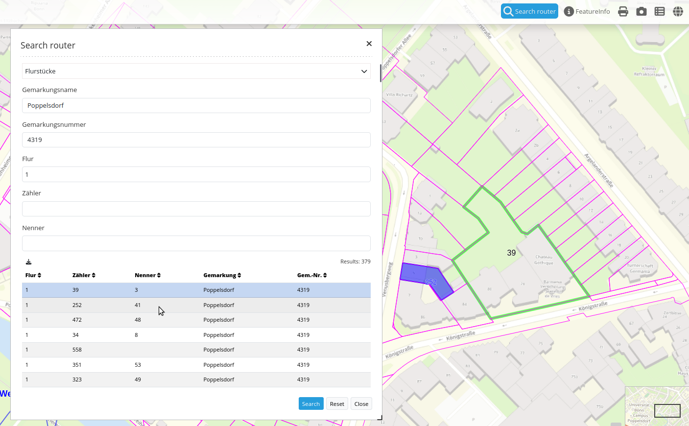

.. _search_router:

Search Router
***********************

Dieses Element ist eine Such-Frontend Oberfläche für Suchmaschinen-Module. Zur Zeit wird eine generische SQL Suchmaschine unterstützt, weitere Entwicklungen werden folgen (z.B. Lucene Suche)

Konfiguration
=============

.. image:: ../../../../../figures/search_router_configuration.png
     :scale: 80

Für das Element wird ein Button verwendet. Siehe unter :doc:`button` für die Konfiguration.

Die Suche greift auf Tabellen in einer Datenbank zu. Dafür muss die Datenbank in Mapbender bekannt gegeben werden. Informationen dazu finden sich unter http://doc.mapbender3.org/de/book/database.html

Es können über den Button + mehrere Suchen (routes) erstellt werden. Jede Suche erhält im Feld titel einen Titel, über den die Suche nachher in einer Auswahlbox selektierbar ist.

Die Definition der Suche erfolgt im yaml-Syntax in einem Textfeld. Hier wird die Suchtabelle/Abfrage, die Datenverbindung, der Formularaufbau und die Trefferausgabe definiert. 

Element Definition im Web Administrationstool im Textfeld configuration:

.. code-block:: yaml

    class: Mapbender\CoreBundle\Component\SQLSearchEngine
    class_options:
        connection: search_db
        relation: ortschaften
        attributes:
            - gid
            - ortsname
        geometry_attribute: geom
    form:
        ortsname:
            type: text
            options:
                required: true
            compare: exact
    results:
        view: table
        count: true
        headers:
            gid: ID
            ortsname: Name
        callback:
            event: click
            options:
                buffer: 10
                minScale: null
                maxScale: null

YAML-Definition in der mapbender.yml Datei:

.. code-block:: yaml

   target: map  # for result visualization
   asDialog: true  # render inside a dialog or not
   timeoutFactor:  2  # timeout factor (multiplied with autcomplete delay) to prevent autocomplete right after a search has been started
   routes:      # collection of search routes
       demo_a:  # machine readable name
           title: Demo A  # human readable title
           class: Mapbender\CoreBundle\Component\SQLSearchEngine  # Search engine to use
           class_options:  # these are forwarded to the search engine
               connection: search_db  # DBAL connection name to use, use ~ for the default one
               relation: test.demo_a  # Relation to select from, you can use subqueries
               attributes: [id, name]  # array of columns to select, expressions are possible
               geometry_attribute: geom  # name of the geometry column to query
           form:  # search form configuration
               the_name:  # field name, use relation column name to query or anything else for splitted fields (see below)
                   type: text  # field type, usually text or integer
                   options:  # field options
                       required: true  # HTML5 required attribute
                       label: Custom Label  # Enter a custom label, otherwise the label will be derived off the field name
                       attr:  # HTML attributes to inject
                           data-autocomplete: on  # this triggers autocomplete
                           data-autocomplete-distinct: on  # This forces DISTINCT select
                           data-autocomplete-using: field_a,field_b  # comma-separated list of other field values to use in WHERE clause for autocomplete
                   split: [name, zusatz]  # optional field contents, might be split
                   autocomplete-key: id  # column name to return as autocomplete key instead of column value
                   compare: ~  # See note below for compare modes
               my_select:
                   type: choice
                   options:
                       empty_value: Please select a sex
                       choices:
                           m: Male
                           f: Female
                           u: Unknown
           results:
               view: table  # only result view type for now
               count: true # Anzahl der Treffer anzeigen
               headers:  # hash of table headers and the corresponding result columns
                   id: ID  # column name -> header label
                   name: Name
               styleMap: ~  # See below
               callback:  # What to do on hover/click
                   event: click  # result row event to listen for (click or mouseover)
                   options:
                       buffer: 10  # buffer result geometry with this (map units) before zooming
                       minScale: ~  # scale restrictions for zooming, ~ for none
                       maxScale: ~

Vergleichsmodus
--------------------------

Jedes Feld kann für einen Vergleichsmodus bestimmt werden, welcher von der Engine ausgewertet wird, wenn die Suchabfrage gestellt wird. Die SQL Suche Engine hat die folgenden Modi:

* exact: genauer Vergleich, Schlüssel = Wert (key = val)
* iexact: Vergleich, bei der Groß- / Kleinschreibung nicht unterschieden wird (case-insensitive)
* like: Standard, zweiseitiges 'like'
* like-left: linksseitiges 'like'
* like-right: rechtsseitiges 'like'
* **ilike**: zweiseitiges 'like', bei dem Groß- / Kleinschreibung nicht unterschieden wird (case-insensitive)
* ilike-left: linksseitiges 'like', bei dem Groß- / Kleinschreibung nicht unterschieden wird (case-insensitive)
* ilike-right: rechtsseitiges 'like', bei dem Groß- / Kleinschreibung nicht unterschieden wird (case-insensitive)

Styling der Ergebnisse
---------------------------

Standardmäßig werden die Ergebnisse in der Karte in dem default-OpenLayers
 Style angezeigt, d.h. orange für die Treffer und blau für selektierte Objekte.

Sie können diese Farbgebung überschreiben, indem Sie eine styleMap-Konfiguration übergeben, die wie folgt aussehen könnte:

.. code-block:: yaml

    results:
        styleMap:
            default:
                fillOpacity: 0
            select:
                fillOpacity: 0.4

Die Definition zeichnet nicht die Füllung von Polygonen, sondern nur die Umrandung, da die Füllung transparent gesetzt wird. Selektierte Objekte werden dagegen mit einer Transparenz von 60% gezeichnet.

Die default-Angaben überschreiben die OpenLayers-Standardangaben. Daher müssen Sie lediglich die Angaben setzen, die Sie überschreiben möchten. Wenn Sie die Angaben weglassen wird der OpenLayers default-Stil verwendet.

Die gleiche Logik wird beim select-Stil verfolgt. Jede Angabe, die Sie machen überschreibt die Angaben des *finalen* default Stils. 
Therefore the example above will *not* yield a blue look for the
selected feature!

Beachten Sie, dass die hexadezimalen Farbwerte in Anführungszeichen angegeben werden müssen, da das #-Zeichen ansonsten als Kommentar interpretiert wird.

Das folgende Beispiel erzeigt grüne (ungefüllte) Objekte und stellt das selektierte Objekt in rot dar:

.. code-block:: yaml

    results:
        styleMap:
            default:
                strokeColor: '#00ff00'
                strokeOpacity: 1
                fillOpacity: 0
            select:
                strokeColor: '#ff0000'
                fillColor: '#ff0000'
                fillOpacity: 0.4

Class, Widget & Style
=====================

* Class: Mapbender\\CoreBundle\\Element\\SearchRouter
* Widget: mapbender.element.searchRouter.js, mapbender.element.searchRouter.Feature.js, mapbender.element.searchRouter.Search.js
* Style: mapbender.element.searchRouter.css

HTTP Callbacks
==============

<route_id>/autocomplete
-----------------------

Automatisch vervollständigter Ajax Endpunkt für die vorgegebene Suchroute. Die Autovervollständigung  wird unter Verwendung von Backbone.js eingesetzt. Das Autovervollständigung-Modul ist implementiert in mapbender.element.searchRouter.Search.js.

<route_id>/search
-----------------

Automatisch vervollständigter Ajax Endpunkt für die vorgegebene Suchroute. Die Suche  wird unter Verwendung von Backbone.js eingesetzt. Das Such-Modul ist implementiert in mapbender.element.searchRouter.Search.js.

JavaScript API
==============

open
----
Wenn das Modul als Dialog konfiguriert wird: open.

close
-----
Wenn das Modul als Dialog konfiguriert wird: close.

JavaScript Signals
==================

Keine.

Beispiele
==================

Beispiel mit Autovervollständigung und individueller Ergebnisanzeige:

.. code-block:: yaml

   Create or Replace view brd.qry_gn250_p_ortslage as Select gid, name, gemeinde, bundesland, oba, ewz_ger,  hoehe_ger ,geom from brd.gn250_p where oba = 'AX_Ortslage' order by name;

.. code-block:: yaml

	class: Mapbender\CoreBundle\Component\SQLSearchEngine
	class_options:
	    connection: search_db
	    relation: brd.qry_gn250_p_ortslage
	    attributes:
		- gid
		- name
		- gemeinde
		- bundesland
		- ewz_ger
		- hoehe_ger
	    geometry_attribute: geom
	form:
	    name:
		type: text
		options:
		    required: false
		    label: Name
		    attr:
		        data-autocomplete: on
		compare: ilike
	    gemeinde:
		type: text
		options:
		    required: false
		compare: ilike
	results:
	    view: table
	    count: true
	    headers:
		name: Name
		gemeinde: Gemeinde
		bundesland: Bundesland
		ewz_ger: Einwohner
		hoehe_ger: Höhe
	    callback:
		event: click
		options:
		    buffer: 1000
		    minScale: null
		    maxScale: null
	    styleMap:
		default:
		    strokeColor: '#00ff00'
		    strokeOpacity: 1
		    fillOpacity: 0
		select:
		    strokeColor: '#ff0000'
		    fillColor: '#ff0000'
		    fillOpacity: 0.8

Beispiel mit Auswahlbox:

.. code-block:: yaml

   Create or Replace view brd.qry_gn250_p as Select gid, name, gemeinde, bundesland, oba, geom from brd.gn250_p where oba = 'AX_Ortslage' OR oba = 'AX_Wasserlauf' order by name;

.. code-block:: yaml

	class: Mapbender\CoreBundle\Component\SQLSearchEngine
	class_options:
	    connection: search_db
	    relation: brd.qry_gn250_p_ortslage
	    attributes:
		- gid
		- name
		- gemeinde
		- bundesland
		- oba
	    geometry_attribute: geom
	form:
	    oba:
		type: choice
		options:
		    empty_value: 'Bitte wählen...'
		    choices:
		        AX_Ortslage: Ort
		        AX_Wasserlauf: 'Gewässer'
	    name:
		type: text
		options:
		    required: false
		    label: Name
		    attr:
		        data-autocomplete: on
		compare: ilike
	    gemeinde:
		type: text
		options:
		    required: false
		compare: ilike
	results:
	    view: table
	    count: true
	    headers:
		name: Name
		gemeinde: Gemeinde
		bundesland: Bundesland
	    callback:
		event: click
		options:
		    buffer: 1000
		    minScale: null
		    maxScale: null

