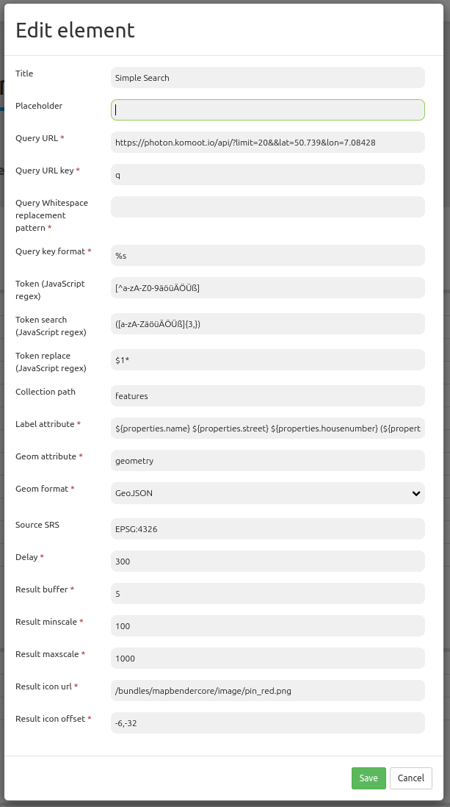

.. _simplesearch:

SimpleSearch
************

SimpleSearch bietet eine einstufige Lösung für Geodatenabfragen an, betrieben z.B. von Solr. Es wird ein Eingabefeld verwendet, welches direkt in die Toolbar eingebunden werden kann. Es sendet den eingegebenen Suchbegriff an eine konfigurierbare URL. Diese empfängt JSON-formatierte Daten, welche eine Beschriftung und Geometrieattribute für jeden Eintrag beinhaltet.

Die Geometriedaten können in WKT oder in GeoJSON-Format codiert werden.

Konfiguration
=============

YAML-Definition:

.. code-block:: yaml

   query_url: http://example.com/solr/core/0/select?wt=json&indent=true&rows=8   # Beispiel Solr URL
   query_key: q                                                                  # Der Suchparameterschlüssel, der angehängt wird
   query_ws_replace:                                                             # Parameter Name to send search term with.
   query_format: '%s'                                                            # Simpe search format.
   token_regex: [^a-zA-Z0-9äöüÄÖÜß]                                              # Tokenizer split regexp.
   token_regex_in: ([a-zA-ZäöüÄÖÜß]{3,})                                         # Tokenizer search regexp.
   token_regex_out: '$1*'                                                        # Tokenizer replace regexp.
   collection_path: response.docs                                                # Es kann ein Attributspfad sein, der vom Abfrageergebnis extrahiert wird.
   label_attribute: label                                                        # Name of the attribute to use for entry labeling
   geom_attribute: geom                                                          # Name der Attribute der Geometriedaten 
   geom_format: WKT                                                              # Geometiedatenformat,kann WKT oder GeoJSON sein
   delay: 300                                                                    # Automatische Vervollständigungs-Verzögerung. 0   result_buffer: 50                                                             # buffer result geometry with this (map units) before zooming
   result_minscale: 1000                                                         # Maßstabseinschränkungen für das Zoomen auf das Objekt
   result_maxscale: 5000
   result_icon_url: http://demo.mapbender3.org/bundles/mapbendercore/image/pin_red.png # Marker, der zur Trefferanzeige verwendet werden soll
   result_icon_offset: -6,-38                                                    # Offset x und y des Symbols
   

Class, Widget & Style
=========================

* Class: Mapbender\\PrintBundle\\Element\\SimpleSearch
* Widget: mapbender.element.simplesearch.js

HTTP Callbacks
==============

- /search: Proxy-Element, welches die konfigurierbare URL abfragt. Im Entwicklungsmodus wird die endgültige Abfrage-URL zum einfachen Debugging als ein x-mapbender-simplesearch-url header zurückgegeben.

JavaScript API
==============

Keine.

JavaScript Signals
==================

Keine.
