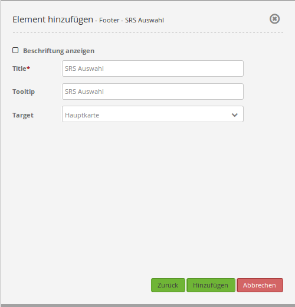

.. _srs_selector:

Spatial Reference System Selector (SRS Selector) (Auswahl des räumlichen Referenzsystems)
************************************************************************************************

Nach der Auswahl eines räumlichen Referenzsystems (SRS) ändert sich das räumliche Referenzsystem in der Karte.

.. image:: ../../../../../figures/de/srs_selector.png
     :scale: 100

Konfiguration
=============

* **Title:** Titel des Elements. Dieser wird in der Layouts Liste angezeigt und ermöglicht, mehrere Button-Elemente voneinander zu unterscheiden. Der Titel wird außerdem neben dem Button angezeigt, wenn "Beschriftung anzeigen" aktiviert ist.
* **Tooltip:** Text, der angezeigt wird, wenn der Mauszeiger eine längere Zeit über dem Element verweilt. 
* **Target:** ID des Kartenelements, auf das sich das Element bezieht.

In der Karte stehen diejenigen Koordinatensysteme in der Selectbox zur Auswahl, die vorher im `Kartenelement <../elements/map.rst>`_ definiert wurden.

YAML-Definition:
----------------

.. code-block:: yaml

   tooltip: 'SRS Selector'  # Text des Tooltips
   label: false             # false/true, um die SRS Auswahl zu beschriften. Der Standardwert ist false.
   target: ~                # ID des Kartenelements
   
Class, Widget & Style
=====================

* **Class:** Mapbender\\CoreBundle\\Element\\SrsSelector
* **Widget:** mapbender.element.srsselector.js
* **Style:** mapbender.elements.css

HTTP Callbacks
==============

Keine.

JavaScript API
==============

- showHidde
- selectSrs
- getSelectedSrs
- isSrsSupported
- isSrsEnabled
- disableSrs
- enableSrs
- enableOnlySrs
- getFullSrsObj
- enableAllSrs
- disableAllSrs
- getInnerJoinSrs
- getInnerJoinArrays

JavaScript Signals
==================

Keine.
