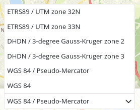

.. _srs_selector:

Spatial Reference System Selector (SRS Selector). (Auswahl des räumlichen Referenzsystems)
************************************************************************************************

Nach der Auswahl eines räumlichen Referenzsystems (SRS) ändert sich das räumliche Referenzsystem in der Karte.

Beachten Sie: Die Selektbox bietet nur die SRS an, die für das Kartenelement definiert wurden.

Konfiguration
=============

.. image:: ../../../../../figures/srs_selector_configuration.png
     :scale: 80

.. code-block:: yaml

   tooltip: 'SRS Selector'  # Text des Tooltips
   label: false             # false/true, um die SRS Auswahl zu beschriften. Der Standardwert ist false.
   target: ~                # ID des Kartenelements
   
Class, Widget & Style
=====================

* Class: Mapbender\\CoreBundle\\Element\\SrsSelector
* Widget: mapbender.element.srsselector.js
* Style: mapbender.elements.css

HTTP Callbacks
==============

Keine.

JavaScript API
==============

showHidde
---------
<>

selectSrs
----------
<>

getSelectedSrs
----------
<>

isSrsSupported
----------
<>

isSrsEnabled
----------
<>

disableSrs
----------
<>

enableSrs
----------
<>

enableOnlySrs
----------
<>

getFullSrsObj
----------
<>

enableAllSrs
----------
<>

disableAllSrs
----------
<>

getInnerJoinSrs
----------
<>

getInnerJoinArrays
----------
<>

JavaScript Signals
==================

Keine.
