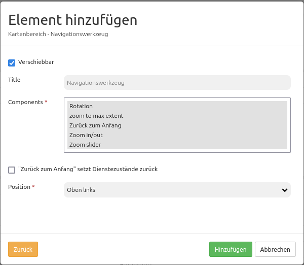

.. _zoom_bar:

Navigation Toolbar (Zoombar) (Navigationswerkzeug)
*********************************************************************

Das Navigationswerkzeug bietet die Funktionen Zoomen und Verschieben an, ähnlich wie bei OpenLayers. Durch unterschiedliche Komponenten, können verschiedene Zoomstufen angesprochen werden. Gezoomt werden kann durch das Aufziehen einer Zoom Box, aber auch durch Klick auf die verschiedenen Maßstäbe in einer Leiste. Schnell lässt sich auch durch die Komponente Zoom to max extent auf die maximale Ausdehnung der Karte zoomen.

.. image:: ../../../../../figures/de/zoom_bar.png
     :scale: 80

Konfiguration
=============

* **Verschiebbar:** Navigationswerkzeug ist verschiebbar oder nicht, Standard ist true
* **Title:** Titel des Elements. Dieser wird in der Layouts Liste angezeigt.
* **Tooltip:** Text, der angezeigt wird, wenn der Mauszeiger eine längere Zeit über dem Element verweilt.
* **Components:** Komponenten des Navigationswerkzeugs, Standardmäßig wird alles selektiert; Auswahlmöglichkeiten: Pan, History, Zoom box, Zoom to max extent, Zoom in/out, Zoom slider 
* **Target:** ID des Kartenelements, auf das sich das Element bezieht.
* **Step size:** Schrittweite für das Verschieben
* **Step by pixel:** Schritttyp: Pixel oder Prozent, false = Prozent, Standard ist false
* **Anchor:** Ausrichtung des Navigationswerkzeugs, Standard ist 'left-top' (oben-links); Auswahlmöglichkeiten: inline (zur Einbinden in der Sidepane), left-top (links-oben), left-bottom (links-unten), right-top (rechts-oben), right-bottom (rechts-unten)

Komponenten des Navigationswerkzeugs:
--------------------------------------
Im Konfigurationsdialog können mehrere unterschiedliche Komponenten (*Components*), also Funktionen des Navigationswerkszeugs, eingebunden werden. Diese Komponenten bestehen aus:

*  Pan
*  History
*  Zoom box
*  Zoom to max extent
*  Zoom in/out
*  Zoom slider

Die Komponenten sehen in der Anwendung wie folgt aus:

.. image:: ../../../../../figures/de/navigationtoolbar_features.png
     :scale: 80
  
Auch wenn ein Häkchen bei *Verschiebbar* gesetzt wurde, ist das in der Anwendung zu sehen, wie auf der Abbildung zu sehen ist. Bei klicken und halten des kleinen Kreuzes kann die Navigation Toolbar beliebig verschoben werden.

Mithilfe der Komponente **Pan** kann der Anwender durch klicken auf die unterschiedlichen Pfeile die Karte in die jeweilige Richtung verschieben. Wie weit die Karte durch den Klick verschoben wird, kann im Konfigurationsdialog durch die Felder *Step size* und *Step by pixel* eingestellt werden. Hierbei wird durch *Step by pixel* die Einheit festgelegt und durch *Step size* der Wert. Ist *Step by pixel* auf "true" gestellt, wird der Wert in *Step size* in der Einheit Pixel gelesen. Ist *Step by pixel* auf false gestellt, wird die Zahl bei *Step size* in Prozent angegeben. Der Wert im Feld *Step size* bestimmt dann die Verschiebung der Karte. Je größer die Zahl, desto mehr wird die Karte in die jeweilige Richtung verschoben. 

.. image:: ../../../../../figures/de/navigationtoolbar_example_step.png
     :scale: 80

Ist das Navigationswerkzeug wie in der Abbildung eingestellt, wird die Karte bei Klick auf einen Richtungspfeil um 30% verschoben. In der Anwendung sieht ein Klick auf den Pfeil Richtung Norden mit einer Verschiebung von 30% wie folgt aus:

.. image:: ../../../../../figures/de/navigationtoolbar_example_step_30percent.png
     :scale: 60

Die Komponente **History** besteht aus zwei Pfeilen. Durch klicken auf dem linken Pfeil (zurück) springt die Kartenansicht auf denjenigen Ausschnitt oder diejenige Zoomstufe zurück, die vor Verschieben der Karte sichtbar waren. Der rechte Pfeil (vor) springt auf den aktuelleren Kartenausschnitt bzw. die aktuellere Zoomstufe. Um diese Funktion zu verdeutlichen ist hier ein Beispiel:

.. image:: ../../../../../figures/de/navigationtoolbar_example_history.png
     :scale: 60
     
Ausschnitt 1: die Startansicht von der Bonner Innenstadt im Maßstab 1:25.000

Ausschnitt 2: Hineinzoomen auf einen Maßstab von 1:10.000

Ausschnitt 3: Verschieben der Karte zur Ansicht der anderen Rheinseite mit Beuel im Maßstab 1:10.000

Die aktuelle Ansicht ist nun Ausschnitt 3. Beim ersten Klick auf den linken Pfeil (zurück) springt die Karte zurück zu Ausschnitt 2. Bei erneutem Klick auf den linken Pfeil (zurück) wird wieder Ausschnitt 1 im Maßstab 1:25.000 sichtbar. Wird nun auf den rechten Pfeil (vor) geklickt, erscheint Ausschnitt 2, usw.

Die Komponente **Zoom box** ermöglicht das Aufziehen einer Box mit der Maus. Der Bereich, der von dieser Box abgedeckt wird entspricht dem Ausschnitt, auf den gezoomt wird. So besteht die Möglichkeit schnell und präzise in einen gewünschten Bereich hineinzuzoomen.

.. image:: ../../../../../figures/de/navigationtoolbar_example_zoombox.png
     :scale: 60

Mit der Komponente **Zoom to max extent** kann schnell auf den im `Kartenelement <../elements/map.html>`_ definierten *Max. Extent* gezoomt werden. Zu beachten ist, dass der *Max. Extent* jedoch nur dann sichtbar ist, wenn auch der entsprechende benötigte Maßstab eingestellt ist. Ist es aufgrund der eingestellten Maßstäbe nicht möglich, den gesamten maximalen Ausschnitt zu sehen, wird auf den maximalen Maßstab herausgezoomt. 
Bei Klick auf *Zoom to max extent* und einem maximalen Maßstab von 1:5.000.000 sieht der Kartenausschnitt wie folgt aus:

.. image:: ../../../../../figures/de/navigationtoolbar_example_maxextent_5mio.png
     :scale: 60

Bei einem maximalen Maßstab von 1:1.000.000 hingegen würde der Kartenausschnitt bei Klick auf Zoom to max extent so aussehen:

.. image:: ../../../../../figures/de/navigationtoolbar_example_maxextent_1mio.png
     :scale: 60

Mit der Komponente **Zoom in/out** kann durch Klick auf das ``+`` -Zeichen (hineinzoomen) oder durch Klick auf das ``–`` -Zeichen (herauszoomen) gezoomt werden. Der Zoom springt mit Klick auf eine der beiden Schaltflächen auf entweder den nächstgrößeren oder nächstkleineren Maßstab, die vorher im `Kartenelement <../elements/map.html>`_ definiert wurden. Je nachdem, welche Maßstäbe dort angegeben wurden, können größere oder kleinere Sprünge im Zoom eingestellt werden.

.. image:: ../../../../../figures/de/navigationtoolbar_example_zoominout.png
     :scale: 80

Die Komponente **Zoom slider** beinhaltet automatisch die Komponente *Zoom in/out*, indem auch hier das ``+`` und ``–`` -Zeichen zur Verfügung stehen. Zusätzlich besteht diese Komponente aus einer Leiste, die die möglichen Zoomstufen durch auswählbare Punkte anzeigt. Bei Bewegung der Maus über die einzelnen Punkte werden die zugehörigen Maßstäbe angezeigt (siehe Abbildung). Auch hier beziehen sich die Maßstäbe auf die vorher definierten im `Kartenelement <../elements/map.html>`_ . Der ausgefüllte Punkt zeigt an, in welchem Maßstab die Karte aktuell angezeigt wird. Durch klicken auf einen anderen Punkt, springt die Karte direkt zu dem zugehörigen Maßstab.

.. image:: ../../../../../figures/de/navigationtoolbar_example_zoomslider.png
     :scale: 80

YAML-Definition:
----------------

.. code-block:: yaml

   tooltip: 'Navigation Toolbar' # Text des Tooltips
   components: array("pan",      # Komponenten des Navigationswerkzeugs, Standardmäßig wird alles selektiert.
     "history","zoom_box",
     "zoom_max","zoom_slider")
   target: ~                     # ID des Kartenelements
   stepSize: 50                  # Schrittweite für das Verschieben
   stepByPixel: false            # Schritttyp: Pixel oder Prozent, false = Prozent, Standard ist false
   anchor: 'inline'/'left-top'/  # Ausrichtung des Navigationswerkzeugs, Standard ist 'left-top' (oben-links) 
     'left-bottom'/'right-top'/  # Benutzen Sie inline z.B. für die Sidebar
     'right-bottom'
   draggable: true               # das Navigationswerkzeug ist verschiebbar oder nicht, Standard ist true

Class, Widget & Style
============================

* **Class:** Mapbender\\CoreBundle\\Element\\ZoomBar
* **Widget:** mapbender.element.zoombar.js
* **Style:** mapbender.element.zoombar.css

HTTP Callbacks
==============

Keine.

JavaScript API
==============

Keine.

JavaScript Signals
==================

Keine.
