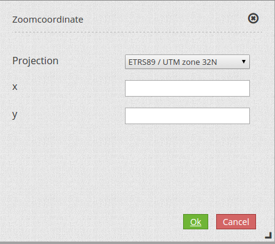

.. _zoomcoordinate:

Zoomcoordinate
**********************************

Dieses Element ermöglicht eine vom Koordinatensystem unabhängige Suche nach Koordinaten. Nach Angabe des Koordinatensystems und des Koordinatenpaares werden die Werte auf das aktuelle Koordinatensystem umgerechnet und die entsprechende Stelle auf der Karte zentriert. 

Configuration
=============

.. image:: ../../../../../figures/zoomcoordinate_configuration.png
     :scale: 80

YAML-Definition:

.. code-block:: yaml

   tooltip: 'Zoomcoordinate'  		# Titel
   prefix_projection: 'projection'      # Präfix für die Angabe des Projektionssystem
   prefix_x: 'x'			# Präfix für die Angabe der x-Koordinate
   prefix_y: 'y'			# Präfix für die Angabe der y-Koordinate
   type: 'element'                      # Auswahl Standort des Elements sidepane(element) oder popup(dialog)
   target: ~				# ID der Karte

Repository
=============

* https://github.com/mapbender/mapbender-zoomcoordinate.git

Class, Widget & Style
===========================

* Class: Mapbender\\ZoomcoordinateBundle\\Element\\Zoomcoordinate
* Widget: mapbender.mbZoomcoordinate
* Style: mapbender.elements.zoomcoordinate.scss

HTTP Callbacks
==============

<action>
--------------------------------

JavaScript API
==============

<function>
----------

JavaScript Signals
==================

<signal>
--------

