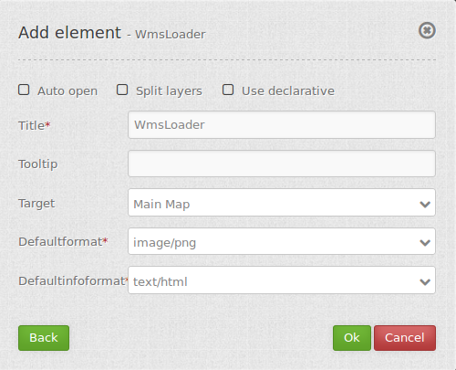

.. _wms_loader:

WMS Loader
***********************

Mit diesem Element können WMS per getCapabilities-Request geladen werden.
Es kann WMS 1.1.1 und  WMS 1.3.0 geladen werden.

.. image:: ../../../../../figures/wms_loader.png
     :scale: 80

Konfiguration
=============

Für das Element wird ein Button verwendet. Siehe unter :ref:`button` für die Konfiguration.

YAML-Definition:

.. code-block:: yaml

   target: ~                            # ID des Kartenelements
   tooltip: 'WMS Loader'                # Text des Tooltips
   autoOpen: false                      # true, wenn das Element beim Start der Anwendung geöffnet werden soll, der Standardwert ist false.
   defaultFormat: 'image/png'           # Standard Format ist image/png, weitere Möglichkeiten: image/gif, image/jpeg
   defaultInfoFormat: 'text/html'       # Standard Infoformat ist text/html, weitere Möglichkeiten: text/xml, text/plain
   splitLayers: false                   # geteilte Ebenen beim Laden des Dienstes, Standard ist false
   useDeclarative: false                # erlaubt einen Dienst über einen Link zu laden (zum Beispiel über die Informationsabfrage oder Suche) 
                                        # und definiert die Layer zu aktivieren, Standard ist false

Hinzufügen eines WMS über einen definierten Link
========================================================================

Mapbender kann ein WMS über einen definierten Link hinzugefügt werden, z.B. zum Beispiel über die Informationsabfrage oder über Suchergebnisse.

Stellen Sie **useDeclarative** in der mapbender.yml auf true oder stellen Sie in diesem Element auf **useDeclarative**

Der Link sollte folgendermaßen aussehen:

.. code-block:: html

<a mb-action="source.add.wms" mb-layer-merge="1" mb-wms-merge="1" 
mb-wms-layers="Gewaesser,Fluesse" 
href="http://wms.wheregroup.com/cgi-bin/germany.xml?VERSION=1.1.1&REQUEST=GetCapabilities&SERVICE=WMS">load service</a>

<a mb-action="source.add.wms" mb-layer-merge="1" mb-wms-merge="1" 
mb-wms-layers="Gewaesser,Fluesse" 
mb-url="http://wms.wheregroup.com/cgi-bin/germany.xml?VERSION=1.1.1&REQUEST=GetCapabilities&SERVICE=WMS" href="">load service</a>

.. code-block:: yaml

    mb-action="source.add.wms"    # definiert die Aktion, um einen WMS hinzuzufügen
    mb-wms-merge="1"              # fügt den WMS nur einmal hinzu, wenn der WMS in der Applikation bereits Bestandteil ist, wird dieser verwendet (Standard ist 1)
    mb-layer-merge="1"            # Standard ist 1: aktiviert die Ebene in mb-wms-layers. Deaktiviert die Ebenen nicht, die schon aktiviert sind.
    mb-wms-layers="Gewaesser,Fluesse" # Definiert die Ebenen, die aktiviert werden sollen, _all activates aktiviert alle Ebenen. Standard ist alle Ebenen sind deaktiviert.
    href oder mb-url              # verweist auf die WMS getcapabilities URL

   

Class, Widget & Style
=======================

* Class: Mapbender\\WmsBundle\\Element\\WmsLoader
* Widget: 
* Style: 

HTTP Callbacks
==============

Keine.

JavaScript API
==============

activate
----------

Öffnet einen Dialog, in dem ein WMS über einen getCapabilities-Request geladen werden kann.
Es kann WMS 1.1.1 und  WMS 1.3.0 geladen werden.

JavaScript Signals
==================

Keine.
