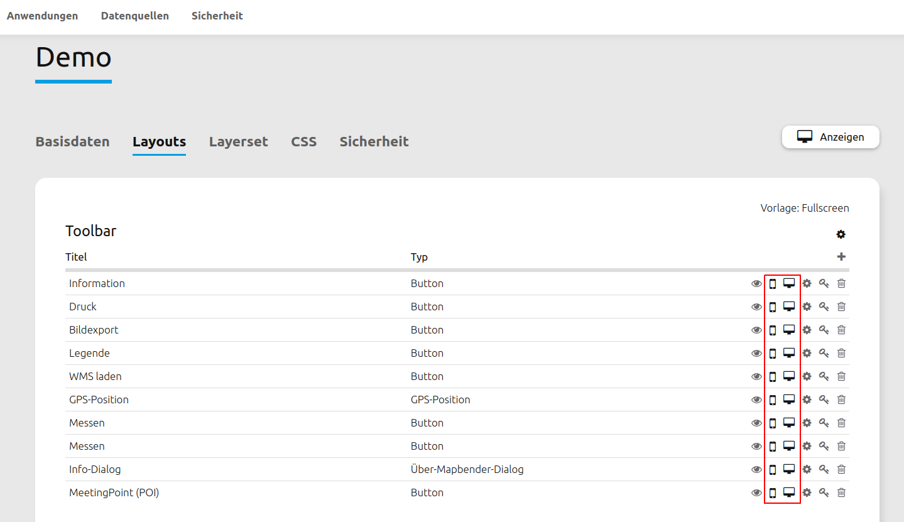
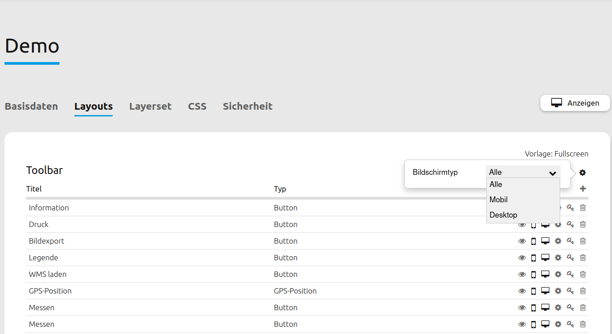

.. _layouts_de:

Layouts
#######

Im diesem Reiter werden die Regionen einer Anwendung definiert, in die Elemente bzw. Funktionen eingebaut werden können. Für unterschiedliche Template-Vorlagen gibt es unterschiedliche Regionen (auch: Bereiche oder Layouts).
Eine Übersicht über alle Elemente gibt es unter :ref:`functions_de`.

Layouts des Fullscreen Templates:

  * Obere Werkzeugleiste (Bereich für die Platzierung von Buttons)
  * Sidepane (Seitenleiste für den Ebenenbaum, Legende, Suche,...)
  * Kartenbereich (Karte, Maßstabsleiste,...)
  * Fußzeile (mit Impressum, Aktivitätsanzeige...)

Layouts des Mobilen Templates:

  * Fußzeile (Bereich für die Platzierung von Buttons)
  * Kartenbereich (Karte, Navigationswerkzeug)
  * MobilePane (Bereich, der über der Karte eingeblendet wird, wenn sich Dialoge wie Themenauswahl, Hintergrundwechsel oder Infoabfrage öffnen)

Das ``+`` -Zeichen rechts oberhalb des Bereichs ermöglicht das Hinzufügen von Elementen. Zuvor öffnet sich eine Dialogmaske, die die Auswahl eines Elements und dessen anschließende Konfiguration ermöglicht.

Alle eingebauten Funktionen lassen sich per Drag & Drop zwischen den Regionen verschieben.

Mit der Ausnahme des Kartenbereichs und der MobilePane lassen sich alle Regionen über das Einstellungsrad in der oberen rechten Ecke individuell konfigurieren. Detaillierte Informationen zu Einschränkungen sind unter Mapbender Templates zusammengefasst.

Konfigurationsmöglichkeiten der Oberen Werkzeugleiste und Fußzeile
******************************************************************
Die Obere Werkzeugleiste und die Fußzeile bieten folgende Konfigurationsmöglichkeiten über das Einstellungsrad an:

 * Bildschirmtyp (Alle, Mobil, Desktop) (nicht bei Vorlage Mapbender Mobile Template)
 * Ausrichtung (Pflichtfeld. Links, Rechts, Zentriert. Standard: Links)
 * Checkbox "Schaltflächen zu Menü zusammenfassen"
 * "Menütitel"-Textfeld

Bei der Auswahl eines Bildschirmtyps wird der Bereich für andere Gerätearten ausgeblendet.
Die Ausrichtung bestimmt über die Positionierung der Elemente innerhalb der Bereiche.
Mithilfe der Checkbox "Schaltflächen zu Menü zusammenfassen" kann ein Ausklappmenü konfiguriert werden, welches die in den Bereich eingebundenen Elemente umfasst.
Über das Menütitel-Textfeld ist es außerdem möglich, dem Ausklappmenü eine Beschriftung zuzuweisen.

.. tip:: **Hinweis**: Insbesondere das Menü bietet sich an, wenn die Anwendung auf mobile Endgeräte zugeschnitten wird. Unter CSS (Link) findet sich ein CSS-Code, welches dem Menü einen Scrollbalken hinzufügt und somit die Bedienbarkeit bei Anwendungen mit vielen Elementen erhöht. 

Sidepane-Konfigurationsmöglichkeiten
************************************
Das Fullscreen Template bietet eine vielseitig konfigurierbare Sidepane an.
Die Ansichtsoptionen für die Sidepane können im Sidepane-Bereich im Mapbender-Backend ausgewählt werden. Dazu genügt ein Klick auf das Einstellungsrad.
Im Anschluss können folgende Optionen konfiguriert werden:

 * Typ
 * Bildschirmtyp
 * Breite (in Pixeln)
 * Position
 * Checkbox "Geschlossen starten"

.. image:: ../../../../figures/de/sidepane_backend.png
     :width: 100%

Die Option "Typ" zeigt die Sidepane-Elemente in unterschiedlichen Ansichten an:

- "Akkordeon" zeigt alle hinzugefügten Elemente in Reitern.

- "Buttons" zeigt alle hinzugefügten Elemente über Buttons.

- "Unformatiert" verzichtet auf Styling-Optionen und zeigt die Elemente direkt und in der im Backend gewählten Reihenfolge untereinander an.

Die Option "Bildschirmtyp" legt fest, für welche Geräteart (Alle, Mobil oder Desktop) die Sidepane angezeigt werden soll.

Über die Option "Breite" kann ein Pixelwert definiert werden, der die Breite der Sidepane in der Anwendung verändert.

Die Position gibt an, ob die Sidepane am linken oder rechten Bildschirmrand angezeigt wird.

Die Checkbox "Geschlossen starten" hält nach Aktivierung die Sidepane bei Anwendungsstart eingeklappt. Sie ist über einen Button in der Anwendung nachträglich aus- & erneut einklappbar.

Element-Buttonleiste
====================
Die Buttonleiste ermöglicht für jede individuelle Funktion eine eigenständige Elementkonfiguration. Die Buttons liefern folgende Möglichkeiten:

* Element aktiv/inaktiv schalten
* Element auf Mobilgeräten anzeigen
* Element auf großen Bildschrimen anzeigen
* Element bearbeiten
* Acl Element bearbeiten (Link)
* Element löschen

Responsives Design
==================

Mapbender bietet ein responsives Webdesign zur besseren Übersichtlichkeit an. Elemente können für unterschiedliche Ansichten individuell konfiguriert werden (Mobile Endgeräte, große Bildschirme oder beides).

Alternativ kann das Design auch für ganze Bereiche definiert werden. Dadurch werden alle zugehörigen Elemente automatisch nicht mehr angezeigt, wenn eine bestimmte Ansicht ausgewählt ist.

