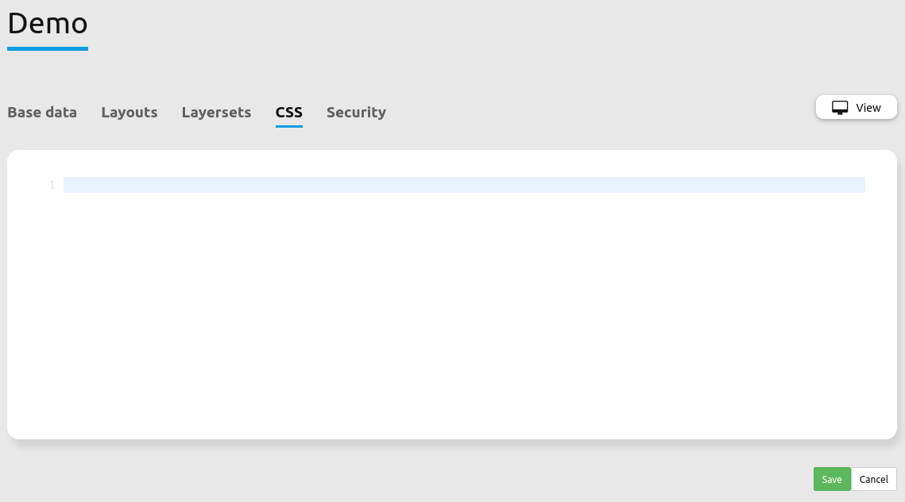

.. _css_de:

Wie kann der Stil einer Anwendung mit dem css-Editor angepasst werden?
############################################################################

Mapbender verfügt ab der Version 3.0.4.0 über einen css-Editor zur Anpassung des Stils (Farben, Größen, Icons, ...) einer Anwendung. Über den Editor können css-Klassen definiert werden, die die Standardklassen überschreiben.

Mit Hife von Firebug können Sie die bestehende Definition ermitteln, in den css-Editor kopieren und hier anpassen.

Über das folgende css können Sie die Farbe der Toolbar und Navigationleiste anpassen. Außerdem setzen Sie die Hintergrundfarbe und Breite der Seitenleiste (sidepane).

.. code-block:: bash

 .toolBar {
   background-color: rgba(0, 29, 122, 0.8) !important;
 }

 .toolPane {
   background-color: rgba(0, 29, 122, 0.8) !important;
 }
 
 .pan{
   background-color: rgba(0, 93, 83, 0.9);
 }

 .sidePane {
   overflow: visible;
   background-image: url("");
   background-color: #eff7e9;
 }
 
 .sidePane.opened {
     width: 350px;
 }

.. image:: ../../figures/css_editor_result_application.png
     :scale: 80

Bis zur Mapbender Version 3.0.3.2 mussten eigene Templates mit css-Dateien erzeugt werden, um den Standardstil anzupassen. Der neue css-Editor ermöglicht es, einfach Stil-Anpassungen der Anwendung vorzunehmen. Die Dokumentation zur Erstellung eigener Templates finden Sie unter :doc:`Wie werden eigene Vorlagen (templates) erzeugt? <templates>`.
