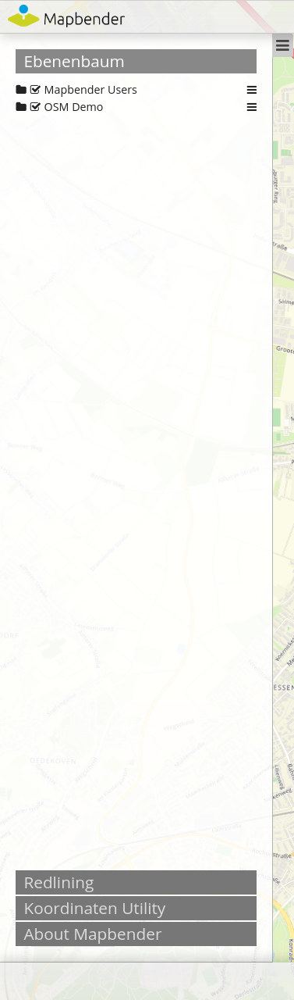
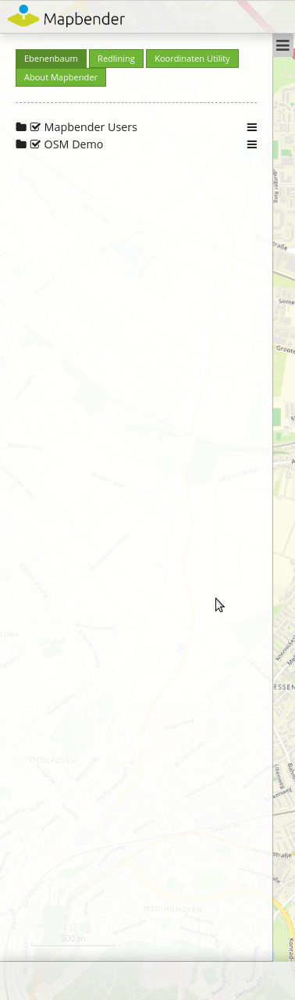
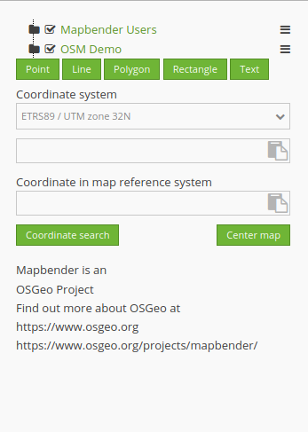

.. _mapbender_templates_de:

Mapbender Templates
##########################

Lernen Sie die wichtigsten Mapbender-Anwendungs-Templates kennen, die bei der Installation mitgeliefert werden.

Fullscreen Template
*********************

.. image:: ../../figures/mapbender_fullscreen.png
     :scale: 50

Schauen Sie sich die Demo zum Mapbender Fullscreen Template an: https://demo.mapbender.org/application/mapbender_user_yml

Regionen des Fullscreen Templates:

  * Toolbar (Bereich für die Platzierung von Buttons)
  * Sidepane (Seitenleiste für den Ebenenbaum, Legende, Suche,...)
  * Content (Karte, Maßstabsleiste,...)
  * Footer (Fußleiste mit Impressum, Aktivitätsanzeige...)

Specials:

  * Template mit dunklem Hintergrund
  * Großansicht mit konfigurierbarer Sidepane:
  
Sidepane-Konfigurationsmöglichkeiten
************************************

Das Fullscreen Template bietet eine Sidepane an, innerhalb derer Elemente in unterschiedlichen Ansichten angezeigt werden können.

- "Accordion" zeigt alle hinzugefügten Elemente in Reitern:

- "Buttons" zeigt alle hinzugefügten Elemente über Buttons:

- "None" verzichtet auf Styling-Optionen und zeigt die Elemente direkt und in der im Backend gewählten Reihenfolge untereinander an:

Die Ansichtsoption für die Sidepane kann im Sidepane-Bereich im Mapbender-Backend ausgewählt werden. Dazu genügt ein Klick auf einen der rechts angeordneten Buttons:

.. image:: ../../figures/sidepane_backend.png
     :scale: 80

Mobile template
*********************

.. image:: ../../figures/mapbender_mobile.png
     :scale: 80

Schauen Sie sich die Demo zum Mapbender Mobile Template an: https://demo.mapbender.org/application/mapbender_mobile_yml

Regionen des Mobile Templates

  * footer (Bereich für die Platzierung von Buttons)
  * Content (map, navigation toolbar)
  * Mobilepane (Bereich, der über der Karte eingeblendet wird, wenn sich Dialoge wie Themenauswahl, Hintergrundwechsel oder Infoabfrage öffnen)

Bitte beachten Sie, dass derzeit nicht alle Elemente im Mobilen Template verwendet werden können. Die folgende Liste führt die Element auf, die verwendet werden können:

  * Map
  * GPS-Position
  * Layertree (anderes Design, nur der root-Layer-Titel eines Services wird angezeigt, Dienst können nur komplett de-/aktiviert werden)
  * BaseSourceSwitcher (anderes Design: Anzeige als Liste nicht als Buttons)
  * FeatureInfo
  * Navigation Toolbar (Zoombar)
  * HTML
  * Button
  * SimpleSearch
