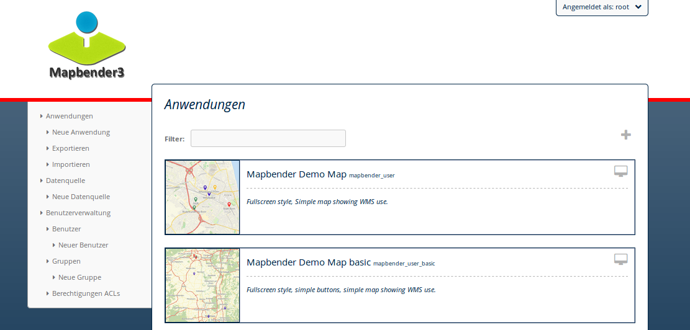

.. _templates_de:

Wie werden eigene Style-Vorlagen (templates) erzeugt?
#####################################################

Mapbender beinhaltet bereits Anwendungs-Vorlagen, sie befinden sich im Mapbender CoreBundle `Template`-Verzeichnis ``/application/mapbender/src/Mapbender/CoreBundle/Template``. 
Häufig sollen jedoch eigene Anwendungs-Vorlagen und Administrationsoberflächen mit eigenem Corporate Design verwendet werden.
Um Probleme bei einem Upgrade zu vermeiden, sollte für personalisierte Oberflächen ein eigenes Bundle verwendet werden.

Der Stil einer einzelnen Anwendung kann ebenfalls über den :ref:`css_de` angepasst werden.

Wie werden eigene Vorlagen erzeugt?
~~~~~~~~~~~~~~~~~~~~~~~~~~~~~~~~~~~

**Schritte für die Einbindung:**

* Erzeugen eines eigenen Bundles
* Erzeugen eines neuen Namespaces
* Template PHP-Datei zur Registrierung der eigenen Vorlage erzeugen
* Erzeugen einer eigenen Twig-Datei
* Erzeugen eigener CSS-Datei(en)
* Registrierung des Bundles in der Datei scr/Kernel.php
* Verwenden der neuen Vorlage

Als Beispiel für die Einbindung einer eigenen Vorlage wurde ein Workshop/DemoBundle vorbereitet. Dieses kann verwendet und individuell verändert werden. 
Sie können sich die Dateien unter folgendem Link herunterladen:

* https://github.com/mapbender/mapbender-workshop/tree/master

Erzeugen eines eigenen Bundles
~~~~~~~~~~~~~~~~~~~~~~~~~~~~~~

Anwender-Bundles werden im src-Verzeichnis ``/application/src`` abgelegt.

Die Struktur eines Bundles kann wie folgt aussehen:

.. code-block:: bash

 src/Workshop/DemoBundle/
 
                         WorkshopDemoBundle.php
                    
                         /Resources
                                    /public
                                           demo_fullscreen.css
                                    
                                    /image
                                           workshop.ico
                                           workshop_logo.png
                                           print.png
   
                                    /views
					                      /Template
                                                   fullscreen_demo.html.twig
                         /Template
		                          DemoFullscreen.php

Die folgenden Dateien können bearbeitet werden:

* twig-Datei: verändert die Struktur (z.B. - Löschen einer Komponente wie die Sidebar)
* css-Datei:  verändert die Farben, Icons, Schriften

Erzeugen eines neuen Namespaces
~~~~~~~~~~~~~~~~~~~~~~~~~~~~~~~

In unserem Beispiel erzeugt die Datei *WorkshopDemoBundle.php* einen Namespace für das Bundle und referenziert auf das Template.

.. code-block:: php

    <?php

    namespace Workshop\DemoBundle;

    use Mapbender\CoreBundle\Component\MapbenderBundle;

    class WorkshopDemoBundle extends MapbenderBundle
    {
        public function getElements()
        {
            return array(
            //    'Workshop\DemoBundle\Element\MapKlick',
            );
        }
        public function getTemplates()
        {
            return array('Workshop\DemoBundle\Template\DemoFullscreen');
        }
    }

Anlegen der eigenen Template-Datei
~~~~~~~~~~~~~~~~~~~~~~~~~~~~~~~~~~

In unserem Beispiel heißt die Template-Datei *FullscreenDemo.php*. Sie befindet sich unter ``src/Workshop/DemoBundle/Template/DemoFullscreen.php``.

In der Template-Datei wird der Name des Templates, die Regionen die angelegt werden sollen sowie die verwendete Twig-Datei definiert.

.. code-block:: php

    <?php

    namespace Workshop\DemoBundle\Template;

    use Mapbender\CoreBundle\Template\Fullscreen;

    class DemoFullscreen extends Fullscreen
    {
        protected static $title             = "Fullscreen Template Workshop";
        protected static $regions           = array('toolbar', 'sidepane', 'content', 'footer');
        protected static $regionsProperties = array(
            'sidepane' => array(
                'tabs'      => array(
                    'name'  => 'tabs',
                    'label' => 'mb.manager.template.region.tabs.label'),
                'accordion' => array(
                    'name'  => 'accordion',
                    'label' => 'mb.manager.template.region.accordion.label')
            )
        );
        protected static $css               = array(
            '@MapbenderCoreBundle/public/sass/template/fullscreen.scss',
            '@WorkshopDemoBundle/public/demo_fullscreen.scss',
        );
        protected static $js                = array(
            '@FOMCoreBundle/public/js/frontend/sidepane.js',
            '@FOMCoreBundle/public/js/frontend/tabcontainer.js',
            '@MapbenderCoreBundle/public/mapbender.container.info.js',
            '/components/jquerydialogextendjs/jquerydialogextendjs-built.js',
            "/components/vis-ui.js/vis-ui.js-built.js"
        );

        public $twigTemplate = 'WorkshopDemoBundle:Template:demo_fullscreen.html.twig';
    }

Eigene Twig-Datei erzeugen
~~~~~~~~~~~~~~~~~~~~~~~~~~

Die Twig-Dateien sind im folgenden Verzeichnis gespeichert:

``application/mapbender/src/Mapbender/CoreBundle/Resources/views/Template``

Kopieren Sie eine existierende Twig-Datei, speichern Sie diese unter einem neuen Namen und verändern Sie den Inhalt, z.B. die Farbe.

Verwenden Sie z.B. ``mapbender/src/Mapbender/CoreBundle/Resources/views/Template/fullscreen.html.twig`` und kopieren Sie diese nach ``/Workshop/DemoBundle/Resources/views/Template/fullscreen_demo.html.twig``

Eigene CSS-Datei erzeugen
~~~~~~~~~~~~~~~~~~~~~~~~~

Erzeugen Sie eine leere CSS-Datei und geben Sie in dieser nur die CSS-Definitionen für Ihre Anwendungs-Vorlage an.
Es muss lediglich das CSS definiert werden, das vom Standard der Elemente abweicht.

Mit Hilfe der Entwicklerwerkzeuge Ihres Browsers können Sie die bestehende Definition ermitteln, in Ihre CSS-Datei kopieren und hier anpassen.

Ihre CSS-Datei könnte wie folgt heißen: ``src/Workshop/DemoBundle/public/demo_fullscreen.css`` und die folgende Definition enthalten:

.. code-block:: css

 .toolBar {
   background-color: rgba(0, 29, 122, 0.8) !important;
 }

 .toolPane {
   background-color: rgba(0, 29, 122, 0.8) !important;
 }

 .sidePane {
   overflow: visible;
   background-image: url("");
   background-color: #eff7e9;
 }

 .sidePane.opened {
     width: 350px;
 }

 .logoContainer {
   background-color: white !important;
   background-image: url("") !important;
   -webkit-box-shadow: 0px 0px 3px #0028AD;
   -moz-box-shadow: 0px 0px 3px #0028AD;
   box-shadow: 0px 0px 3px #0028AD;
 }

 .sidePaneTabItem {
    background-color: #0028AD;
 }

 .layer-opacity-handle {
     background-color: #0028AD;
 }

 .mb-element-overview .toggleOverview {
     background-color: #0028AD;
 }

 .button, .tabContainerAlt .tab {
     background-color: #0028AD;
 }

 .iconPrint:before {
   /*content: "\f02f"; }*/
   content:url("image/print.png");
 }

 .popup {
   background-color: #eff7e9;
   background-image: url("");
 }

 .pan{
   background-color: rgba(0, 93, 83, 0.9);
 }

Das Ergebnis der wenigen Zeilen CSS sieht dann so aus:

.. image:: ../../figures/workshop_application.png
     :scale: 80

Beim Laden der neuen Anwendung wird eine CSS-Datei im web/assets-Verzeichnis angelegt:

* ``web/assets/WorkshopDemoBundle__demo_fullscreen__css.css``

Wenn Sie die CSS-Datei weiter bearbeiten, müssen Sie die unter ``web/assets`` generierte Datei löschen, damit diese neu geschrieben wird und die Änderungen wirksam werden. Der Browser-Cache sollte ebenfalls geleert werden.

.. code-block:: bash

 sudo rm -f web/assets/WorkshopDemoBundle__demo_fullscreen__css.css

Styling der Administrationsseiten
*********************************

Passen Sie die vorhandenen CSS-Dateivorlagen für die unterschiedlichen Bereiche an:

* login.css : Anpassung des Designs der Login-Oberfläche (Anmelde-Seite)
* manager.css : Anpassung des Designs der Verwaltungs/Administrations-Oberfläche (Anwendungsübersicht u.ä.)
* password.css : Anpassung des Designs der Passwort-Oberfläche (Passwort vergessen u.ä.)

Es muss lediglich das CSS definiert werden, das vom Standard der Administrationsoberfläche abweicht.

Auf die CSS-Dateien wird über das FOMManagerBundle und FOMUserBundle referenziert. Diese müssen unter ``app/Resources/`` abgelegt werden. Die bereits enthaltenen Twig-Dateien überschreiben nach der erfolgreichen Einrichtung die Standard-Einstellungen (Vorgaben aus der manager.html.twig Datei).
Alternativ kann auch die bisherige Twig-Datei kopiert und angepasst werden.

.. code-block:: bash

 cp fom/src/FOM/ManagerBundle/Resources/views/manager.html.twig app/Resources/FOMManagerBundle/views/

Bei unveränderter Übernahme der Stylevorgaben sieht die Administration dann so aus:

Registrieren des Bundles in scr/Kernel.php
~~~~~~~~~~~~~~~~~~~~~~~~~~~~~~~~~~~~~~~~~~

Bevor Ihre neue Vorlage angezeigt wird, muss diese registriert werden:

* ``mapbender/scr/Kernel.php``

.. code-block:: php

 class AppKernel extends Kernel
 {
    public function registerBundles()
    {
        $bundles = array(

            ....

            // Mapbender bundles
            new Mapbender\CoreBundle\MapbenderCoreBundle(),
            ...

	        new Workshop\DemoBundle\WorkshopDemoBundle(),

        );
    }
 }
 

Setzen Sie Schreibrechte für das web-Verzeichnis für Ihren Webserver-Benutzer.

.. code-block:: bash

    chmod ug+w web

Aktualisieren Sie das web-Verzeichnis. Jedes Bundle hat seine eigenen Assets - CSS Dateien, JavaScript Dateien, Bilder und mehr - diese müssen in das öffentliche web-Verzeichnis kopiert werden. Mit der Option symlink werden die Dateien nicht kopiert. Es wird stattdessen ein symbolischer Link erzeugt. Dies erleichtert das Editieren innerhalb des Bundles.

.. code-block:: bash

    bin/console assets:install web
    oder
    bin/console assets:install web --symlink --relative

Jetzt sollte beim Anlegen einer neuen Anwendung die neue Vorlage in der Liste erscheinen.

Verwendung der eigenen Vorlage
~~~~~~~~~~~~~~~~~~~~~~~~~~~~~~

Die neue Anwendungs-Vorlage kann über verschiedene Wege verwendet werden:

Einbindung in YAML-Anwendungen
******************************

Sie können nun die YAML-Anwendungen unter ``application/config/applications`` anpassen und auf das neue Template verweisen.

.. code-block:: yaml

                template: Workshop\DemoBundle\Template\DemoFullscreen

Einbindung in eine neue Anwendungen über das Backend
****************************************************

Wenn Sie eine neue Anwendung mit der Mapbender-Administration erzeugen, können Sie eine Vorlage (Template) auswählen.

Einbindung in eine bestehende Anwendung
***************************************

Für bereits existierende Anwendungen kann das Template über die Mapbender Datenbank in der Tabelle ``mb_core_application`` in der Spalte *template* angepasst werden.

Für das *WorkshopDemoBundle* wird hier statt des Eintrags ``Mapbender\CoreBundle\Template\Fullscreen`` der Eintrag ``Workshop\DemoBundle\WorkshopDemoBundle`` angegeben.

Anwendungsfälle
~~~~~~~~~~~~~~~

Wie kann das Logo verändert werden?
Wie kann der Anwendungstitel angepasst werden?
Wie stelle ich die Sprache ein?

Auf diese und weitere Fragen finden Sie Antworten im Kapitel :ref:`yaml_de`.

Wie können eigene Buttons eingebunden werden?
*********************************************

Mapbender verwendet Schrift-Icons auf der FontAwesome Collection:

.. code-block:: css

 @font-face {
   font-family: 'FontAwesome';
   src: url("../../bundles/fomcore/images/icons/fontawesome-webfont.eot?v=3.0.1");
   src: url("../../bundles/fomcore/images/icons/fontawesome-webfont.eot?#iefix&v=3.0.1") format("embedded-opentype"), url("../../bundles/fomcore/images/icons/fontawesome-webfont.woff?v=3.0.1") format("woff"), url("../../bundles/fomcore/images/icons/fontawesome-webfont.ttf?v=3.0.1") format("truetype");
   font-weight: normal;
   font-style: normal;
 }

In der CSS-Datei können Sie zu den Icons der Schriftart folgendermaßen verweisen:

.. code-block:: css

  .iconPrint:before {
    content: "\f02f";
  }

Wenn Sie ein Bild nutzen möchten, legen Sie dieses am besten in Ihrem Bundle ab und referenzieren es auf die folgende Art und Weise:

.. code-block:: css

  .iconPrint:before {
    content:url("image/print.png");
  }

Probieren Sie es aus
~~~~~~~~~~~~~~~~~~~~

* Laden Sie das Workshop/DemoBundle herunter: https://github.com/mapbender/mapbender-workshop
* Ändern Sie die Farbe Ihrer Icons.
* Ändern Sie die Größe Ihrer Icons.
* Ändern Sie die Farbe der Oberen Werkzeugleiste.
* Benutzen sie ein Bild anstelle eines Font-Icons für Ihre Buttons.
* Verschieben Sie die Übersichtskarte auf die linke Seite.
* Schauen Sie in die Workshop-Dateien, um zu erfahren, wie das funktioniert.
