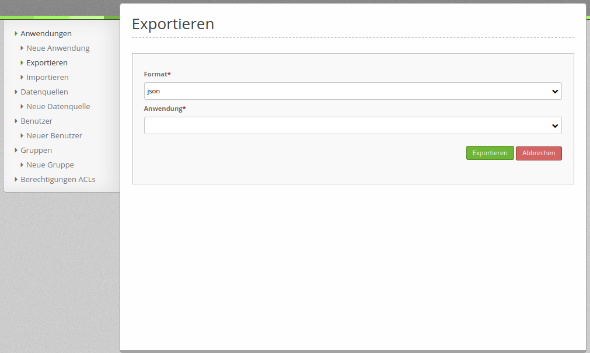
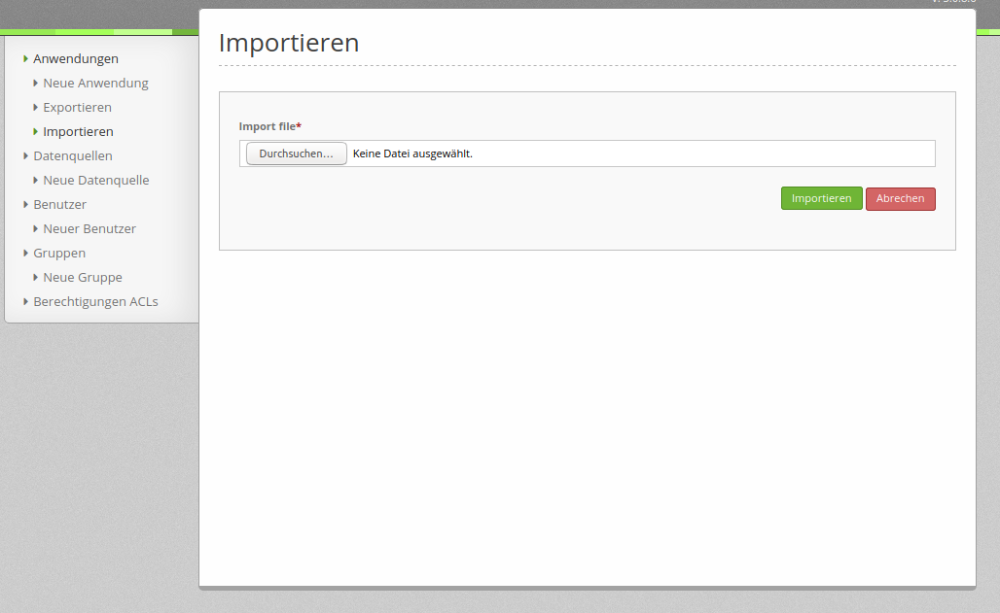

.. _yaml_de:

YAML Konfiguration (Konfigurations- und Anwendungsdateien)
===========================================================

Die folgenden Konfigurationsdateien sind zu finden unter application/app/config.

parameters.yml
--------------

Hier werden grundlegende Parameter von Mapbender bestimmt:

Datenbank
*********

Zur Konfiguration der Datenbankverbindung werden die Dateien config.yml und parameters.yml verwendet. Während in der config.yml nur die Platzhalter angegeben werden, werden die Werte in der parameters.yml gefüllt.

Die Standarddatenbankdefinition erfolgt in der config.yml und sieht folgendermaßen aus:

.. code-block:: yaml

    doctrine:                                               # Bei Werten, die von dem %-Zeichen umschlossen werden,handelt es sich um Variablen
        dbal:
            default_connection: default                     # gibt die Datenbankverbindung an, die standardmäßig von Mapbender verwendet werden soll (``default_connection: default``).
            connections:
                default:
                driver:    "%database_driver%"              # Mehr Information unterhalb des Codes
                host:      "%database_host%"                # Der Host, auf dem die Datenbank läuft. Entweder der Name (z.B. localhost) oder die IP-Adresse (z.B. 127.0.0.1).
                port:      "%database_port%"                # Der Port, auf dem die Datenbank lauscht (z.B. 5432 für PostgreSQL).
                dbname:    "%database_name%"                # Der Name der Datenbank (z.B. mapbender). Erstellen Sie die Datenbank mit dem Befehl ``doctrine:database:create`` bzw. ``doctrine:schema:create``. Siehe die `Installationsanleitung <../installation.html>`_ für Details.
                path:      "%database_path%"                # Der %database_path% ist der Pfad zur Datei der SQLite-Datenbank. Wenn Sie keine SQLite-Datenbank verwenden, schreiben Sie als Wert entweder eine Tilde (~) oder ``null``.
                user:      "%database_user%"                # Benutzername für die Verbindung zur Datenbank.
                password:  "%database_password%"            # Das Passwort des Datenbankbenutzers.
                charset:    UTF8                            # Die Kodierung, die die Datenbank verwendet.
                logging:   "%kernel.debug%"                 # Die Option sorgt dafür, das alle SQLs nicht mehr geloggt werden (Standardwert: %kernel.debug%). `Mehr Informationen <http://www.loremipsum.at/blog/doctrine-2-sql-profiler-in-debugleiste>`_.
                profiling: "%kernel.debug%"                 # Profiling von SQL Anfragen. Diese Option kann in der Produktion ausgeschaltet werden. (Standardwert: %kernel.debug%)

* database_driver: Der Datenbanktreiber. Mögliche Werte sind:

  * pdo_sqlite - SQLite PDO driver
  * pdo_mysql - MySQL PDO driver
  * pdo_pgsql - PostgreSQL PDO driver
  * oci8 - Oracle OCI8 driver
  * pdo_oci - Oracle PDO driver

  Beachten Sie, dass Sie den entsprechenden PHP-Treiber installiert bzw. aktiviert haben.

Beispiel:
Die Datenbankkonfiguration in der parameters.yml sieht folgendermaßen aus, wenn PostgreSQL verwendet wird:

.. code-block:: yaml

    database_driver:   pdo_pgsql
    database_host:     localhost
    database_port:     5432
    database_name:     mapbender
    database_path:     ~
    database_user:     postgres
    database_password: geheim

Verwendung mehrerer Datenbanken
*******************************

Mit Mapbender können Sie auch mehrere Datenbanken verwenden. Dies wird empfohlen, wenn Sie Ihre eigenen Daten von den Mapbender-Daten trennen möchten. Das kann nützlich sein, wenn Sie eigenen Code verwenden, der nicht zu einem Mapbender-Bundle gehört.

Eine zweite Datenbank benötigen Sie ebenfalls für die *Geodatensuche* (über den SearchRouter) und die Datenerfassung (Digitizer). Die Geodaten sollten grundsätzlich in einer anderen Datenbank als der Mapbender Datenbank gesichert werden.

Die Standard-Datenbankverbindung (``default_connection: default``) wird von Mapbender verwendet.

Wenn Sie eine weitere Datenbank verwenden möchten, müssen Sie eine zweite Datenbankverbindung mit einem anderen Namen definieren.

.. code-block:: yaml

    parameters:
        # Datenbankverbindung "default"
        database_driver:   pdo_pgsql
        database_host:     localhost
        database_port:     5432
        database_name:     mapbender
        database_path:     ~
        database_user:     postgres
        database_password: postgres

        # Datenbankverbindung "search_db"
        database2_driver:   pdo_pgsql
        database2_host:     localhost
        database2_port:     5432
        database2_name:     search_db
        database2_path:     ~
        database2_user:     postgres
        database2_password: postgres

In den Elementen SearchRouter und Digitizer kann nun auf die Datenbankverbindung (connection) mit dem Namen **search_db** verwiesen werden.

Weitere Informationen unter:

Symfony Dokumentation <http://symfony.com/doc/current/best_practices/configuration.html>`_)

Mapbender verwendet Doctrine. Doctrine ist eine Sammlung von PHP-Bibliotheken und bietet einen objektrelationalen Mapper und eine Datenbankabstraktionsschicht (`Doctrine Projektseite <http://www.doctrine-project.org/>`_).

Disclaimer
**********

Es kann ein Disclaimer mittels Sitelinks hinzugefügt werden. Dafür muss Folgendes in der parameters.yml ergänzt werden:

.. code-block:: yaml

    mapbender.sitelinks:
      - link: https://mapbender.org/impressum           			# Link URL
        text: Impressum & Kontakt									# Link Text
      - link: https://mapbender.org/datenschutz
        text: Datenschutz

Die Sitelinks werden mittels "|" voneinander getrennt.

Logo
****

Das Logo (Standard ist das Mapbender Logo) kann in der Datei parameters.yml angepasst werden. Diese Änderung wirkt sich  global auf die gesamte Mapbender Installation aus.

.. code-block:: yaml

    branding.logo:     neues_logo.jpg

  Die Datei des neuen Logos muss unter application/web eingefügt werden.

Mailer
******

Die Mailerangaben starten mit mailer (z.B. smtp oder sendmail).
Eine Konfiguration könnte wie folgt aussehen:

.. code-block:: yaml

        mailer_transport:  smtp
        mailer_host:       localhost
        mailer_user:       ~
        mailer_password:   ~

Ein Mailer wird für die Funktionen 'Self-Registration' und 'Passwort zurücksetzen' benötigt.

Weitere Informationen im Kapitel :ref:`users_de`.

Projektname
***********

Der Projektname (Standard: Mapbender) kann in der Datei parameters.yml angepasst werden. Diese Änderung wirkt sich global auf die gesamte Mapbender Installation aus.

.. code-block:: yaml

    branding.project_name:     Example

**Wichtiger Hinweis:** In der parameters.yml dürfen **keine Tabulatoren für Einrückungen** verwendet werden.

Proxy-Einstellungen
*******************

Wenn ein Proxy verwendet wird, muss dieser in der Datei parameters.yml im Bereich OWSProxy Configuration angegeben werden.

Eine Konfiguration könnte wie folgt aussehen:

.. code-block:: yaml

    # OWSProxy Configuration
        ows_proxy3_logging: false
        ows_proxy3_obfuscate_client_ip: true
        ows_proxy3_host: myproxy
        ows_proxy3_port: 8080
        ows_proxy3_connecttimeout: 60
        ows_proxy3_timeout: 90
        ows_proxy3_user: ~
        ows_proxy3_password: ~
        ows_proxy3_noproxy:
            - 192.168.1.123

Spracheinstellung
*****************

Mapbender verwendet automatisch die ausgewählte Sprache der Browsereinstellungen.
Es ist jedoch möglich, eine bevorzugte Sprache (fallback) zu definieren, die Mapbender bei unvollständigen Übersetzungen anstelle der Browsersprache nutzt. Es werden Englisch und/oder Deutsch aufgrund ihres hohen Übersetzungsanteils empfohlen.
Dies kann nur für die gesamte Mapbender Installation angepasst werden (nicht für einzelne Anwendungen).

  Folgende Sprachcodes sind verfügbar:
    * en für Englisch (Standard),
    * de für Deutsch,
    * tr für Türkisch,
    * es für Spanisch,
    * it für Italienisch,
    * nl für Niederländisch,
    * pt für Portugiesisch,
    * ru für Russisch.

Eine Konfiguration könnte wie folgt aussehen:

.. code-block:: yaml

   # en, de, tr, it, es, ru, nl, pt are available
    fallback_locale:   en
    locale:            de
    secret: ThisTokenIsNotSoSecretChangeIt

Weitere Informationen unter https://doc.mapbender.org/en/architecture/translation.html

config.yml
----------

Diese Datei enthält grundlegende Architektur-Vorgaben von Mapbender. Gleichzeitig sind hier die Parameter für die parameters.yml als Platzhalter definiert. Des Weiteren legt die Datei fest, welche Konfigurationen für den produktiven Modus und den Entwicklermodus verwendet werden sollen.

* **fom_user.selfregistration**: Um die Selbstregistrierung zu de/aktivieren, passen Sie den fom_user.selfregistration Parameter an.   Sie müssen unter self_registration_groups eine/mehrere Gruppen angeben, so dass selbstregistriere Anwender automatisch (bei der Registrierung) diesen Gruppen zugewiesen werden. Über die Gruppe bekommen Sie dann entsprechend Rechte zugewiesen.
* **fom_user.reset_password**: Über diesen Parameter kann die Möglichkeit de/aktiviert werden, das Passwort neu zu setzen.
* **framework.session.cookie_httponly**: Stellen Sie für HTTP-only session cookies sicher, dass der Parameter framework.session.cookie_httponly auf true steht.

Datenbank
*********
Wichtig: Jede Datenbank, die in der parameters.yml definiert wird, muss auch als Platzhalter in der config.yml stehen:

.. code-block:: yaml

    doctrine:                                               # Bei Werten, die von dem %-Zeichen umschlossen werden,handelt es sich um Variablen
        dbal:
            default_connection: default                     # gibt die Datenbankverbindung an, die standardmäßig von Mapbender verwendet werden soll (``default_connection: default``).
            connections:
                default:
                driver:    "%database_driver%"              # Mehr Information unterhalb des Codes
                host:      "%database_host%"                # Der Host, auf dem die Datenbank läuft. Entweder der Name (z.B. localhost) oder die IP-Adresse (z.B. 127.0.0.1).
                port:      "%database_port%"                # Der Port, auf dem die Datenbank lauscht (z.B. 5432 für PostgreSQL).
                dbname:    "%database_name%"                # Der Name der Datenbank (z.B. mapbender). Erstellen Sie die Datenbank mit dem Befehl ``doctrine:database:create`` bzw. ``doctrine:schema:create``. Siehe die `Installationsanleitung <../installation.html>`_ für Details.
                path:      "%database_path%"                # Der %database_path% ist der Pfad zur Datei der SQLite-Datenbank. Wenn Sie keine SQLite-Datenbank verwenden, schreiben Sie als Wert entweder eine Tilde (~) oder ``null``.
                user:      "%database_user%"                # Benutzername für die Verbindung zur Datenbank.
                password:  "%database_password%"            # Das Passwort des Datenbankbenutzers.
                charset:    UTF8                            # Die Kodierung, die die Datenbank verwendet.
                logging:   "%kernel.debug%"                 # Die Option sorgt dafür, das alle SQLs nicht mehr geloggt werden (Standardwert: %kernel.debug%). `Mehr Informationen <http://www.loremipsum.at/blog/doctrine-2-sql-profiler-in-debugleiste>`_.
                profiling: "%kernel.debug%"                 # Profiling von SQL Anfragen. Diese Option kann in der Produktion ausgeschaltet werden. (Standardwert: %kernel.debug%)

**Verwendung mehrerer Datenbanken**

Es folgt ein Beispiel mit zwei Datenbankverbindungen in der **config.yml**:

.. code-block:: yaml

    doctrine:
        dbal:
            default_connection: default
            connections:
                # Datenbankverbindung default
                default:
                    driver:    "%database_driver%"
                    host:      "%database_host%"
                    port:      "%database_port%"
                    dbname:    "%database_name%"
                    path:      "%database_path%"
                    user:      "%database_user%"
                    password:  "%database_password%"
                    charset:    UTF8
                    logging:   "%kernel.debug%"
                    profiling: "%kernel.debug%"
                # Datenbankverbindung search_db
                search_db:
                    driver:    "%database2_driver%"
                    host:      "%database2_host%"
                    port:      "%database2_port%"
                    dbname:    "%database2_name%"
                    path:      "%database2_path%"
                    user:      "%database2_user%"
                    password:  "%database2_password%"
                    charset:    UTF8
                    logging:   "%kernel.debug%"
                    profiling: "%kernel.debug%"

Weitere Informationen weiter oben unter parameters.yml.

YAML Anwendungsdateien
----------------------

Als YAML definierte Anwendungen können in dem Verzeichnis **app/config/applications** abgelegt werden. Die bekannten Beispielanwendungen “**Mapbender mobile**”, “**Mapbender Demo Map**” und “**Mapbender Demo Map basic**” liegen dort als einzelne YAML Dateien.

Sollen die drei Beispielanwendungen nicht im Mapbender sichtbar sein, so kann man unter **app/config/applications** die einzelne Anwendung auswählen und deren Variable "published" auf "false" setzen.

.. code-block:: yaml

	parameters:
		applications:
			mapbender_mobile:
				[...]
				published: false

Nun sind die Anwendungen für Benutzer (außer dem root user) nicht sichtbar.

Weitere YAML basierende Anwendungen können einfach in dieses Verzeichnis abgelegt werden und werden automatisch von Mapbender erkannt.

Mapbender Demo Map
------------------

Folgende Funktionen sind vorimplementiert:

Toolbar
    * Layer tree (Button)
    * Featureinfo (Button)
    * Print client (Button)
    * Image Export (Button)
    * Legend (Button)
    * WMS loader (Button)
    * GPS Position
    * measure (line und area) (Buttons)
    * about (About dialog)
    * POI (Button)

Sidepane
    * Layer tree
    * Redlining
    * Coordinates utility
    * About Mapbender (HTML)

Content
    * Map
    * Navigation toolbar
    * Legend
    * Featureinfo
    * WMS loader
    * Image export
    * Print client
    * measure line
    * measure area
    * Scale bar
    * Layer tree
    * Overview
    * Scale display
    * POI

Footer
    * Activity Indicator
    * Coordinates Display (mb.core.coordinates.class.title)
    * SRS selector
    * Scale selector
    * © OpenStreetMap contributors (Button)
    * HTML-powered by Mapbender (HTML)

Ausführliche Beschreibungen der einzelnen Funktionen unter https://doc.mapbender.org/de/functions.html

Mapbender Demo Map basic
------------------------

Unterschiede zu Mapbender Demo Map:

Toolbar
    Die Toolbar unterscheidet sich kaum von der in der Mapbender Demo Map Anwendung. Statt 'POI' ist 'Coordinates utility'      eingebunden.

Sidepane
    Hier sind keine Funktionen vorimplementiert.

Content
    Statt der Funktionen 'Scale display' und 'POI' ist die Funktion 'Coordinates utility' eingebunden.

Ausführliche Beschreibungen der einzelnen Funktionen unter https://doc.mapbender.org/de/functions.html

Mapbender mobile
----------------

Die Beispielanwendung kann als Mobile Template für die Erstellung von Anwendungen für Smatphones oder Tablets verwendet werden.

Folgende Funktionen sind vorimplementiert:

Footer
    * Themes (Button)
    * Base source switcher (Button)
    * GPS Position
    * Imprint (Button)
    * help (Button)
    * about (Button)

Content
    * Map
    * Navigation toolbar

Mobilepane
    * Themes (Layer tree)
    * Featureinfo
    * Imprint (HTML)
    * help (HTML)
    * Base source switcher
    * about (HTML)

Export/Import von YAML Anwendungsdateien über die Benutzeroberfläche
--------------------------------------------------------------------

**Export**

Sie können eine Anwendung unter **Anwendungen --> Exportieren** als JSON oder YAML exportieren.

**Import**

Unter **Anwendungen --> Importieren** kann die Exportdatei in eine Mapbender-Installation importiert werden.

Export/Import/Klonen von YAML Anwendungsdateien über die Konsole
----------------------------------------------------------------

**Export über die Konsole**

Anwendungen können als .json oder.yml - Datei über die Konsole exportiert werden.
Jedoch kann eine YAML-Datei, die über die Konsole exportiert wurde, nicht unter app/config/application abgelegt und somit als Anwendung in Mapbender eingefügt werden.
Das YAML-Format einer Datei, die über die Konsole exportiert wurde, unterscheidet sich von dem YAML-Format der Dateien unter app/config/application. Ersteres wurde von einer Maschine erzeugt, letzteres von einem Programmierer.

.. code-block:: bash

    $ app/console mapbender:application:export mapbender_user_yml > ~/Downloads/demo.yaml

Durch *> ~/Downloads/demo.yaml* wird eine neue Datei unter dem angegebenen Pfad erstellt.
*$ app/console mapbender:application:export mapbender_user_yml* gibt den Inhalt auf der Konsole aus.

**Import über die Konsole**

YAML-Dateien, die zuvor über die Benutzeroberfläche oder die Konsole exportiert wurden, können über die Konsole importiert werden.

.. code-block:: bash

    $ app/console mapbender:application:import ~/Downloads/demo.yaml

**Anwendung über die Konsole klonen**

Klont eine existierende Anwendung.

.. code-block:: bash

	$ app/console mapbender:application:clone mapbender_user_yml

Die neue Anwendung erhält die Endung _imp1 und heißt somit mapbender_user_yml_imp1.

**Hilfe zu den Befehlen**

Die Hilfekommandos, welche die Import- & Exportfunktion und erweiterte Optionen genauer erläutern, lauten:

.. code-block:: bash

    $ app/console mapbender:application:import --help

.. code-block:: bash

    $ app/console mapbender:application:export --help
