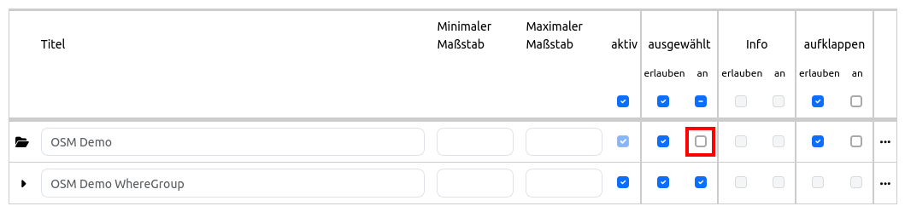

.. _basesourceswitcher_de:

Hintergrund wechseln
********************

 .. |mapbender-button-add| image:: ../../../figures/mapbender_button_add.png

"Hintergrund wechseln" erstellt Buttons mit Themen, um zuvor für diesen Zweck konfigurierte Dienste im Kartenbereich sichtbar zu schalten. Auf diese Weise kann etwa zwischen verschiedenen Hintergrundkarten gewechselt werden. Dabei ist immer nur ein Thema aktiv. 
Zusätzlich können Gruppen für die Hintergrund-Themen definiert werden. Alle Definitionen einer Gruppe werden als Dropdown-Liste angezeigt, wobei der Gruppenname als übergeordneter Eintrag erscheint.

.. image:: ../../../figures/basesourceswitcher.png
     :scale: 80

.. hint:: Das Element kann auch in der Sidepane eingebunden werden. Beim Hinzufügen des Hintergrundwechslers in der Sidepane ist keine Definition von Gruppen möglich.

Konfiguration
=============

**Vorbereitung**: Zur Definition einer Hintergrundkarte mit dem Element müssen zuvor im :ref:`backend_de` (Reiter: :ref:`layerset_de`) mindestens zwei Dienste konfiguriert werden. Um sie verwenden zu können, ist in den Layerset-Einstellungen eines Dienstes das Anhaken der Checkbox "Basesource" erforderlich.

.. image:: ../../../figures/de/basesourceswitcher_basesource.png
     :scale: 80

.. note:: Beachten Sie, dass beim Anwendungsstart die Themen aktiviert werden, bei denen der root-Layer aktiv ist.

Konfiguration aktiver ausgewählter root-Layer - Thema ist aktiv beim Start:

Konfiguration nicht aktivierter ausgewählter root-Layer - Thema ist beim Start nicht aktiv:

Die Konfiguration des Elements geschieht in zwei Schritten:

#. Erzeugen eines Elements zum Wechseln der vordefinierten Themen (Titel, Tooltip; bei Einbindung in Kartenbereich: Position)
#. Hinzufügen von Themen mit einer oder mehreren Quellen und optionaler Definition einer Gruppe

* **Titel:** Titel des Elements.
* **Tooltip:** Text, der erscheint, wenn der Mauszeiger längere Zeit über dem Hintergrundwechsler gehalten wird.
* **Instancesets:** Es können eine oder mehrere Themengruppen definiert werden. Diese verweisen auf eine Auswahl an Instanzen und sind mit einem Titel und einem Gruppennamen (optional) zu versehen.

.. image:: ../../../figures/de/basesourceswitcher_de.png
     :scale: 80

Das Konfigurationsbeispiel zeigt, dass entweder ein, kein oder mehrere Einträge pro Instanceset gewählt werden können. Durch eine Group-Angabe lassen sich Gruppen bilden. Weitere Instancesets können über den |mapbender-button-add| Button hinzugefügt werden. Ein Instanceset lässt sich mit Drag & Drop verschieben.

* **Titel**: Name der Hintergrundkarte.
* **Gruppe**: Optionale Zuweisung zu einer Themengruppe.
* **Position:** Positionierung (nur bei Nutzung im Kartenbereich). Möglichkeiten: 'Oben links', 'Unten links', 'Oben rechts', 'Unten rechts'
* **Instanzen**: Auswahl der Instanzen für die Hintergrundkarte.

YAML-Definition
---------------

Diese Vorlage kann genutzt werden, um das Element in einer YAML-Anwendung einzubinden.

.. code-block:: yaml

    title:                                              # Titel
    tooltip:                                            # Text des Tooltips
    target: map                                         # ID des Kartenelements
    anchor: 'right-bottom'                              # Positionierung nur bei Nutzung im Kartenbereich (Standard: right-bottom) - Optionen: 'left-top', 'right-top', 'left-bottom', 'right-bottom'
    sourcesets:                                         # Liste der Sourcesets.
        - { title: sourcesetname, group: groupname,
            sources: [sourceId]}                        # sourceset: Titel,
                                                        # group: (optional) Gruppenname der Gruppen der Sourcesets über "group name"
                                                        # sources Liste der Sources
        - { title: sourcesetname, group: groupname,
            sources: [sourceId]}

