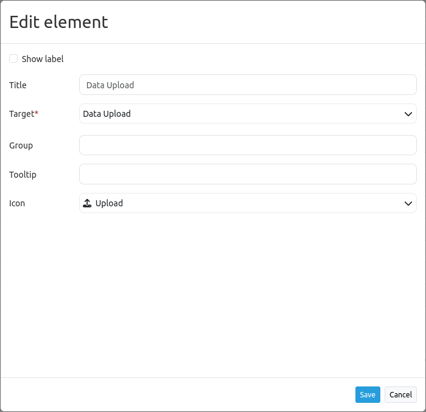

Daten Laden
***********

Mit dem Element *Daten Laden* können Punkte, Linien, Polygone und Multipolygone aus Geodaten in Mapbender hochgeladen werden.
Sie können Dateien im GeoJSON-, KML-, GML- und GPX-Format per Drag and drop oder mithilfe des Ordnersystems der Dateiverwaltung hochladen.
Für eine passende Projektion wählen Sie entweder ein eigenes Koordinatenreferenzsystem oder nutzen das Feature *Projektion automatisch bestimmen*.

.. hint:: Die Dateigröße sollte 10 MB nicht überschreiten. Diese Einstellung kann in der YAML-Definition angepasst werden.

Konfiguration
-------------

* **Beschriftung anzeigen (Show label)**: Zeigt eine Titelbeschriftung an, die neben den Koordinaten erscheint.
* **Title**: Titel des Elements. Dieser wird neben den Koordinaten ausgegeben, wenn 'Beschriftung anzeigen' aktiviert ist.
* **Target**: ID des Kartenelements.
* **Gruppe**: Optionaler Gruppenname.
* **Tooltip**: Hilfetext, der angezeigt wird, sobald der Cursor über dem Element verweilt.
* **Icon**: Symbolbild, welches für den Button in der Anwendung gewählt werden kann.

Nachdem das Element dem Backend hinzugefügt wurde, wird es in Mapbender an der entsprechenden Position angezeigt.
Anschließend können neue Dateien sowohl über Drag and drop als auch über den 'Datei wählen'-Button hinzugefügt werden.

.. image:: ../../../figures/dataupload.png
     :width: 100%

Nachdem eine Datei hochgeladen wurde, werden die Objekte auf der Karte angezeigt und in der Sidepane gelistet.
Über die Liste können Sie die Objektsichtbarkeit einstellen, auf das Objekt zoomen oder es löschen.

YAML-Definition
---------------

Diese Vorlage kann genutzt werden, um das Element in einer YAML-Anwendung einzubinden.

.. code-block:: yaml
     
     dataupload:
     class: Mapbender\CoreBundle\Element\DataUpload
     target: map
     maxFileSize: 10
     helpText: mb.core.dataupload.admin.helpText