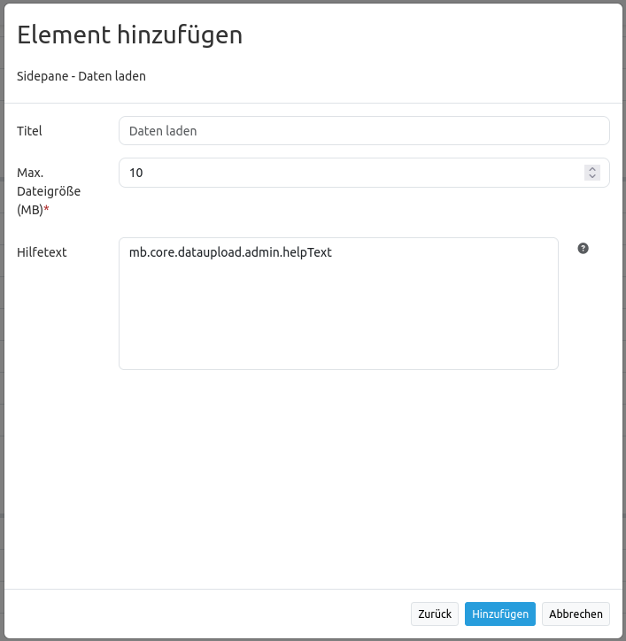

Daten laden
***********

Mit **Daten laden** können Punkte, Linien, Polygone und Multipolygone aus Geodaten in den Formaten GeoJSON-, KML-, GML- und GPX geladen werden.
Sie können eine oder mehrere Dateien per drag & drop oder über die Dateiauswahl hochladen.
Für eine passende Projektion wählen Sie entweder ein eigenes Koordinatenreferenzsystem oder nutzen das Feature *Projektion automatisch bestimmen*.

.. hint:: Die Dateigröße ist begrenzt. In der Elementkonfiguration kann eine maximale Größe definiert werden.

.. image:: ../../../figures/dataupload.png
     :scale: 70

Konfiguration
-------------

* **Titel**: Titel des Elements, erscheint in der Kopfzeile des Elements.
* **Max. Dateigröße (MB)**: Maximal erlaubte Dateigröße in Megabyte. Vorgabewert: 10 MB.
* **Hilfetext**: Frei definierbarer Hilfetext, der über dem Uploadfeld angezeigt wird.

Nachdem **Daten laden** dem Backend hinzugefügt wurde, wird es in Mapbender an der entsprechenden Position angezeigt.
Anschließend können neue Dateien sowohl über Drag and drop als auch über den 'Datei wählen'-Button hinzugefügt werden.
Nachdem eine Datei hochgeladen wurde, werden die Objekte auf der Karte angezeigt und in der Sidepane gelistet.
Über die Liste können Sie die Objektsichtbarkeit einstellen, auf das Objekt zoomen oder es löschen.

YAML-Definition
---------------

Diese Vorlage kann genutzt werden, um das Element in einer YAML-Anwendung einzubinden.

.. code-block:: yaml
     
 dataupload:
    class: Mapbender\CoreBundle\Element\DataUpload     # Element class name
    target: map                                        # Element target
    maxFileSize: 10                                    # Maximum file size (Megabyte)
    helpText: mb.core.dataupload.admin.helpText        # Text that appears as help dialog