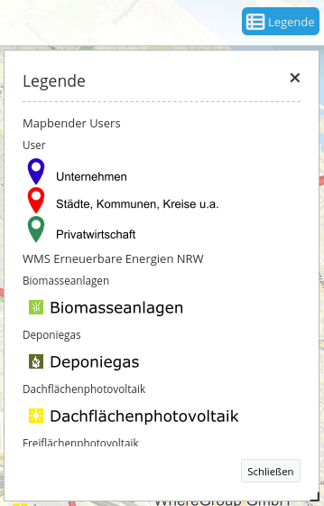
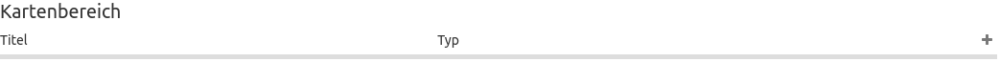
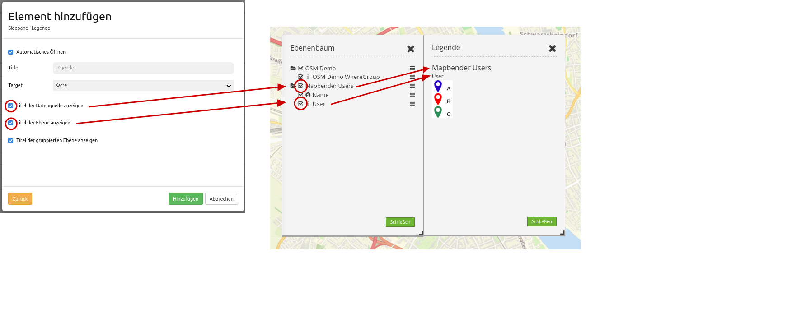

.. _legend_de:

Legende (Legend)
****************

Dieses Element zeigt eine Legende der Layer an, die in der Karte dargestellt werden. Nicht jeder Layer verfügt dabei über eine Legende. Zusätzlich zum Legendenbild können der Titel des Dienstes, des Layers und der Gruppe (sofern vorhanden) angezeigt werden. 

Konfiguration
=============

.. image:: ../../../figures/de/legend_configuration.png
     :scale: 80

* **Automatisches Öffnen:** Sofern aktiviert, öffnet sich die Legende beim Anwendungsstart (Standard: deaktiviert).
* **Title:** Titel des Elements. Dieser wird in der Layouts Liste angezeigt. In der Karte wird der Titel neben dem :ref:`button_de` angezeigt, wenn dort "Beschriftung anzeigen" aktiviert ist.
* **Titel der Datenquelle anzeigen:** zeigt den WMS Titel (Standard: true).
* **Titel der Ebene anzeigen:** zeigt den Layertitel (Standard: true).
* **Titel der gruppierten Ebenen anzeigen:** zeigt den Gruppenlayertitel für gruppierte Layer (Standard: true).

Für das Element wird ein Button oder die Sidepane verwendet. Zu der Konfiguration des Buttons besuchen sie die Dokumentationsseite unter :ref:`button_de`.

Konfigurationsbeispiele
=======================

Legende in der Sidepane
-----------------------
Die Legende in der Sidepane wird über das ``+`` -Zeichen im Backend der Anwendung unter Layouts - Sidepane eingebunden.

.. image:: ../../../figures/de/add_sidepane.png
     :scale: 80

Anschließend wird das Element ausgewählt. Es öffnet sich der Konfigurationsdialog.

.. image:: ../../../figures/de/legend_example_sidepane_dialog.png
     :scale: 80

Das hier konfigurierte Element hat den Titel "Legende". Die Legende öffnet sich automatisch (Häkchen bei *Automatisches Öffnen*). Der Titel der Ebenen sowie der Titel der gruppierten Ebenen (Häkchen bei *Titel der Ebene anzeigen* und *Titel der gruppierten Ebene anzeigen*) werden angezeigt.

Diese Konfiguration ergibt folgendes Ergebnis in der Anwendung:

.. image:: ../../../figures/de/legend_example_sidepane.png
     :scale: 80

Legende in der Oberen Werkzeugleiste (Toolbar)
-----------------------------------------------
Die Legende kann auch als Button in der Werkzeugleiste eingebunden werden. Hierfür muss zuerst das Element Legende unter dem Reiter Layouts im Kartenbereich eingefügt werden.

Für das Konfigurationsbeispiel wurden folgende Einstellungen gewählt:

.. image:: ../../../figures/de/legend_example_toolbar_dialog.png
     :scale: 80

Für das Konfigurationsbeispiel wurde das Häkchen bei *Automatisches Öffnen* entfernt, sodass sich die Legende nur bei aktivem Klicken auf einen Button öffnet.
Sobald dieses Element im Kartenbereich eingebunden wurde, muss ein Button in der oberen Werkzeugleiste eingefügt werden. Die Konfiguration von Buttons wird in der Mapbender-Dokumentation unter :ref:`button_de` beschrieben.

Die Konfiguration eines Buttons für die Legende kann wie folgt aussehen:

.. image:: ../../../figures/de/legend_example_button.png
     :scale: 80

Mit diesen Einstellungen sieht das Ergebnis in der Anwendung wie folgt aus:

.. image:: ../../../figures/de/legend_example_toolbar.png
     :scale: 80

In der Oberen Werkzeugleiste (Toolbar) ist der Button für das Legenden-Element zu sehen. Sobald auf den Button geklickt wird, öffnet sich ein Dialog mit der Legende.

Inwiefern sich die Aktivierung bzw. Deaktivierung einzelner Haken auf die Legende auswirkt, ist hier zu sehen:

YAML-Definition
---------------

Diese Vorlage kann genutzt werden, um das Element in einer YAML-Anwendung einzubinden.

.. code-block:: yaml

   tooltip: 'Legend'                    # Text des Tooltips
   elementType: dialog                  # Anzeige als Dialog- oder Blockelement (Standard: Dialog)
   autoOpen: true                       # true, wenn die Legende beim Start der Anwendung geöffnet werden soll (Standard: false)
   displayType: list                    # Akkordeonartige Anzeige oder Liste (Standard: Liste)
   target: ~                            # ID des Kartenelements
   hideEmptyLayer: true                 # true/false Layer wird versteckt, wenn keine Legende verfügbar ist (Standard: true)
   showWmsTitle: true                   # true/false zeigt den WMS Titel (Standard: true)
   showLayerTitle: true                 # true/false zeigt den Layertitel (Standard: true)
   showGroupedLayerTitle: true          # true/false zeigt den Gruppentitel für gruppierte Layer (Standard: true)
