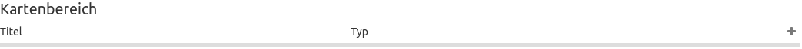

.. _map_de:

Karte (Map)
***********
Die Karte ist das zentrale Element einer Anwendung. Sie basiert auf OpenLayers und wird als Element in den Kartenbereich im :ref:`backend_de` integriert.

.. image:: ../../../figures/de/map.png
     :width: 75%

Konfiguration
=============

.. image:: ../../../figures/de/map_dialog.png
     :width: 50%

* **Title:** Titel des Elements. Dieser wird im :ref:`layouts_de`-Bereich angezeigt.
* **Layersets:** Wählen Sie ein oder mehrere :ref:`layerset_de` aus, die vom Kartenelement dargestellt werden sollen. Dabei kann die Reihenfolge der Layersets via Drag-and-drop verändert werden.
* **Tile size:** Größe der Tiles bei gekachelten Diensten.
* **SRS:** Koordinatenbezugssystem beim Start der Anwendung ("Spatial Reference System"). Zwei Arten der SRS Definition werden unterstützt: EPSG:CODE oder EPSG:CODE|MEIN SRS TITEL. Wird kein eigener SRS-Titel definiert, so wird die Standarddefinition aus der Title-Spalte der Tabelle *mb_core_srs* verwendet.
* **Max. Kartenausdehnung:** Maximaler Kartenbereich (BBOX mit min/max x/y). Ein Umgebungsrechteck, das den Ausschnitt definiert. Bei Klick auf das Globus-Icon im :ref:`navigation_toolbar_de` wird auf die maximale Ausdehnung gezoomt.
* **Initiale Kartenausdehnung:** Bereich der Karte, der beim Starten der Anwendung angezeigt wird (BBOX mit min/max x/y). Ein Umgebungsrechteck, das den Ausschnitt definiert. Bei Klick auf das Haus-Icon im :ref:`navigation_toolbar_de` wird auf die initiale Ausdehnung gezoomt.
* **Standard-Auflösung [dpi]:** Die Auflösung passt sich auf Basis dieses Wertes an die Auflösung des verwendeten Gerätes an. Standard: 96 dpi.
* **Feste Maßstabsstufen:** Das Zoom-Verhalten wird hierdurch konfiguriert. Feste Maßstabsstufen verbessern die visuelle Qualität von Diensten, welche nur auf bestimmten Maßstäben zwischengespeichert werden. Ist die Einstellung aktiviert, dann können nur Maßstäbe ausgewählt werden, die auch unter *scales* im Folgenden definiert sind (Standard: false).
* **Scales (csv):** Festgelegte Zoomstufen, die durch Drehen des Mausrads oder bei stufenweisem Zoomen für den Maßstab genutzt werden (werden durch Komma getrennt).
* **Other SRS:** Weitere auswählbare Projektionen unter denen die Karte angezeigt werden kann (werden durch Komma getrennt). Zwei Arten der SRS Definition werden unterstützt: EPSG:CODE oder EPSG:CODE|MEIN SRS TITEL.

Konfigurationsbeispiel
======================

Das Kartenelement (Map) muss unter Layouts im Kartenbereich integriert werden:

In der Karte können alle Instanzen angezeigt werden, welche im Layerset enthalten sind. Im vorliegenden Beispiel wird zwischen der *Hauptkarte/main* (1) und *Übersichtskarte/overview* (2) unterschieden.

.. image:: ../../../figures/de/map_example_layersets.png
     :width: 100%

Damit *Layersets* auch in der Karte angezeigt werden, müssen diese im Kartenelement aktiviert werden. Eine Mehrfachauswahl ist hierbei auch möglich. Layersets, welche nicht ausgewählt wurden, können als :ref:`overview_de` fungieren. Im Beispiel dient *main* als Haupt- und *overview* als Übersichtskarte.

Im Feld *SRS* muss das Koordinatenreferenzsystem eingetragen werden. Im Beispiel ist dies EPSG:25832 bzw. ETRS89/UTM Zone 32N. Wenn andere Referenzsysteme zur Auswahl stehen sollen, werden diese unter *Other SRS* angegeben. Im Beispiel umfasst dies: EPSG:25833 (ETRS89/UTM Zone 33N), EPSG:31466 (DHDN/3-degree Gauss-Krüger Zone 2), EPSG:31467 (DHDN/3-degree Gauss-Krüger Zone 3), EPSG:3857 (WGS 84/Pseudo-Mercator) und EPSG:4326 (WGS 84).

Weiterhin muss das Feld *Max. Kartenausdehnung* definiert werden. Dieses gibt den maximalen sichtbaren Kartenbereich an. Alles was außerhalb dieser Angabe liegt, wird in der Anwendung nicht dargestellt. Das Pflichtfeld *Initiale Kartenausdehnung* wiederum definiert den Startbereich, welcher beim Öffnen der Anwendung zu sehen ist. Im Beispiel wird das Stadtgebiet von Bonn angezeigt.

Die Standard-Auflösung in dpi definiert die Auflösung des verwendeten Geräts; der zugehörige Standardwert von 96 dpi ist über dieses Feld anpassbar. Falls die dargestellte Auflösung der Karte nicht mit der des WMS-Dienstes übereinstimmt, kann eine Veränderung des Werts helfen, um die Karte passend darzustellen.

.. note:: Hinweis: Die maßstabsabhängige Anzeige funktioniert derzeit nur auf Desktops mit regulärer Auflösung zuverlässig.

Zuletzt definiert *Scales (csv)* die unterschiedlichen Maßstabsstufen in der Anwendung. Zwischen diesen kann mithilfe des :ref:`scale_selector_de` oder der :ref:`navigation_toolbar_de` navigiert werden. Feste Maßstabsstufen wurden dabei im Beispiel deaktiviert, weshalb auch eine Auswahl anderer Maßstäbe über das Mausrad möglich ist.

YAML-Definition
---------------

Diese Vorlage kann genutzt werden, um die Karte in einer YAML-Anwendung einzubinden.

.. code-block:: yaml

   layerset: null             # Definiert und verweist auf ein Layerset
   srs: "EPSG:4326"           # Koordinatenbezugssystem. Zwei Arten der SRS Definition werden unterstützt:
                                - "EPSG:CODE" oder
                                - "EPSG:CODE|MEIN SRS TITEL"
   extents:
       max: [0, 40, 20, 60]
       start: [5, 45, 15, 55] # Kartenbereich (extent)
   scales: "25000000,10000000,5000000,1000000,500000" # eine CSV-Liste für den Maßstab
   otherSrs:
       - EPSG:31466
       - EPSG:31467
       - EPSG:25832          # andere Koordinatenbezugssystem. Zwei Arten der SRS Definition werden unterstützt:
                                - ["EPSG:CODE","EPSG:CODE"] or
                                - ["EPSG:CODE|MEIN SRS TITEL","EPSG:CODE|MEIN SRS TITEL"]
   tileSize: 256             # Kachelgröße

Kontrolle über URL-Parameter
============================

.. _layer_activation_de:

Ebenen aktivieren
-----------------

Mapbender ermöglicht über den URL-Parameter ``visiblelayers`` die Möglichkeit, Layer unabhängig von ihrer Backend-Konfiguration beim Start einer Anwendung zu aktivieren. Hierbei kann die Aktivierung entweder via `ID` oder `Name` erfolgen:

* **ID**: <InstanceID>/<InstanceLayerID>
* **Name**: <RootLayerName>/<LayerName>

**InstanceID/InstanceLayerID**: Auf diese Weise werden die anwendungsspezifischen Werte von InstanceID und InstanceLayerID übergeben:

.. code-block:: php

  ?visiblelayers=<InstanceID>/<InstanceLayerID>

**RootLayerName/LayerName**: Auf diese Weise werden Ebenen entlang der Kombination aus Dienst- und Layernamen als Parameter übergeben:

.. code-block:: php

  ?visiblelayers=<RootLayerName>/<LayerName>
  
.. hint:: Bitte beachten Sie, dass sich die IDs nach jedem Dienst-Update ändern. Die Übergabe des Names ist daher ggf. die konstantere Lösung.

Um weitere Layereigenschaften anzuzeigen, gibt es im Layerset-Reiter bei der Instanz-Konfiguration neben jedem Layer ein Icon mit drei Punkten.
Klicken Sie auf das Icon, damit ein Informationsfenster erscheint:

* **ID**: Der erste Wert im oberen Textfeld nennt die interne `SourceID` und die `SourceLayerID` (3-15). Der zweite Wert im oberen Textfeld nennt die `InstanceID` und die `InstanceLayerID` (4-79).
* **Name**: Im zweiten Textfeld steht der `LayerName`. Dabei wird in der ersten Zeile der `RootLayerName` ausgegeben.
* **Style**: Im dritten Dropdownfeld können Stylingalternativen ausgewählt werden, sofern verfügbar.

Nutzen Sie für eine ID-Übergabe die *zweite* Wertkombination nach dem Schrägstrich für den ``visiblelayers``-Parameter in der URL.
Trennen Sie die beiden Werte mit einem Schrägstrich (anstelle des Bindestrichs):

Zum Beispiel: ``https://localhost/mapbender/application/myapp?visiblelayers=4/79``

Zwei oder mehr nicht-sichtbare Layer können kommasepariert übergeben werden. Fügen Sie dazu die jeweiligen Attributwerte nach demselben Schema ein:

Zum Beispiel: ``https://localhost/mapbender/application/myapp?visiblelayers=4/79,1/42``

Auch Kombinationen aus Namen und ID-Werten sind möglich:

``https://localhost/mapbender/application/myapp?visiblelayers=Mapbender/Mapbender_Names,Mapbender/Mapbender_User,39/149``

Punkte übergeben
----------------

Sie können einen Punkt in der Karte mit der URL übergeben. Jeder Punkt verfügt dabei über die folgenden Parameter:

- Punkt (point): Koordinatenpaar, die Werte werden mit Komma getrennt (Pflichtfeld),
- Beschriftung (label): Beschriftung, die angezeigt werden soll (optional),
- Maßstab (scale): Maßstab, in dem der Punkt angezeigt werden soll (optional).

Format für die Übergabe eines Punktes:

.. code-block:: php

   ?poi[point]=368777,5619411&poi[label]=Rheinaue&poi[scale]=10000

Rechteck (BBOX) übergeben
-------------------------

Es kann ein Rechteck (BBOX) beim Start übergeben werden. Es wird dann auf dieses Rechteck gezoomt. Der Aufruf sieht wie folgt aus:

.. code-block:: php

   ?bbox=364286,5622263,365979,5622806

Maßstab übergeben
-----------------

Es kann der gewünschte Maßstab aus der Liste der verfügbaren Maßstäbe übergeben werden.

.. code-block:: php

   ?scale=1000

SRS (Projektion) übergeben
--------------------------

Es kann eine gewünschte Projektion für den Start der Anwendung übergeben werden.

.. code-block:: php

   ?srs=EPSG:4326

Anwendung über Koordinate zentrieren
------------------------------------

Es kann eine Koordinate beim Start übergeben werden, die in der Anwendung zentriert werden soll.

.. code-block:: php

   ?center=364286,5622263

Weitere Startparameter
----------------------

Die Elemente WMS Loader und WMC Loader stellen ebenfalls Parameter zur Verfügung, die beim Start einer Anwendung übergeben werden können. Schauen Sie sich für nähere Informationen die Dokumentation dieser Elemente an.

