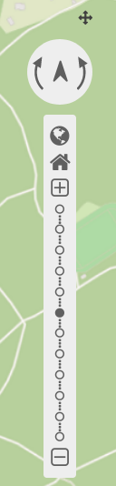
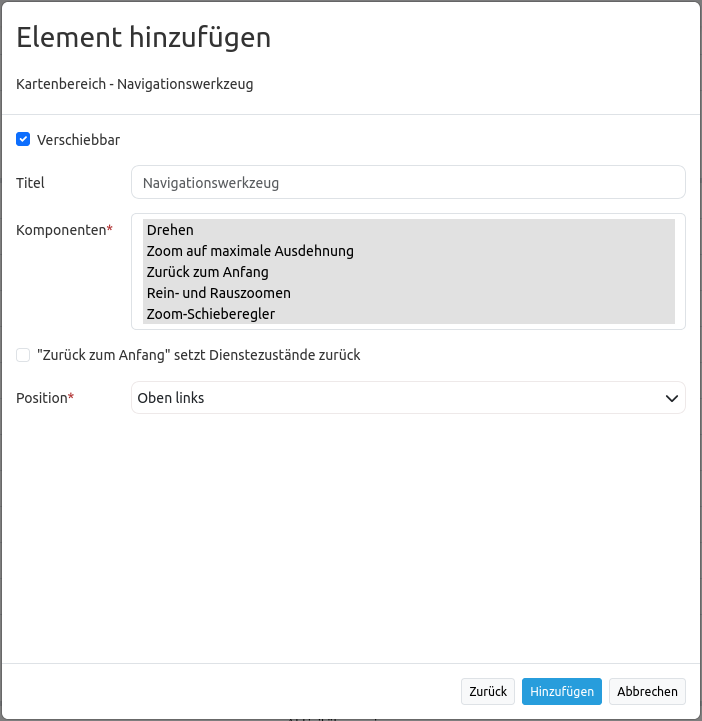

.. _navigation_toolbar_de:

Navigationswerkzeug (Navigation Toolbar)
****************************************

Das Element erleichtert die Navigation in der Karte (Rotation und Zoom) durch entsprechende Buttons. Der Kartenmaßstab kann dabei individuell über eine Leiste angesprungen oder über die Zoom in/out-Buttons abgeändert werden. Es besteht zudem die Möglichkeit, auf die maximale Kartenausdehnung zu zoomen oder zum Anfangszustand zurück zu navigieren. Das Navigationselement kann verschoben werden, wenn die Option aktiviert wird.

Konfiguration
=============

* **Verschiebbar:** Navigationswerkzeug ist verschiebbar oder nicht (Standard: true).
* **Titel:** Titel des Elements. Dieser wird in der Layouts Liste angezeigt.
* **Komponenten:** Komponenten des Navigationswerkzeugs; Pflichtfeld. Auswahlmöglichkeiten: Drehen, Zoom auf maximale Ausdehnung, Zurück zum Anfang, Rein- und Rauszoomen und Zoom-Schieberegler.
* **"Zurück zum Anfang" setzt Dienstezustände zurück:** Zurücksetzen von Dienstzuständen (Standard: false).
* **Position:** Ausrichtung des Navigationswerkzeugs (Standard: 'left-top'); Pflichtfeld. Auswahlmöglichkeiten: inline (zum Einbinden in der Sidepane), left-top (oben links), left-bottom (unten links), right-top (oben rechts), right-bottom (unten rechts).

.. note:: Das Element muss innerhalb des Kartenbereichs konfiguriert werden.

Komponenten des Navigationswerkzeugs
------------------------------------

Im Konfigurationsdialog können unterschiedliche Komponenten, also Funktionen des Navigationswerkszeugs, eingebunden werden.

Die Komponenten sehen in der Anwendung wie folgt aus:

.. image:: ../../../figures/de/navigationtoolbar_features.png
   :scale: 80

*  **Verschiebbar:** Wenn das Häkchen bei Verschiebbar gesetzt wurde, dann erscheint in der Anwendung ein kleines Kreuzsymbol zur Verschiebung des Navigationselements.
*  **Drehen:** Mit Drehen kann die Ausrichtung der Karte verändert werden. Durch Klick auf den Nordpfeil ist es möglich, die Standardrotation (Nordausrichtung) wiederherzustellen.
*  **Zoom auf maximale Ausdehnung:** Es besteht die Möglichkeit, auf den kleinsten Maßstab zu zoomen. Dieser wird innerhalb des :ref:`Kartenelements <map_de>` im Kartenbereich definiert.
*  **Zurück zum Anfang:** Ermöglicht das Wiederherstellen der anfänglichen Einstellungen von Maßstab, Koordinatenreferenzsystem, Rotation und Zentrierung.
*  **Rein- und Rauszoomen:** Ermöglicht das Hineinzoomen, sowie das Hinauszoomen aus der Karte. Der Kartenausschnitt springt dabei immer zum jeweils nächstgrößeren bzw. -kleineren Maßstab. Je nach Definition im Kartenelement sind größere oder kleinere Zoomschritte möglich. Nutzer haben außerdem die Möglichkeit, feste Zoomstufen im Kartenelement zu deaktivieren.
*  **Zoom-Schieberegler:** Die Komponente beinhaltet automatisch die Komponente *Rein- und Rauszoomen*. Zusätzlich besteht diese Komponente aus einer Leiste, die die möglichen Zoomstufen als auswählbare Punkte anzeigt.

YAML-Definition
---------------

Diese Vorlage kann genutzt werden, um das Element in einer YAML-Anwendung einzubinden.

.. code-block:: yaml

   tooltip: 'Navigation Toolbar'    # Text des Tooltips
   components: ["rotation",         # Komponenten des Navigationswerkzeugs, standardmäßig wird alles selektiert
   "zoom_max", "zoom_home",
   "zoom_in_out", "zoom_slider"]
   target: ~                        # ID des Kartenelements
   anchor: left-top                 # Ausrichtung des Navigationswerkzeugs (Standard: 'left-top')
                                    # Benutzen Sie inline z.B. für die Sidebar
                                    # Optionen: 'inline', 'left-top', 'left-bottom', 'right-top', 'right-bottom'
   draggable: true                  # das Navigationswerkzeug ist verschiebbar oder nicht (Standard: true)
   zoomHomeRestoresLayers: false    # Zurücksetzen von Dienstzuständen (Standard: false)

