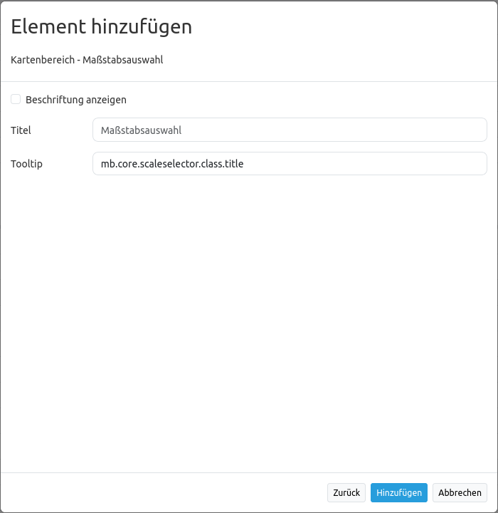

.. _scale_selector_de:

Maßstabsauswahl (Scale selector)
********************************

Dieses Element zeigt eine Auswahlbox mit Maßstäben an. Der Kartenmaßstab ändert sich, wenn ein neuer Wert der Auswahlbox ausgewählt wird. Zudem ändert sich der Wert der Anzeige, wenn in die Karte hinein- oder herausgezoomt wird. Die Auswahlbox zeigt nur Maßstäbe an, die vorher auch für das Map Element definiert wurden.

.. image:: ../../../figures/scale_selector.png
     :scale: 100

Konfiguration
=============

* **Beschriftung anzeigen:** Zeigt die Beschriftung der Maßstabsauswahl an (Standard: false).
* **Title:** Titel des Elements. Dieser wird unter dem Reiter Layouts angezeigt und ermöglicht, mehrere Button-Elemente voneinander zu unterscheiden. Der Titel wird außerdem neben der Auswahlbox angezeigt, wenn die Option "Beschriftung anzeigen" aktiviert ist.
* **Tooltip:** Text, der angezeigt wird, wenn der Mauszeiger eine längere Zeit über dem Element verweilt.

YAML-Definition
---------------

Diese Vorlage kann genutzt werden, um das Element in einer YAML-Anwendung einzubinden.

.. code-block:: yaml

   tooltip: "Maßstabsauswahl"  # Text des Tooltips
   target: ~         # ID des Kartenelements
   label: false      # false/true, um die Maßstabsauswahl zu beschriften (Standard: false).

