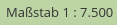
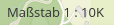

.. _scaledisplay_de:

Maßstabsanzeige (Scale display)
*******************************

Die Maßstabsanzeige zeigt den aktuellen Maßstab numerisch an (z.B. als 1:7.500 oder 1:10K).

Konfiguration
=============

.. image:: ../../../figures/de/scaledisplay_configuration.png
     :scale: 70

* **Titel:** Titel des Elements. Dieser wird in der Layouts Liste angezeigt und ermöglicht, mehrere Button-Elemente voneinander zu unterscheiden.
* **Präfix:** Anpassbare Bezeichnung, die vor der Maßstabsangabe steht. Der Standard ``mb.core.scaledisplay.label`` wird als Maßstab in der Sprache des Benutzers gerendert.
* **Maßstab abkürzen:** Falls aktiviert, werden Maßstabszahlen ab 10.000 nicht ausgeschrieben, sondern mit nachgestelltem ``K`` oder ``M`` versehen, z.B. 10K für 10.000 (Standard: false).
* **Position:** Position des Elements (Pflichtfeld, Standard: 'Unten rechts').

YAML-Definition
---------------

Diese Vorlage kann genutzt werden, um das Element in einer YAML-Anwendung einzubinden.

.. code-block:: yaml

   tooltip: 'ScaleDisplay'          # Text des Tooltips
   target: ~                        # ID des Kartenelements
   anchor: 'inline'/'left-top'/     # Ausrichtung des ScaleDisplay-Elements (Standard: 'right-bottom')
     'left-bottom'/'right-top'/     
     'right-bottom'
   scalePrefix: Scale               # Bezeichnung, die vor der Maßstabsangabe steht, z.B. "Maßstab"
   unitPrefix: true                 # aktiviert Darstellung der Maßstabszahl mit Präfix (Standard: false).

