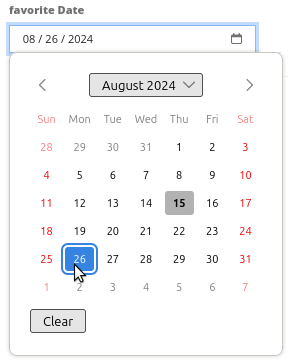

.. _digitizer_configuration_de:

Einrichtung des Digitizers
==========================

Der Digitizer kann nur in der Sidepane eingebettet werden. Es ist jedoch möglich, dieser mehrere Digitizer-Instanzen hinzuzufügen.
Der Digitizer wird im Backend eingerichtet. Dabei muss eine YAML-Definition in dem zugehörigen Formularfenster gespeichert werden.
Mit dieser konfigurieren Sie die Datenbankverbindung, editierbare Felder, Anzeigeformulare und andere Verhaltensweisen.

.. image:: ../../../../figures/digitizer_configuration.png
     :width: 100%

* **Title:** Titel des Elements. Dieser ermöglicht, mehrere Element-Instanzen voneinander zu unterscheiden.
* **Schemes:** Konfigurierbare YAML-Definition.

Zusätzlich benötigt der Digitizer einen Zugriff auf die Datenbank, in der die zu editierenden Tabellen liegen.
Deshalb muss ein Datenbankzugriff konfiguriert werden. Lesen Sie mehr dazu unter :ref:`yaml_de`.

Bei fehlerhaften Angaben zur Datenbank, zu Feldern und bei Formularfehlern erscheinen Fehlermeldungen. Bei Produktivumgebungen erscheint eine allgemeine Fehlermeldung.
Falls Sie die detaillierte Fehlermeldung sehen möchten, sollten Sie die Anwendung als Entwicklungsumgebung aufrufen. Weitergehende Informationen unter :ref:`de/quickstart:Starten von Mapbender als Produktivumgebung`.

.. warning:: Verknüpfen Sie **keine** Digitizer-Verbindung für Geodaten mit Ihrer Mapbender "default"-Datenbank. Diese enthält bereits Doctrine-Entitäten, sodass bei einer Kombination Fehler bei der Ausführung von Doctrine-Schema-Updates zu erwarten sind.

Diese Seite umfasst mehrere Kapitel:

1. :ref:`de/elements/editing/digitizer/digitizer_configuration:SQL für die Demo-Tabellen` legt mit beispielhaften SQL-Befehlen eine Datenbankverbindung und drei Demo-Tabellen für den Digitizer an.
2. :ref:`de/elements/editing/digitizer/digitizer_configuration:YAML-Definition` gibt ein Beispiel für eine Standard-YAML-Konfiguration des Digitizer-Elements.
3. :ref:`de/elements/editing/digitizer/digitizer_configuration:konfiguration` erläutert den Funktionsumfang der im YAML-Block eingebauten Features (und weitere Funktionen).

SQL für die Demo-Tabellen
-------------------------

Die folgenden SQL-Befehle müssen in Ihrer Geodaten-Datenbank ausgeführt werden. Sie legen drei Demo-Tabellen an, die mit der obigen YAML-Definition verknüpft werden können. Bedingung ist eine aktive `PostGIS-Extension <https://postgis.net/>`_ in der Datenbank.

.. code-block:: postgres

    CREATE TABLE public.poi (
        gid serial PRIMARY KEY,
        name varchar,
        type varchar,
        abstract varchar,
        public boolean,
        date_favorite date,
        title varchar,
        firstname varchar,
        lastname varchar,
        email varchar,
        interests varchar,
        category varchar,
        user_name varchar,
        group_name varchar,
        modification_date date,
        my_type varchar,
        file_reference varchar,
        x float,
        y float,
        city varchar,
        style text,
        geom geometry(point,4326)
    );

.. code-block:: postgres

    CREATE TABLE  public.lines (
        gid serial PRIMARY KEY,
        name varchar,
        type varchar,
        abstract varchar,
        public boolean,
        date_favorite date,
        title varchar,
        firstname varchar,
        lastname varchar,
        email varchar,
        interests varchar,
        length float,
        category varchar,
        user_name varchar,
        group_name varchar,
        modification_date date,
        my_type varchar,
        file_reference varchar,
        x float,
        y float,
        city varchar,
        style text,
        geom geometry(linestring,4326)
    );

.. code-block:: postgres

    CREATE TABLE public.polygons (
        gid serial PRIMARY KEY,
        name varchar,
        type varchar,
        abstract varchar,
        public boolean,
        date_favorite date,
        title varchar,
        firstname varchar,
        lastname varchar,
        email varchar,
        interests varchar,
        area float,
        category varchar,
        user_name varchar,
        group_name varchar,
        modification_date date,
        my_type varchar,
        file_reference varchar,
        x float,
        y float,
        city varchar,
        style text,
        geom geometry(polygon,4326)
    );

YAML-Definition
---------------

Im folgenden YAML-Block sind Definitionen für drei Erfassungsoberflächen enthalten. Kopieren Sie ihn und fügen ihn vollständig unter **schemes** im Backend des Digitizer-Elements ein, um ein Digitizer-Element für Punkte, Linien und Polygone zu konfigurieren.

.. code-block:: yaml

    poi:
        label: point digitizing
        minScale: 5000
        maxScale: 20000
        maxResults: 500 
        featureType:
            connection: search_db
            table: poi
            uniqueId: gid
            geomType: point
            geomField: geom
            srid: 4326
        allowEditData: true # Allow attribute editing (default true)
        allowDelete: true # Allow user to remove features from the database (default true)
        allowDigitize: true # Allow geometry creation and editing (default true)
        roles: #Show this schema only to users with (at least one of) these roles
            - root
            - ROLE_GROUP_EDITING
        displayPermanent: true # Keep features visible on map even after switching to a different schema
        displayOnInactive: true # Keep features visible on map even after deactivating Digitizer
        continueDrawingAfterSave: # Keep drawing tool active after creating and saving a new feature (~fast batch mode feature creation)
        printable: false
        allowChangeVisibility: true
        inlineSearch: true
        searchType: currentExtent
        pageLength: 5 # Limits the number of rows per page (default 16)
        tableFields:
            gid:
                label: Nr.
                width: 20%
            name:
                label: Name
                width: 80%
        toolset:
            - type: drawPoint
            - type: moveFeature
        popup:
            title: point test suite
            width: 500px
        searchType: currentExtent
        tableFields:
            gid: {label: Nr. , width: 20%}
            name: {label: Name , width: 80%}
        styles:
            default:
                strokeWidth: 2
                strokeColor: '#0e6a9e'
                fillColor: '#1289CD'
                fillOpacity: 1
                fillWidth: 2
                pointRadius: 10
            select:
                strokeWidth: 3
                strokeColor: '#0e6a9e'
                fillOpacity: 0.7
                pointRadius: 10
            unsaved:
                strokeWidth: 3
                strokeColor: "#f0f0f0"
                fillColor:   "#ffffff"
                fillOpacity: 0.5
                pointRadius: 6
                label: 'Please save'
                fontColor: red
                fontSize: 18
        formItems:
           - type: tabs
             children:
               - type: form
                 title: Basic information
                 css: {padding: 10px}
                 children:
                     - type: label
                       title: Welcome to the digitize demo. Try the new Mapbender feature!
                     - type: input
                       title: Name
                       mandatory: true
                       name: name
                       mandatoryText: Please give a name to the poi.
                       infoText: "Help: Please give a name to the new object."
                     - type: input
                       title: Title
                       mandatory: false
                       name: title
                       mandatoryText: Please give a title to the poi.
                     - type: textArea
                       name: abstract
                       title: Abstract
                       placeholder: 'please edit this field'
                     - type: select
                       title: Type
                       name: type
                       options: {A: A, B: B, C: C, D: D, E: E}
                     - type: breakLine
               - type: form
                 title: Personal information
                 css: {padding: 10px}
                 children:
                     - type: label
                       title: Please give us some information about yourself.
                     - type: fieldSet
                       children:
                           - type: input
                             title: Firstname
                             name: firstname
                             css: {width: 30%}
                           - type: input
                             title: Lastname
                             name: lastname
                             css: {width: 30%}
                           - type: input
                             title: E-Mail
                             name: email
                             css: {width: 40%}
                     - type: select
                       multiple: false
                       title: Interests
                       name: interests
                       options: {maps: maps, reading: reading, swimming: swimming, dancing: dancing, beer: beer, flowers: flowers}
                     - type: date
                       title: favorite Date
                       name: date_favorite
                       mandatory: true
                       css: {width: 25%}
                     - type: breakLine
                     - type: breakLine
                     - type: checkbox
                       name: public
                       value: true
                       title: public (this new object is public)
    line:
        label: line digitizing
        inlineSearch: true
        featureType:
            connection: search_db
            table: lines
            uniqueId: gid
            geomType: line
            geomField: geom
            srid: 4326
        openFormAfterEdit: true
        allowDelete: true
        toolset:
            - type: drawLine
            - type: modifyFeature
            - type: moveFeature
        popup:
            title: line test suite
            width: 500px
        searchType: currentExtent
        tableFields:
            gid: {label: Nr. , width: 20%}
            name: {label: Name , width: 80%}
        styles:
            default:
                strokeWidth: 2
                strokeColor: '#0e6a9e'
                fillColor: '#1289CD'
                fillOpacity: 1
                fillWidth: 2
                pointRadius: 10
            select:
                strokeWidth: 3
                strokeColor: '#0e6a9e'
                fillOpacity: 0.7
                pointRadius: 10
        formItems:
           - type: form
             title: Basic information
             css: {padding: 10px}
             children:
                 - type: label
                   title: Welcome to the digitize demo. Try the new Mapbender feature!
                 - type: input
                   title: Name
                   name: name
                   mandatory: true
                   mandatoryText: Please give a name to the new object.
                   infoText: "Help: Please give a name to the new object."
                 - type: select
                   title: Type
                   name: type
                   options: {A: A, B: B, C: C, D: D, E: E}
    polygon:
        label: polygon digitizing
        inlineSearch: true
        featureType:
            connection: search_db
            table: polygons
            uniqueId: gid
            geomType: polygon
            geomField: geom
            srid: 4326
        openFormAfterEdit: true
        allowDelete: false
        useContextMenu: true
        toolset:
            - type: drawPolygon
            - type: drawRectangle
            - type: drawDonut
            - type: drawEllipse
            - type: drawCircle
            - type: modifyFeature
            - type: moveFeature
        popup:
            title: polygon test suite
            width: 500px
        searchType: currentExtent
        tableFields:
            gid: {label: Nr. , width: 20%}
            name: {label: Name , width: 80%}
        styles:
            default:
                strokeWidth: 2
                strokeColor: '#0e6a9e'
                fillColor: '#1289CD'
                fillOpacity: 1
                fillWidth: 2
                pointRadius: 10
            select:
                strokeWidth: 3
                strokeColor: '#0e6a9e'
                fillOpacity: 0.7
                pointRadius: 10
        formItems:
           - type: form
             title: Basic information
             css: {padding: 10px}
             children:
                 - type: label
                   title: Welcome to the digitize demo. Try the new Mapbender feature!
                 - type: input
                   title: Name
                   mandatory: true
                   name: name
                   mandatoryText: Please give a name to the new object.
                   infoText: "Help: Please give a name to the new object."
                 - type: select
                   title: Type
                   name: type
                   options: {A: A, B: B, C: C, D: D, E: E}

Konfiguration
=============

Nachfolgend werden alle Bestandteile des Digitizer-Elements, die in den YAML-Block eingebettet werden können, vorgestellt.

Basisdefinition
---------------

Eine Basisdefinition für eine Erfassungsoberfläche, hier am Beispiel der *poi*, sieht folgendermaßen aus:

.. code-block:: yaml

    poi:
        label: point digitizing
        minScale: 5000
        maxScale: 20000
        maxResults: 500 
        featureType:
            connection: search_db
            table: poi
            uniqueId: gid
            geomType: point
            geomField: geom
            srid: 4326
            filter: interests = 'maps'
            userColumn: user_name
            styleField: style
            # file upload location - customization per column on featureType (or dataStore) level
            files:
                - field: file_reference
                  path: /data/demo/mapbender_upload_lines/
        openFormAfterEdit: true
        zoomScaleDenominator: 500
        allowEditData: true
        allowDelete: true
        allowDigitize: true
        [...]
        popup:
            [...]

Die möglichen Optionen sind:

* **label:** Beschriftung mit dem Namen der Erfassungsoberfläche.
* **minScale:** Minimaler Maßstab, ab dem die Features in der Karte angezeigt werden (z.B. minscale: 5000 = Anzeige von Features ab einem kleineren Maßstab als 1:5000).
* **featureType:** Verbindung zur Datenbank.
    * connection: Name der Datenbank-Verbindung aus `parameters/doctrine.yaml`.
    * table: Name der Tabelle, in der das FeatureType gespeichert wird.
    * uniqueId: Name der Spalte mit dem eindeutigen Identifier (Standard bei Leerwert: [id]).
    * geomType: Geometrietyp.
    * geomField: Attributspalte, in der die Geometrie liegt.
    * srid: Koordinatensystem im EPSG-Code.
    * filter: Datenfilter über Werte in einer definierten Spalte, z.B. filter: interests = 'maps'.
* **allowChangeVisibility:** Ändern der Sichtbarkeit von einem Treffer in der Karte (sichtbar/nicht sichtbar) [true/false]. Falls aktiv, wird ein Auge-Symbol zu jedem Feature eingeblendet, mit dem dieses explizit aus- und wieder eingeblendet werden kann.
* **allowCreate:** Es dürfen neue Features erstellt werden (Standard true).
* **allowDelete:** Daten dürfen gelöscht werden (Standard true). Es erscheint eine **Löschen**-Schaltfläche.
* **allowDigitize:** Daten dürfen verändert und neu erstellt werden. [true/false]. Es erscheint immer die Digitalisierungs-Schaltfläche (neuer Punkt, Verschieben, etc.). Das Speichern ist jedoch nicht möglich.
* **allowEditData:** Daten dürfen editiert und gespeichert werden [true/false]. Es erscheint immer eine **Speichern**-Schaltfläche.
* **displayOnInactive:** Der aktuellen FeatureType wird weiterhin auf der Karte angezeigt, auch wenn der Digitizer in der Sidepane (Accordion, Tabs) nicht mehr aktiviert ist [true/false]. Die Option ist, wenn angeschaltet, etwas herausfordernd, da auch die einzelnen Digitizer Events noch aktiviert sind. Kann je nach Szenario dennoch hilfreich sein.
* **allowCustomStyle:** Objekte können individuell gestylt werden (Standard: false). Jedes Objekt kann einen eigenen Stil erhalten. Diese Option benötigt die Definition des Parameters **styleField** im featureType-Bereich.

 .. image:: ../../../../figures/digitizer/stylemanager.png
              :width: 100%

* **allowRefresh:** Button zum Neuladen der Daten (für Tabellen, die gleichzeitig von unterschiedlichen Anwendenden bearbeitet werden) (Standard: false).
* **continueDrawingAfterSave:** Das Zeichnen-Werkzeug bleibt auch nach dem Erzeugen und Speichern von Objekten aktiv.  
* **displayPermanent:** FeatureTypes werden dauerhaft angezeigt, auch wenn im Digitizer in ein anderes Schema gewechselt wird. (Standard: false)
* **displayOnInactive:** Features bleiben sichtbar, auch wenn der Digitizer nicht aktiv ist (Standard: false).
* **pageLength:** Limitert die Anzahl der Zeilen pro Seite (Standard: 16).
* **refreshLayersAfterFeatureSave:** Liste der Mapbender-Layerinstanz-IDs/Namen (siehe :ref:`de/backend/applications/layerset:Layerset-Instanzen`), die neu geladen werden, wenn ein Element erstellt, aktualisiert oder gelöscht wird (Standard: none).

.. code-block:: yaml

        refreshLayersAfterFeatureSave:
            - mapbender_users # or WMS InstanceID

* **roles:** Liste der Rollen. Zeigen Sie dieses Schema nur Benutzern an, die (mindestens eine) der folgenden Rollen haben.

.. code-block:: yaml

        roles: # Dieses Schema nur Benutzern mit (mindestens einer) der folgenden Rollen zeigen
            - root
            - ROLE_GROUP_EDITING

Kombinationsschema
------------------

Wenn ein Schema eine Kombinationseinstellung (``combine``) definiert, wird es als Kombinationsschema behandelt. Daten aus mehreren anderen Schemata werden dann gemeinsam angezeigt. Die Einträge in der Kombinationsliste müssen die Namen der zu kombinierenden Teilschemata sein.

* Ein Schema mit Angabe von ``combine`` erlaubt nur einen reduzierten Satz anderer Einstellungen.
* Es kann Rollen definieren, um den Benutzerzugriff auf die gesamte Kombination zu beschränken.
* Es kann eine Tabelle definieren, um explizit die Tabellenformatierung von Daten anzugeben, die allen referenzierten Teilschemata gemeinsam sind.
* Ein Schema, auf das eine Kombinationsliste verweist, darf selbst keine Kombination definieren.

.. code-block:: yaml

                        schemes:
                            combine_schemes_together:
                                label: combine schemes (hier poi und line)
                                searchType: currentExtent
                                combine:
                                    - poi
                                    - line
                                roles: # Dieses Schema nur Benutzern mit (mindestens einer) der folgenden Rollen zeigen
                                    - root
                                    - ROLE_GROUP_EDITING

Benutzerspezifische Daten
-------------------------

Die in jedem Schema angezeigten Daten können für verschiedene Benutzer unterschiedlich sein.

Jedes Schema kann definieren:

* **filterUser** Daten für jeden Benutzer getrennt halten (Standard false). Erfordert die Definition einer userColumn in featureType.
* **trackUser** Speichert den erstellenden/ändernden Benutzer (Standard: false). Kann ohne tatsächliche Filterung der Auswahl durchgeführt werden. Benötigt die Definition einer **userColumn** in featureType.

Wenn eine der beiden Optionen auf true gesetzt wird, muss zusätzlich **userColumn** (string) in der dataStore/featureType-Definition definiert werden. Diese muss eine Tabellenspalte von ausreichender Länge benennen, um den Benutzernamen zu speichern.

.. hint:: Es ist zu beachten, dass bei ``filterUser: true`` *trackUser* impliziert ist und dessen Konfiguration ignoriert wird.

.. code-block:: yaml

        poi:
        label: 'point digitizing'
        filterUser: true
        trackUser: true
        featureType:
            connection: geodata_db
            table: poi
            uniqueId: gid
            geomType: point
            geomField: geom
            srid: 4326
            userColumn: user_name

Definition der verfügbaren Werkzeugsätze (Toolset Type)
-------------------------------------------------------

Jedes Schema kann eine Werkzeugsatz-Einstellung definieren, um die bei der Geometrieerstellung verfügbaren Arten der Zeichenwerkzeuge zu konfigurieren. Dabei sollte es sich um eine Liste von Zeichenketten handeln, oder um ``NULL`` für die automatische Konfiguration (NULL ist der Standardwert).

Werkzeugsatz-Typen
^^^^^^^^^^^^^^^^^^

* **drawPoint:** Punkt zeichnen.
* **drawLine:** Zeichnen einer Linie.
* **drawPolygon:** Polygon zeichnen.
* **drawRectangle:** Rechteck zeichnen.
* **drawCircle:** Kreis zeichnen.
* **drawEllipse:** Ellipse zeichnen.
* **drawDonut:** Zeichnet einen Donut (Enklave).
* **modifyFeature:** Verschiebt Eckpunkte einer Geometrie.
* **moveFeature:** Geometrie verschieben.

YAML-Definition der Werkzeugsatz-Typen
^^^^^^^^^^^^^^^^^^^^^^^^^^^^^^^^^^^^^^

.. code-block:: yaml

    polygon:
        [...]
        toolset:
            - type: drawPolygon
            - type: drawRectangle
            - type: drawDonut

Einige Beispielkonfigurationen:

* Wenn ``toolset`` eine leere Liste ist, werden keine Geometrieerstellungswerkzeuge angeboten.
* Wenn ``toolset`` NULL oder nicht gesetzt ist und der verknüpfte Featuretyp seinen ``geomType`` deklariert, reduziert Digitizer die Auswahl auf die kompatiblen Werkzeuge (z.B. keine Linienzeichnung für Datensätze, die nur Punkte oder Polygone enthalten).
* Wenn weder ein Werkzeugsatz noch der ``GeomType`` definiert sind, werden alle unterstützten Werkzeuge angeboten.
* Wenn die Änderung von Features erlaubt ist (über ``allowDigitize``/``allowEdit``), werden auch Werkzeuge für die Änderung von Eckpunkten und das Kopieren von Features angeboten.
* Wenn ``allowCreate: false`` gesetzt ist, werden keine Erstellungswerkzeuge aus der Werkzeugsatz-Einstellung angeboten. ``drawDonut`` (inhärent ein Modifikations-, kein Erstellungswerkzeug) kann dennoch angeboten werden, wenn die Bearbeitung erlaubt ist.

Definition der Objekttabelle
----------------------------

Der Digitizer stellt eine Objekttabelle bereit. Über diese kann auf Objekte gezoomt und das Bearbeitungsformular geöffnet werden. Die Objekttabelle ist sortierbar. Die Breite der einzelnen Spalten kann optional in Prozent oder Pixeln angegeben werden.

* **tableFields:** Definition der Spalten für die Objekttabelle.
    * Definition einer Spalte: [Tabellenspalte]: {label: [Beschriftung], width: [css-Angabe, z.B. Angabe der Breite]}
* **searchType:** Suchbereich in der Karte, Anzeige aller Objekttreffer in der Tabelle oder nur aller Objekttreffer in dem derzeitigen Kartenausschnitt [all/currentExtent] (Standard: currentExtent).
* **inlineSearch:** Erlaubt das Suchen in der Tabelle (Standard: true).
* **paging:** De-/Aktivieren des Pagings (Ansicht über mehrere Seiten, Standard: true).
* **pageLength:** Definiert Trefferanzahl pro Seite bei Aktivierung des Pagings (Standard: 16)

Detaillierte Informationen zu möglichen Angaben finden Sie `hier <https://datatables.net/reference/option/>`_.

.. code-block:: yaml

    poi:
      []
        searchType: currentExtent
        paging: true
        pageLength: 10
        inlineSearch: true
        tableFields:
            gid:
                label: Nr.
                width: 20%
            name:
                label: Name
                width: 80%

Suche in den Tabellen (inline Search)
-------------------------------------

Über die Suche können Begriffe in der Tabelle gesucht werden.
Die aktivierte Suchleiste erscheint über der Tabelle. Nach der Eingabe eines Suchbegriffs werden alle Spalten der Tabelle durchsucht und die Ergebnisse angezeigt.

.. code-block:: yaml

  poi:
      ...
      inlineSearch: true      # Suche in den Tabellenspalten (Standard: true)
      ...

Konfiguration von Formularen
----------------------------

In Zusammenhang mit der Digitalisierung können für die Erfassung von dazugehörigen Sachdaten komplexe Formulare generiert werden. Jede Schema-Konfiguration enthält unter dem Parameter ``formItems`` eine Liste von (teilweise verschachtelten) Objekten, über die der Inhalt und die Struktur des Formulars definiert wird.

.. hint:: Beachten Sie, dass dieses Formular auch zur Anzeige verwendet wird, falls das Editieren deativiert wurde.

.. image:: ../../../../figures/digitizer.png
     :width: 100%

Folgende Optionen stehen für den Aufbau von Formularen zur Verfügung:

* Definition von mehreren Datenquellen und Geometrieformaten für die Erfassung. Die verschiedenen Quellen werden über eine Auswahlbox angeboten.
* Als Datenquelle wird eine Datenbank-Tabelle angesprochen. Es ist möglich, eine Auswahl der Daten über einen Filter heranzuziehen. 
* Textfelder.
* Textblöcke (mehrzeilige Textfelder).
* Selectboxen, Multiselectboxen (Füllen der Auswahlbox über eine feste Definition von Werten in der YAML-Definition oder über ein Select auf eine Tabelle).
* Checkboxen und Radiobuttons.
* Datumsauswahl.
* Dateiupload und Bildanzeige.
* Definition von Reitern.
* Definition von Trennlinien (breakLine).
* Definition von beschreibenden Texten zur Information.
* Definition von Hilfetexten.
* Pflichtfelder, Definition von regulären Ausdrücken für die Formatvorgabe bestimmter Feldinhalte.
* Möglichkeit, in Formulare eingegebene Inhalte per Buttonklick in die Zwischenablage zu kopieren.
* Karten-Refresh nach Speichern.

Formularfelder
--------------

Es gibt eine Vielzahl an Formularfeldern, die über den ``type`` definiert werden. Alle Felder teilen die gleichen Konfigurations-Optionen:

.. list-table::
   :widths: 20 20 40 10
   :header-rows: 1

   * - name
     - type
     - description
     - default
   * - type
     - string
     - Typ des Formularfelds (siehe unten)
     - -none-
   * - name
     - string
     - Tabellenspalte, auf die sich das Feld bezieht
     - -none-
   * - value
     - string
     - Initialer Wert, nur bei neu erstellten Objekten
     - -none-
   * - title
     - string
     - Beschriftung
     - -none-
   * - attr
     - object
     - Anwenden von HTML-Attributen
     - -none-
   * - infoText
     - string
     - Erklärender Text als Tooltio neben der Beschriftung
     - -none-
   * - css
     - object
     - Anwenden von CSS-Regeln zur Formular-Gruppe(Container um Beschriftung und input-Feld)
     - -none-
   * - cssClass
     - string
     - Fügt CSS zum class-Attribut der Formular-Gruppe hinzu (Container um Beschriftung- und input-Feld)
     - -none-

.. image:: ../../../../figures/digitizer_with_tabs.png
     :scale: 80

Anpassungen über attr-Objektdefinitionen
----------------------------------------

Einige gängige Anpassungen für input-Felder können einfach über das attr-Objekt erfolgen. Beispielsweise kann ``type: input`` auf die Eingabe von Zahlen limitiert werden, indem dessen HTML-Type-Attribut überschrieben wird. Beispielsweise können Felder via attr auch als Pflichtfeld oder als *readonly* definiert werden.

.. code-block:: yaml

	formItems:
	  - type: input
	    name: strictly_formatted_column
	    title: Strict input pattern demo
            required: true
	    attr:
		  pattern: '\w{2}\d{3,}'
		  placeholder: Two letters followed by at least three digits
	  - type: input
	    name: numeric_column
	    title: Numbers only
            required: true
	    attr:
	      type: number
	      min: 10
	      max: 200
	      step: 10
	  - type: textArea
	    name: text_column
	    title: Very large text area
	    attr:
	      rows: 10

Definition Popup
----------------

Die folgenden Optionen können für ein Popup definiert werden:

.. code-block:: yaml

        popup:
            title: POI    # Definition des Formularfenster-Titels 
            height: 400   # Höhe des Formularfensters
            width: 500    # Breite des Formularfensters
            #width: 50vw   # Breite auf Hälfte des Browserfensters

Dateireiter (type tabs)
-----------------------

Die Formularelemente können über ``type: tabs`` in verschiedenen Reitern dargestellt werden.

.. code-block:: yaml

        formItems:
           - type: tabs
             children:
                 - title: '1. Basic information'    # erster Reiter, Titel des Reiters
                   css: {padding: 10px}
                   children:                        
                       # Erster Reiter, Formulardefnition
                       - type: label
                         title: Welcome to the digitize demo. Try the new Mapbender feature!
                         ...
                 - title: '2. More information'    # zweiter Reiter, Titel des Reiters
                   children:                       
                       # Zweiter Reiter, Formulardefinition
                       - type: label
                         title: Welcome to the digitize demo. Try the new Mapbender feature!
                         ...

Textfelder (type input)
-----------------------

Eingabeformulare können über ``type: input`` erzeugt werden.

.. code-block:: yaml

         - type: input                                      # element type definition
           title: Title for the field                       # Definition of a labeling (optional, if not defined no labeling is set)
           name: column_name                                # Reference to table column
           copyClipboard: false                             # Offer a button that copies entered information to the clipboard (default: false) (optional)
           #mandatory: true                                 # Specifies a mandatory field (optional), please use required instead
           infoText: "Info: Please emter Information."      # Offer a button that that provides Intormation on mouse-over (optional)
           mandatoryText: You have to provide information.  # Define text that is shown on save if no content is provided for a mandatory field (optional)
           required: true
           cssClass: 'input-css'                            # css class to use as style for the input field (optional).
           value: 'default Text'                            # Define a default value  (optional)
           css:                                             # CSS definition (optional)
               color: green
           attr:
               placeholder: 'please edit this field'        # placeholder appears in the field as information when field is empty (optional)

* **title:** Definition einer Beschriftung (optional, wenn nicht definiert, wird keine Beschriftung gesetzt).
* **name:** Verweis auf Tabellenspalte (erforderlich).
* **copyClipboard:** Bietet eine Schaltfläche an, die eingegebene Informationen in die Zwischenablage kopiert (optional, Standard: false).
* **infoText:** Bietet eine Schaltfläche an, die beim Überfahren mit der Maus Informationen liefert (optional).
* **mandatoryText:** Definieren Sie einen Text, der beim Speichern angezeigt wird, wenn kein Inhalt für ein Pflichtfeld angegeben wurde (optional).
* **value:** Definieren Sie einen Standardwert (optional).
* **css:** CSS-Definition (optional).
* **cssClass:** Wird zum class-Attribut der Formulargruppe (Container um Label und Input) hinzugefügt.

Attribute (attr)
* **placeholder:** Platzhalter erscheint im Feld als Information (optional).
* **required:** Gibt ein Pflichtfeld an (optional, Standard: false).

Auswahlboxen - Selectbox oder Multiselect (type select)
-------------------------------------------------------

Durch die Definition einer Auswahlbox können vordefinierte Werte im Formular genutzt werden.
Hier wird in eine Auswahlbox mit einem wählbaren Eintrag (type select) und einer Auswahlbox mit mehreren auswählbaren Einträgen (type multiselect) unterschieden.

(1) select - Ein Eintrag kann ausgewählt werden
^^^^^^^^^^^^^^^^^^^^^^^^^^^^^^^^^^^^^^^^^^^^^^^

.. code-block:: yaml

         - type: select                     # Typ-Definition
           title: select a type             # Beschriftung (optional)
           name: type                       # Tabellenspalte
           select2: true                    # Aktivierung der Volltextsuche (Hinweis für multi: true - die Voltextsuche ist standardmäßig aktiv)
           maximumSelectionLength: 2        # Definition der maximalen Anzahl der möglichen Selectionen (benötigt select2: true)
           copyClipboard: false             # Definition eines Buttons der die ausgewählten Werte in den Zwischenspeicher kopiert (optional) [true/false] (Standard: false).
           infoText: 'Help: Please choose a type.'
           attr:
               multiple: false              # Definition der Mehrfachauswahl (Standard: false).
           options:                         # Definition der Optionen (key, value)
               '': 'Please select a type...'
               'A': 'Type A'
               'B': 'Type B'
               'C': 'Type C'
               'D': 'Type D'

.. code-block:: yaml

           options:
               - label: 'Please select a type...'
                 value: ''
               - label: 'Type A'
                 value: 'A'
               - label: 'Type B'
                 value: 'B'
               - label: 'Type C'
                 value: 'C'
               - label: 'Type D'
                 value: 'D'

Wenn Sie ``useValuesAsKeys: true`` definieren, müssen Sie sich nur auf die Werte beziehen. Die Werte werden dann auch als Schlüssel verwendet. Bitte beachten Sie, dass ohne den Parameter oder mit ``useValuesAsKeys: false`` eine Zahl verwendet wird.

.. code-block:: yaml

            useValuesAsKeys: true
            options:
                - A
                - B
                - C
                - D

* **select2:** Aktiviert die Volltextsuche für die Selectbox (bitte beachten Sie, dass bei Multiselectboxen (``multi: true``) die Volltextsuche standardmäßig aktiviert ist).
* **multi:** Definieren Sie eine Single- oder Multiselectbox (Standard: false).
* **value:** Definition des Standardwertes.
* Optionen mit **label:** und **value:** Definition der Optionen (label, value).
* **useValuesAsKeys:** Die Werte werden auch als Schlüssel verwendet. Andernfalls handelt es sich um eine Zahl, die für jede Option zugewiesen wird (Standard: false).

**(2) multiselect - mehrere Einträge können ausgewählt werden**
^^^^^^^^^^^^^^^^^^^^^^^^^^^^^^^^^^^^^^^^^^^^^^^^^^^^^^^^^^^^^^^

Eine Multiselect-Box wird durch das attribute ``multiple: true`` aktiviert. Damit können mehrere Einträge ausgewählt werden. Die Verwendung und ihre Anforderungen an die Datenbanktabellenspalte können variieren.
Generell können Sie bei dem obigen Beispiel über ``multiple: true`` auf multiselects umschalten. Die Datenbankfelder sind nach wie vor ein variierendes Zeichen. Die Werte werden kommasepariert in der Tabellenspalte gespeichert.

.. code-block:: yaml

         - type: select
           title: Interests
           name: type
           maximumSelectionLength: 2 # maximum number of possible selections
           attr:
               multiple: true
           options:
               - label: 'Please select a type...'
                 value: ''
               - label: 'Type A'
                 value: 'A'
               - label: 'Type B'
                 value: 'B'
               - label: 'Type C'
                 value: 'C'
               - label: 'Type D'
                 value: 'D'
                 attr:
                     disabled: disabled
           value: A,C   # use comma-separated values for default multi-select value

.. tip:: Die Mehrfachauswahl bietet einen einfacheren Mechanismus zur Auswahl eines Eintrags, der auch eine Suche in der Dropdown-Liste ermöglicht. Die Navigation durch die Liste ist über die Tastatur möglich. 
  Mögliche Einträge werden während des Tippens hervorgehoben. Ein bereits ausgewählter Eintrag kann durch Anklicken des kleinen "x"-Symbols entfernt werden. Ein Eintrag kann auch als deaktiviert markiert werden.

.. image:: ../../../../figures/digitizer/digi_multiselecttool.png
     :scale: 80

* **maximumSelectionLength**: maximale Anzahl der möglichen Auswahlen (optionaler Parameter):

.. image:: ../../../../figures/digitizer/digi_multiselect_maximumselectionlength.png
     :scale: 80

Optionen für die Selectbox über SQL
^^^^^^^^^^^^^^^^^^^^^^^^^^^^^^^^^^^

Mit einer SQL-Anfrage können die Werte der Selectbox direkt aus einer Datenbanktabelle geholt werden.

.. code-block:: yaml

         - type: select         # Typ-Definition
           title: Choose a type # Beschrfitung (optional)
           name: type           # Reference zur Tabellenspalte
           connection: connectionName # Definition der Datenbank-Verbindung
           sql: 'SELECT DISTINCT type_name as label, type_id as value FROM types order by value;'    # get the options fro the selectbox
           options:
               - label: 'Please select a type...'
                 value: ''

Texte/Label (type label)
------------------------

.. code-block:: yaml

         - type: label                                    # Erstellt einen nicht bearbeitbaren Text imFormularfenster.
           text: 'Please give information about the poi.' # Definition eines nicht bearbeitbaren Textes. 
           css:
              color: red

Texte (type text)
-----------------

Im Formular können Texte definiert werden. Hierbei kann auf Felder der Datenquelle zugegriffen werden; dazu wird JavaScript verwendet.

.. code-block:: yaml

        - type: text   # Typ text zur Generierung von dynamischen Texten aus der Datenbank
          title: Name  # Beschriftung (optional)
          name: name   # Referenz zu Tabellenspalte, dessen Inhalt angezeigt werden soll
          text: data.gid + ': ' + data.name
          # Text Definition in JavaScript
          # data - Die Angabe data ermöglicht den Zugriff auf alle Datenfaelder

Textbereiche (type textArea)
----------------------------

Ähnlich zum Textfeld über type input (siehe oben) können hier Textbereiche erzeugt werden, die bei type textArea mehrere Zeilen umfassen können.

.. code-block:: yaml

         - type: textArea       # Typ textArea erzeugt einen Textbereich
           rows: 4              # Anzahl der Zeilen für den Textbereich (Standard: 4).
           title: Beschreibung  # Beschriftung (optional)
           name: abstract       # Tabellenspalte

* **rows**: Anzahl der Zeilen für den Textbereich (Standard: 3).

Trennlinien (type breakLine)
----------------------------

Fügt ein einzelnes HTML 
-Element ein. Unterstützt das Hinzufügen von HTML-Attributen über das attr-Objekt und eine benutzerdefinierte cssClass.

.. code-block:: yaml

         - type: breakLine      # fügt eine einfache Trennlinie ein

Checkboxen (type checkbox)
--------------------------

Type checkbox erzeugt eine an/aus-Checkbox.

.. code-block:: yaml

         - type:  checkbox        # Typ checkbox erzeugt eine Checkbox. Beim Aktivieren wird in die Datenbank der angegebene Value (hier 'TRUE') geschrieben.
           title: Is this true?   # Beschriftung (optional)
           name:  public          # Referenz zu Tabellenspalte
           value: true            # Initialer Wert für neue Objekte (true/false, Standard: true)

Radio-Buttons (type radioGroup)
-------------------------------

Der Typ radioGroup erzeugt Radio-Buttons.

.. code-block:: yaml

        -   type: radioGroup      # Typ radioGroup erzeugt Radio-Buttons. Wenn sie aktiviert ist, wird der angegebene Wert in die Tabellenspalte geschrieben.
            title: Radiobuttons - Treffen Sie eine Auswahl # Beschriftung (optional)
            name: test1           # Tabellenspalte
            options:              # Definition der Optionen
                - label: Option 1
                  value: v1
                - label: Option 2
                  value: v2
            value: v2   # Definition von Vorgabewerten. Hier wird die Option v2 für neue Objekte vorausgewählt.

Datumsauswahl (type date)
-------------------------

Type date erstellt ein Eingabefeld, in das Sie ein Datum eingeben können, entweder mit einem Textfeld, das die Eingabe überprüft, oder einer speziellen Schnittstelle zur Datumsauswahl. Es erzeugt das Standard-SQL-Datum-String-Format "YYYY-MM-DD".

.. code-block:: yaml

                     - type: date                  # Textfeld, das eine Datumsauswahl bereitstellt
                       title: favorite Date        # Beschriftung (optional)
                       name: date_favorite         # Referenz zur Tabellenspalte
                       attr:
                           min: '2020-01-01'       # Legt das kleinste auswählbare Datum fest.
                           max: '2030-01-01'       # Legt das größte auswählbare Datum fest.

* **min**: Legt das kleinste auswählbare Datum fest. Wenn es auf null gesetzt ist, gibt es kein Minimum (optional).
* **max**: Legt das maximal auswählbare Datum fest. Wenn es auf null gesetzt ist, gibt es kein Maximum (optional).

Farbauswahl (type colorPicker)
------------------------------

Die Farbauswahl erstellt ein Eingabefeld, in das Sie einen Farbwert (in HEX-Form, z. B. #ff00ff)  eingeben oder diesen über eine Farbauswahl auswählen können.

.. code-block:: yaml

                     - type: colorPicker      # Farbauswahl
                       title: 'Fill color'    # Beschriftung (optional)
                       name: fill_color       # Tabellenspalte
                       value: 'ff00ff'        # Vordefinition eines Farbwertes

Typ HTML (type html)
--------------------

Type html erlaubt es, HTML zu definieren (z.B. Buttons oder Links).

.. code-block:: yaml

                     - type: html      # define html
                       html: '<b>Read more at the </b><a href="https://mapbender.org" target="_blank">Mapbender-Webseite</a> '

Gruppierungen (type: fieldSet)
------------------------------

Elemente können in einer Zeile gruppiert werden, um logische Einheiten zu bilden oder um Platz zu sparen. Hierbei muss ein ``fieldSet`` definiert werden. Anschließend können die Elemente der Gruppe unter ``children`` angegeben werden.
Für jedes Gruppenelement kann eine Breite über CSS angegeben werden, um die Aufteilung der Zeile für die angegebenen Elemente zu kontrollieren.

.. code-block:: yaml

                     - type: fieldSet            # Gruppierung von Feldern, unabhängig vom Feldtyp
                       children:                 # Angabe der Gruppenelemente unter children
                           - type: input
                             title: Vorname
                             name: firstname
                             css: {width: 30%}   # Angabe der Breite des Gruppenelements. Zusammen sollten die Elemente 100% ergeben.
                           - type: input
                             title: Nachname
                             name: lastname
                             css: {width: 30%}
                           - type: input
                             title: E-Mail
                             name: email
                             css: {width: 40%}

Dateiupload (type file)
-----------------------

Über den Dateiupload können Dateien durch die Angabe in einer Datenbankspalte im Formular verknüpft werden. Dazu werden die hochgeladenen Dateien im Mapbender gespeichert und der Pfad in der Spalte vermerkt.
Der Speicherpfad und der Name der abgespeicherten Dateien kann bis jetzt nicht verändert werden. Der Dateiupload speichert immer in das gleiche Verzeichnis und baut sich aus den Parametern:

* Tabellenname
* Spaltenname
* Dateiname

auf.

Das Verzeichnis ist:

* `<mapbender>/web/uploads/featureTypes/[tabellenname]/[spaltenname]/[dateiname].png`

Die in der Datenbank verlinkte URL ist:

* ``http://localhost/mapbender/uploads/featureTypes/[tabellenname]/[spaltenname]/[dateiname].png``

.. code-block:: yaml

                    - type: file                   # Typ file für das Hochladen von Dateien
                      title: Datei-Upload          # Beschriftung (optional)
                      text: Laden Sie ein Bild.    # Informationstext zum Feld (optional)
                      name: file_reference         # Angabe der Datenbankspalte, in die der Speicher-Pfad geschrieben wird
                      attr:
                          accept: image/*          # Vorauswahl von Elementen im Image-Format (Fenster für Dateiupload öffnet sich mit Einschränkungsfilter)
                                                   # Es können jedoch weiterhin auch andere Dateiformate hochgeladen werden.

Für die Ansicht von hochgeladenen Bildern kann die Bildanzeige via ``type: image`` verwendet werden.

Bildanzeige (type image)
------------------------

.. image:: ../../../../figures/digitizer_image.png
     :scale: 80

Für die Ansicht eines Bildes im Formular kann die Bildanzeige genutzt werden. Diese werden über die Angabe einer URL in einem Datenbankfeld oder einer URL über den src-Parameter dargestellt.
Bilder, die durch das Element Dateiupload in einer Tabellenspalte vermerkt sind, können somit auch direkt eingebunden und angezeigt werden.

Das Bild lässt sich durch die Angabe von den beiden Parametern ``src`` und ``name`` angeben.

* **src**: Url-Pfad oder Dateipfad (kann ein relativer Pfad sein).
* **name**: Url-Pfad oder Dateipfad, wird aus der Tabellenspalte übernommen (darf kein relativer Pfad sein).
* Angabe von **name** und **src** zusammen: Der Inhalt der Datenbankspalte aus name wird genommen. Falls die Spalte leer ist, wird die src-Angabe genutzt.

.. code-block:: yaml

                    - type: image                                         # Type image für das Anzeigen von Bildern
                      name: file_reference                                # Referenz zur Datenbankspalte. Wenn definiert, wird der Pfad oder die URL in dem Feld ermittelt und "src" Option ersetzt
                      src: "../bundles/mapbendercore/image/logo_mb3.png"  # Angabe eines Pfades oder URL zu einem Bild. Falls der relative Pfad genutzt wird, muss relative: true stehen.
                      enlargeImage: true                                  # Bild wird beim Klick auf das Vorschaubild auf Originalgröße/maximale Auflösung vergrößert. Es wird nicht auf die Bildschirmgröße skaliert.
                      imageCss:
                        width: 100%                                       # Image CSS Style: Skaliert das Vorschaubild in dem Formular, abweichend von der Originalgröße in Prozent.

.. warning:: **Achtung**: Wenn nur name und nicht name und src angegeben wird, erscheint bei leeren Spalteneinträgen ein Bild aus dem vorherigen Dateneintrag.

Dynamische Pfade (z.B. `bundles/mapbendercore/image/[nr].png` oder `bundles/mapbendercore/image/` + data.image_reference) können nicht angegeben werden.
Bitte beachten Sie, dass ein alternativer Hochladeort im Abschnitt ``featureType`` definiert werden kann.

Pflichtfelder
-------------

Das Objekt kann nicht gespeichert werden, wenn Pflichtangaben fehlen. Im Falle einer fehlenden Eingabe in einem Pflichtfeld wird das Feld mit einem roten Rahmen markiert und ein Text (mandatoryText) angezeigt, falls definiert.

.. code-block:: yaml

         - type:  [Angabe zum Feldtyp]     # Jeder Feldtyp kann ein Pflichtfeld sein
           attr:
               placeholder: 'Das Feld ist ein Pflichtfeld....'  # Der Text wird im Feld angezeigt und verschwindet bei der Eingabe.
                                                                # Der Text wird nicht gespeichert.
               pattern:  /^\w+$/gi         # Sie können einen regulären Ausdruck definieren, um den Inhalt eines Feldes zu prüfen.
                                           # Lesen Sie mehr https://wiki.selfhtml.org/wiki/JavaScript/Objekte/RegExp
                                           # pattern:  /^[0-9]+$/ # Prüft, ob die Eingabe eine Zahl ist.
           required: true                  # true/required/false, Standard: false.
           mandatoryText: Please choose a type!  # Text, der angezeigt wird, bei fehlender oder falscher Eingabe im Pflichtfeld.
           mandatory: /^\w+$/gi                  # Sie können einen regulären Ausdruck definieren, um den Inhalt eines Feldes zu prüfen.

Hilfetexten zu den Eingabefeldern (Attribut infoText)
-----------------------------------------------------

Anders als bei Hifetexten zu den Pflichtfeldern kann der Infotext über jedem Feld erscheinen, unabhängig davon, ob dieses ein Pflichtfeld ist oder nicht. Bei der Angabe ``infotext: [Text]`` erscheint ein Info-Button über dem jeweiligen Feld.
Der Klick auf diesen Button öffnet den angegebenen Informationstext.

.. code-block:: yaml

         - type:  [Angabe zum Feldtyp]     # jedes Feld kann einen Infotext nutzen
           infoText: 'In dieses Feld dürfen nur Zahlen eingegeben werden'  # Hinweistext, der angezeigt wird über i-Symbol.

Karten-Refresh nach Speichern
-----------------------------

Nach dem Speichern eines Objekts kann ein Refresh der Karte über die Option ``refreshLayersAfterFeatureSave`` aktiviert werden. Über diesen Parameter werden die definierten Layer-Instanzen aus dem :ref:`map_de`-Element neu geladen. Damit werden Änderungen in WMS-Diensten direkt in der Karte sichtbar. Dieses Event wird nur gestartet, wenn **Speichern** aus dem Attributdialog verwendet wird.

Ein Layer kann über den Namen oder die Instanz-ID angegeben werden: 

.. code-block:: yaml

  poi:
      [...]
       refreshLayersAfterFeatureSave:  # bei keiner Angabe in diesem Bereich erfolgt kein Karten-Refresh nach Speichern
         - 17
         - 18
         - osm                         # Namensangabe nur bei Anwendungen unter applications/ möglich
      [...]

Duplizieren von Objekten
------------------------

Bereits erfasste Objekte können dupliziert werden. Dies geht über einen **Duplizieren**-Button innerhalb des Erfassungsfensters eines selektierten vorhandenen Features, über das Kontextmenü oder über die Treffertabelle.
Damit das neue Objekt in der Karte besser erkannt werden kann, ist eine farbliche Hervorhebung definierbar.

Der Button kann außerdem in Abhängigkeit von einem bestimmten Attributwert aktiviert werden. Dies bedeutet, dass ausschließlich bei entsprchenden Attributwerten (z.B. date > 0) die Duplizieren-Funktion erscheint.

* **copy:** Duplizieren-Funktion einbinden.
* **enabled:** Duplizieren aktivieren (Standard: false).
* **data**: Angabe von Standardwerten für Attributfelder.
* **style**: Styling des kopierten Objekts (mehr dazu s.u. unter dem Bereich Darstellung).
* **on**: Events beim Duplizieren.

.. code-block:: yaml

  poi:
      [...]
       copy:
         enable: true  # Aktivierung der Möglichkeit, Objekte zu duplizieren (Standard: false)
         data:
           date: 2017
         style:
           label: "Dupliziertes Objekt"
           fillColor: "#ff0000"
           fillOpacity: 1
           strokeWidth: 4
           strokeColor: "#660033"
         on:
           success: widget._openFeatureEditDialog(feature)
           error: console.error(feature)

Events
------

Es gibt mehrere Events, die zu einem Feature zugeordnet werden können, um Attribute vor oder nach einer Aktion zu manipulieren.

* **onBeforeSave**: Event vor dem Speichern von neuen/veränderten Informationen.
* **onAfterSave**: Event nach dem Speichern von neuen/veränderten Informationen.

* **onBeforeUpdate**: Event vor der Aktualisierung von veränderten Informationen.
* **onAfterUpdate**: Event nach der Aktualisierung von veränderten Informationen.

* **onBeforeSearch**: Event vor dem Suchen im SearchField des Digitizers.
* **onAfterSearch**: Event nach dem Suchen im SearchField des Digitizers.

* **onBeforeRemove**: Event vor dem Löschen von Daten.
* **onAfterRemove**: Event nach dem Löschen von Daten.

Im Unterschied zu den Save-Events arbeiten die Update-Events nur bei einer Aktualisierung der Daten, aber nicht bei einer Erstellung.

.. note:: Die Events sind noch in der Entwicklung und sollten mit Voraussicht eingebunden werden: Die korrekte Abstimmung der Events aufeinander und ihre Abhängigkeiten sind noch nicht vollständig fertiggestellt und können sich in zukünftigen Versionen ändern.

Es folgen einige Anwendungsbeispiele.

Einfügen mehrerer Parameter in einem Event
^^^^^^^^^^^^^^^^^^^^^^^^^^^^^^^^^^^^^^^^^^

Falls mehrere Parameter in einem Event gesetzt werden sollen, können diese durch ein Semikolon getrennt hintereinander aufgelistet werden, z.B. 

.. code-block:: yaml

                events:
                  onBeforeSave: $feature->setAttribute('interests', 'maps'); $feature->setAttribute('name', 'test');

Speichern von festen Sachdaten in zusätzlichen Attributspalten
^^^^^^^^^^^^^^^^^^^^^^^^^^^^^^^^^^^^^^^^^^^^^^^^^^^^^^^^^^^^^^

Das folgende Beispiel zeigt, wie Daten beim Speichern in eine zusätzliche Attributspalte geschrieben werden können. Hier geschieht das mit der Spalte "interests" und dem festen Wert "maps". Beim Speichern wird der feste Wert in die Tabelle gespeichert und kann z.B. über einen Filter für die selektierte Anzeige genutzt werden. 

.. code-block:: yaml

                events:
                  onBeforeSave: $feature->setAttribute('interests', 'maps');

Speichern von Gruppenrollen in zusätzlichen Attributspalte
^^^^^^^^^^^^^^^^^^^^^^^^^^^^^^^^^^^^^^^^^^^^^^^^^^^^^^^^^^

Das folgende Beispiel zeigt, wie Mapbender-Benutzerdaten beim Speichern in eine zusätzliche Attributspalte geschrieben werden können. Hier geschieht das mit der Spalte "group" und der Füllung mit den jeweiligen Gruppenrollen des Benutzers (userRoles).

.. code-block:: yaml

                events:
                  onBeforeSave: $feature->setAttribute('group', implode(',', $userRoles));

Speichern von Sachdaten in zusätzlichen Attributspalten
^^^^^^^^^^^^^^^^^^^^^^^^^^^^^^^^^^^^^^^^^^^^^^^^^^^^^^^

Das folgende Beispiel zeigt, wie Daten beim Speichern in eine zusätzliche Attributspalte geschrieben werden können. Hier geschieht das mit den Spalten "geom" und "geom2". Beim Speichern sollen die Daten von "geom" in das Feld "geom2" geschrieben werden.
Man kann das Event je nach Anwendungsfall bei ``onBeforeInsert`` oder ``onBeforeUpdate`` eintragen.

Da zum Zeitpunkt des Editierens die Geometrie noch nicht persistent in der Datenbank ist, kann auf sie nicht als Feature zugegriffen werden, sondern nur über das jeweilige "Item", was eine interne Digitizer-Speicherstruktur ist. Die Items orientieren sich am Formular und den dort angegebenen Attributen.

.. code-block:: yaml

                events:
                  onBeforeInsert: $item['geom2'] = $item['geom'];
                  onBeforeUpdate: $item['geom2'] = $item['geom'];

Bei dem Event wird der Wert des Feldes "geom2" mit dem Wert des Feldes "geom" überschrieben.

Speichern unterschiedlicher Geometrietypen
^^^^^^^^^^^^^^^^^^^^^^^^^^^^^^^^^^^^^^^^^^

Dieses Szenario ist zu einem konstruierten Beispiel erweiterbar, in dem gleichzeitig unterschiedliche Geometrietypen geschrieben werden. Mithilfe von PostGIS können Linien in Punkte interpoliert werden. Im Digitizer kann ein Event genutzt werden, um das richtige SQL-Statement abzuschicken.

.. code-block:: postgres

                events:
                  onBeforeInsert: |
                    $sql = "SELECT 
                    ST_Line_Interpolate_Point('".$item['geomline']."'::geometry, 1) as geom";
                    $stmnt = $this->getConnection()->prepare($sql);
                    $stmnt->execute();
                    $result  = $stmnt->fetchAll();
                    $item['geompoi'] = $result[0]['geom'];

Hier wird das ``onBeforeInsert``-Event genommen. Der Längsstrich '|' hinter dem Event zeigt einen mehrzeiligen Block an. Dieser Block besteht aus PHP-Code, der ein SQL-Statement weiterleitet. Das SQL-Statement ruft die ``ST_Line_Interpolate_Point`` Funktion auf und übergibt die Geometrie der gezeichneten Linie. Da diese noch nicht persistent ist, muss über das "Item" auf die Geometrie (geomline) zugegriffen werden. Die restlichen Zeilen bauen das SQL-Statement zusammen und schicken es an die im FeatureType angegebene SQL-Connection. In der letzten Zeile wird der resultierende Punkt (geompoi) in die Punktgeometrie geschrieben.

Darstellung (Styles)
--------------------

Über die Angabe eines Styles kann definiert werden, wie die Objekte angezeigt werden.

* **default**: Definiert die normale Darstellung der Objekte auf der Karte.
* **select**: Darstellung der ausgewählten Objekte beim Klick-Ereignis.
* **unsaved**: Darstellung der nicht gespeicherten Objekte.

.. code-block:: yaml

  poi:
      ...
      styles:
          default:
              strokeWidth: 5
              strokeColor: "#ff00ff"
              fillColor:  '#c0c0c0'
              fillOpacity: 0.5
              pointRadius: 10
          select:
              strokeWidth: 1
              strokeColor: "#0e6a9e"
              fillOpacity: 0.7
              fillColor: "#0e6a9e"
              pointRadius: 10
              label: ${name} ${type}
              fontColor: black
              fontSize: 12
              fontFamily: 'Arial, Courier New, monospace'
              fontWeight: bold
              labelOutlineColor: white
              labelOutlineWidth: 1
              labelYOffset: -18
              labelXOffset: -18
          unsaved:
              strokeWidth: 4
              strokeColor: "#648296"
              fillOpacity: 1
              fillColor: "#eeeeee"              
              label: 'Bitte speichern'
              pointRadius: 10

* **strokeColor:** Farbe der Umrandungslinie [Farbwert/transparent].
* **strokeWidth:** Breite der Umrandungslinie [numeric].
* **strokeOpacity:** Transparenz der Umrandungslinie [0-1].
* **fillColor:** Farbe der Füllung [Farbwert/transparent].
* **fillWidth:** Breite der Füllung [numeric].
* **fillOpacity:** Transparenz der Füllung [0-1].
* **pointRadius:** Radius um den Mittelpunkt [numeric].
* **label:** Beschriftung des Objekts mit festen Werten und/oder DB-Feldern, z.B. "ID ${nummmer}".
* **fontColor:**  "#0000ff" #'${fontcolor}' Schriftfarbe.
* **fontSize:** Schriftgröße in Pixeln.
* **fontFamily:** Schriftart.
* **fontWeight:** Schriftdicke (Standard: normal).
* **labelOutlineColor:** Farbe der Umrandung der Beschriftung [Farbwert/transparent].
* **labelOutlineWidth:** Breite der Umrandung der Beschriftung.
* **labelYOffset:** Beschriftungsversatz x (Standard: 0).
* **labelXOffset:** Beschriftungsversatz y (Standard: 0).

Es ist möglich, auf Grafiken zu verweisen:

.. code-block:: yaml
          
          default:
              graphic: true
              externalGraphic: 'https://schulung.foss.academy/symbols/${symbol}.png'
              graphicWidth: 30
              graphicHeight: 30

* **graphic:** [true/false].
* **externalGraphic:** Definition eines Links zu einer externen Grafik. In der Definition können Variablen verwendet werden.
* **graphicWidth/graphicHeight:** Definition der Breite und der Höhe in Pixeln.

CSS-Verhalten und Styling-Felder
--------------------------------

Jedem Eingabefeld können, unabhängig vom Typ, CSS-Verhaltens- und Stylinginformationen zugewiesen werden. Dies kann z.B. genutzt werden, um wichtige Felder hervorzuheben oder ein Attributfeld beim Bearbeiten eines anderen Feldes zu füllen.

Verhaltensparameter:

* load, focus, blur
* input, change, paste
* click, dblclick, contextmenu
* keydown, keypress, keyup
* dragstart, ondrag, dragover, drop
* mousedown, mouseenter, mouseleave, mousemove, mouseout, mouseover, mouseup
* touchstart, touchmove, touchend, touchcancel

.. code-block:: yaml

        formItems:
           - type: tabs
             children:
               - type: form
                 [...]
                     - type: input
                       name: firstname
                       title: Firstname
                       css: {width: 30%}
                       input: |
                            var inputField = el;
                            var form = inputField.closest(".modal-body");
                            var lastnameField = form.find("[name='lastname']");
                            lastnameField.val(inputField.val());
                       focus: |
                            var inputField = el;
                            var form = inputField.closest(".modal-body");
                            form.css("background-color","#ffc0c0");
                       blur: |
                            var inputField = el;
                            var form = inputField.closest(".modal-body");
                            form.css("background-color","transparent");
                     - type: date
                       name: date
                       title: Datum
                       css: {width: 30%}
                       # Hervorhebung des Jahres bei Änderung des Datum-Feldes und autom. Füllen des Jahres aus dem Datum
                       change: |
                          var inputField = el;
                          var form = inputField.closest(".data-manager-edit-data");
                          var yearField = form.find("[name='year']");
                          var value = inputField.val()
                          var year = value && value.match(/^\d{4}/)[0] || null;
                          yearField.val(year);
                          yearField.css("background-color","#ffc0c0");

YAML-Definition für das Element "digitizer" in der Sidepane in der mapbender.yaml
=================================================================================

Im Workshop-Bundle finden Sie ein Beispiel für eine YAML-Definition.

.. code-block:: yaml

                sidepane:
                    digitizer:
                        class: Mapbender\DigitizerBundle\Element\Digitizer
                        title: Digitalisation
                        target: map
                        schemes:
                            ...

