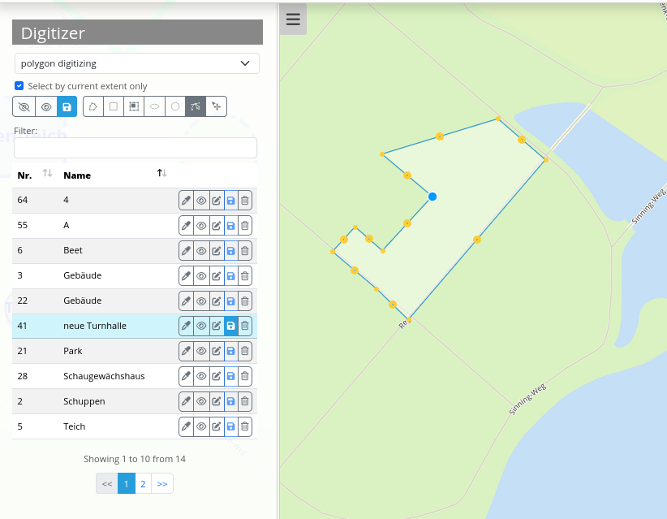
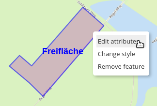

.. _digitizer_functionality_de:

Funktionen des Digitizers
*************************

Der Digitizer ermöglicht das Editieren von FeatureTypes. Diese basieren auf Punkt-, Linien- oder Polygongeometrien und ihren Sachdaten. Letztere werden in dem Formular des Digitizers angezeigt. Das Editieren der Geometrien geschieht über die Karte. Der Digitizer ermöglicht eine Vielzahl von Funktionen zur Erstellung und Bearbeitung von Geometrien:

* Erstellen von Punkten, Linien und Polygonen (Quadrate, Rechtecke, Kreise und Ellipsen)
* Verschieben von Geometrieobjekten
* Einfügen von Stützpunkten (bei Linien und Polygonen)
* Erfassung von Polygonen mit Enklaven
* Snappen an Stützpunkten von angezeigten Objekten 

.. image:: ../../../../figures/Digitizer_geometries.png
     :width: 100%

Die folgenden Abschnitte stellen die Arbeit mit Digitizer gemäß der Standardkonfiguration genauer vor.

Geometrien erstellen
--------------------

In der Standardkonfiguration kann der Nutzer über ein Dropdown-Menü zwischen drei verschiedenen Geometrietypen wählen: Punkt, Linie und Polygon.

**Punkte**

Durch einen Klick auf den Button *"Punkt erstellen"* wird die Funktion aktiviert/deaktiviert.

.. image:: ../../../../figures/Digitizer_create_points.png
     :scale: 100

**Linien**

Durch einen Klick auf den Button *"Linie erstellen"* wird die Funktion aktiviert/deaktiviert.

.. image:: ../../../../figures/Digitizer_create_lines.png
     :scale: 100

**Polygone**

Es können unterschiedliche Arten von Polygonen erstellt werden. Dies ist über eine Aktivierung des jeweiligen Buttons für Flächen, Rechtecke, Enklaven, Ellipsen oder Kreise möglich.

.. image:: ../../../../figures/Digitizer_create_polygons.png
     :scale: 100

Mithilfe der Maus kann nun die zuvor ausgewählte Geometrieart in der Karte erstellt werden. Anschließend öffnet sich ein Pop-up Fenster, welches das vordefinierte Sachdatenformular gemäß der Yaml-Konfiguration ausgibt und die Erfassung dieser zulässt.

Geometrien bearbeiten, speichern oder löschen
---------------------------------------------

Die Speicherung der Geometrien erfolgt in der jeweils definierten Datenbanktabelle. 
Die Objekte werden in der Karte angezeigt und darüber 
hinaus im Digitizer-Element in Form einer Tabelle aufgelistet. 
Dies erleichtert die Verwaltung der Geometrien. 
In der Tabelle können beliebige Spalten ausgegeben werden. Im Beispiel werden die Nummer (ID wird automatisch erzeugt) sowie Name jedes Objekts angezeigt. Es besteht die Möglichkeit, die Sortierung der Spalten zu ändern sowie die Tabelle zu durchsuchen.

In der Auflistung können nur Objekte des aktuellen Kartenausschnitts angezeigt werden  **1**. Alle Daten können aufgefrischt werden **2**. Weiterhin besteht die Option, alle Objekte auszublenden **3** oder einzublenden **4**. Änderungen können für alle Objekte gespeichert werden **5**. Eine Bearbeitung wäre z.B. die Verschiebung von Objekten **6**. Nach Aktivierung dieses Buttons können Geometrien mithilfe der Maus verändert werden. 

Es besteht weiterhin die Möglichkeit, Objete zu duplizieren **7**, der Stil einzelner Objekte kann individuell angepasst werden **8**, einzelne Objekte können ausgeblendet werden **9** sowie deren Modifikationen individuell abzuspeichern **11**. Veränderungen der Sachdaten sind ebenfalls möglich **10**. Außerdem kann jedes Objekt gelöscht werden **12**.

.. image:: ../../../../figures/Digitizer_editing.png
     :scale: 100

Die zuvor beschriebenen Funktionen sind identisch bei allen Objekten. Es gibt außerdem noch die Option, Linien und Polygone zu modifizieren. Mit dieser Funktion können Stützpunkte eingefügt oder Eckpunkte verschoben werden. Durch Klick auf den Button *"Bearbeiten"* wird die Funktion aktiviert. Um ein Objekt nun zu modifizieren, muss dieses nun individuell durch einen Klick ausgewählt werden. 

Kontextmenü
-----------

Für jede Funktion ist standardmäßig ein Kontextmenü verfügbar. Sie können das Kontextmenü über den rechten Mausklick auf ein Objekt öffnen.

