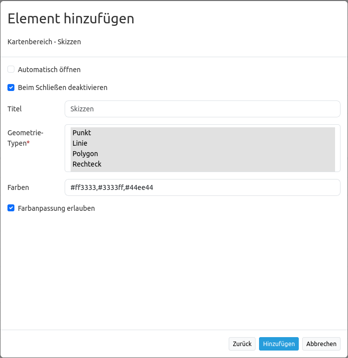

.. _sketch_de:

Skizzen (Sketch)
****************

Mit diesem Element können temporär verfügbare Objekte in der Karte erstellt werden. Diese werden nicht in einer Datenbank gespeichert und gehen beim browsergesteuerten Aktualisieren oder Schließen der Anwendung verloren.
Erstellte Skizzen werden im :ref:`imageexport_de` und :ref:`printclient_de` ausgegeben.

Mit Skizzen können folgende Geometrietypen erstellt werden:

* Punkt
* Linie
* Polygon
* Rechteck
* Kreis
* Text

Konfiguration
================

* **Automatisch öffnen:** Das Element wird beim Anwendungsstart automatisch geöffnet.
* **Beim Schließen deaktivieren:** Erstellte Skizzen werden nach Schließen des Elements (Button oder Sidepane) nicht mehr in der Karte angezeigt. Erneutes Öffnen zeigt erstellte Skizzen wieder an.
* **Title:** Titel des Elements. Dieser wird in der Layouts Liste angezeigt und ermöglicht, mehrere Button-Elemente voneinander zu unterscheiden. Der Titel wird außerdem neben dem Button angezeigt, wenn “Beschriftung anzeigen” aktiviert ist.
* **Geometrytypes:** Liste der unterstützten Geometrietypen (Pflichtfeld)
* **Farben:** Texteingabefeld für optionale Farbanpassung (Hex-Codes). Kommaseparierte Eingabe. Benötigt mindestens einen Farbcode.
* **Farbanpassung erlauben:** Aktiviert einen Button als Farbwähler, mit dem aus der Anwendung heraus Skizzen farblich verändert werden können.

Geometrien erstellen
--------------------

* **Punkt zeichnen:** wird über den Button "Punkt" aktiviert. Punkte werden über einen Einfachklick in die Karte definiert.
* **Linie zeichnen:** wird über den Button "Linie" aktiviert. Liniensegmente werden mit einem Einfachklick definiert. Das Abschließen der Zeichnung erfolgt mit einem Doppelklick. 
* **Polygon zeichnen:** wird über den Button "Polygon" aktiviert. Eckpunkte werden mit einem Einfachklick definiert. Das Abschließen der Zeichnung erfolgt mit einem Doppelklick. 
* **Rechteck zeichnen:** wird über den Button "Rechteck" aktiviert. Rechtecke werden nach einem Einfachklick mit der Maus aufgezogen und mit einem erneuten Einfachklick erstellt.
* **Kreis zeichnen:** wird über den Button "Kreis" aktiviert. Kreise werden nach einem Einfachklick mit der Maus aufgezogen und mit einem erneuten Einfachklick erstellt. Nach dem Zeichnen eines Kreises kann dessen Radius über die Oberfläche angepasst werden.
* **Text setzen:** wird über den Button "Text" aktiviert. Damit eine Textsetzung erfolgen kann, muss der Text zunächst unter "Beschriftung" definiert werden. 

Beispiele für die verschiedenen Skizzengeometrien zeigt die Abbildung:

.. image:: ../../../figures/de/sketch.png
     :width: 100%

Löschen, Bearbeiten und Zoomen
------------------------------

Gezeichnete Skizzen können individuell gelöscht [1] bearbeitet [2] werden. Außerdem besteht die Möglichkeit, auf einzelne Geometrien zu zoomen [3].

.. image:: ../../../figures/de/sketch_delete_edit_zoom.png
     :scale: 80

Farbauswahl ändern
------------------

Nach der Konfiguration im Backend finden sich Farben als Button im Skizzen-Werkzeug. Um einer Skizze eine bestimmte Farbe zuzuweisen, muss zunächst das gewünschte Geometriewerkzeug und anschließend der gewünschte Farbbutton angeklickt werden.
Auch bereits gespeicherte Geometrien lassen sich farblich anpassen: Dazu muss eine Skizze per Klick auf "Editieren der Geometrie" (Bearbeiten-Button) ausgewählt und anschließend die gewünschte Farbe per Mausklick zugewiesen werden. Ein Farbwechsel per Klick auf den entsprechenden Farb-Button ist auch während des Erstellens einer Geometrie möglich.
Der Farbwähler, der im Backend mit **Farbanpassung erlauben** aktiviert werden kann, erlaubt eine freie Farbwahl auf Anwendungsebene.
Sofern das Auswählen von Farben komplett deaktiviert und stattdessen nur eine einzige Farbe angeboten werden soll, muss die gewünschte Farbe im Konfigurationsdialog definiert und die Checkbox **Farbanpassung erlauben** deaktiviert werden.

Zeichnen abbrechen
------------------

Das Zeichnen von Skizzen kann mithilfe von "Zeichnen abbrechen" (Stop-Button) unterbrochen werden.

.. image:: ../../../figures/de/sketch_stop_drawing.png
     :width: 100%

YAML-Definition
---------------

Diese Vorlage kann genutzt werden, um das Element in einer YAML-Applikation einzubinden.

.. code-block:: yaml

   tooltip: 'Sketch'                # Text des Tooltips
   target: ~                        # ID des Kartenelements
   auto_activate: false             # (Standard: false)
   deactivate_on_close: true        # Gezeichnete Geometrien werden durch Schließen des Elements deaktiviert (Standard: true)
   geometrytypes: point,line,polygon,rectangle,circle,text   # Liste der unterstützten Geometrietypen 
   colors:                          # Definition optionaler CSS-Farben in hexadezimaler Notation möglich
     - '#ff3333'                    # Standardfarbe rot
     - '#3333ff'                    # Standardfarbe blau
     - '#44ee44'                    # Standardfarbe grün
   allow_custom_color: true         # Aktiviert Farbauswahl im Skizzen-Element (Standard: true)
