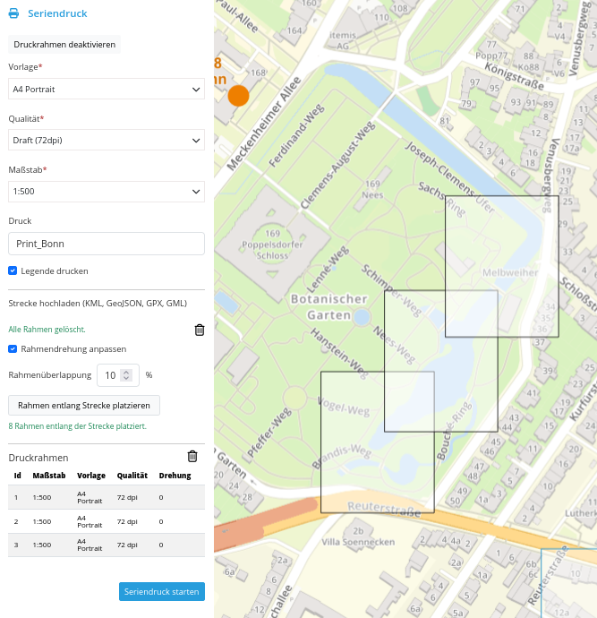
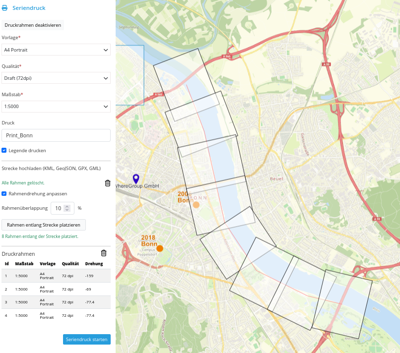
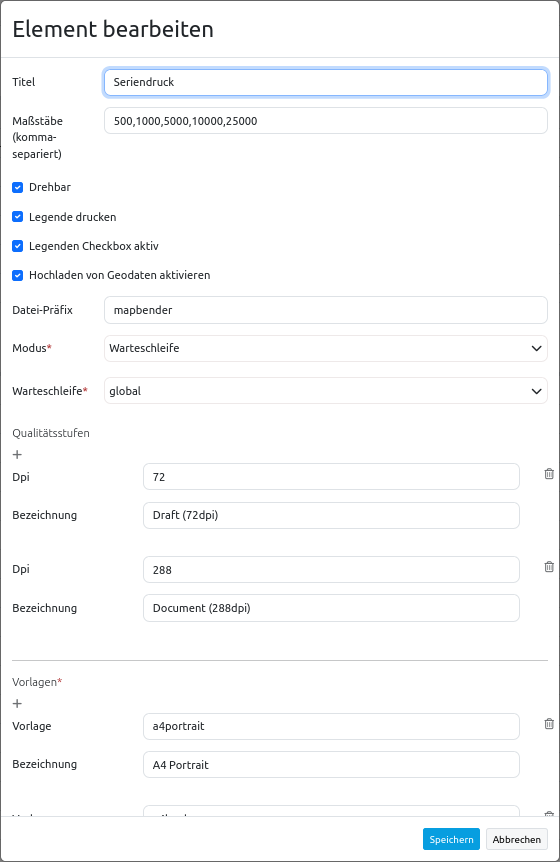

.. _printclientbatch_de:

Seriendruck (PrintClient Batch Mode)
************************************

Das Druckelement ermöglicht den Druck eines auswählbaren Kartenausschnitts. 

Der Seriendruck bietet zusätzlich die Möglichkeit, 
mehrere Druckrahmen zu definieren und zu drucken.
Die Druckrahmen können durch Klicken auf die Karte platziert werden. 

Außerdem kann eine Linie hochgeladen werden und es können Druckrahmen entlang der Linie generiert werden.

Konfiguration
-------------
Diese Dokumentation beschreibt nur die zusätzlichen Funktionen des Seriendrucks.

Die Dokumentation zum allgemeinen Drucken finden Sie unter PrintClient.

* **Enable upload of track (KML, GeoJSON, GPX, GML)**: Allow the upload of linstrings(default true)
