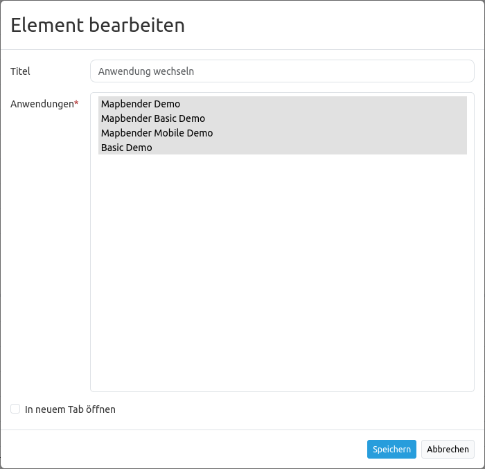

.. _applicationswitcher_de:

Anwendung wechseln (Application Switcher)
*****************************************

Dieses Element stellt ein Auswahlbox bereit, über die zwischen Anwendungen gewechselt werden kann. Dabei bleibt der aktuelle Kartenausschnitt erhalten.

.. image:: ../../../figures/de/applicationswitcher.png
     :scale: 80

Konfiguration
=============

* **Title:** Titel des Elements. Dieser wird angezeigt, wenn der Mauszeiger eine längere Zeit über der Auswahl verweilt.
* **Anwendungen:** Wählen Sie die Anwendungen, die zur Auswahl erscheinen sollen.
* **In neuem Tab öffnen:** Definiert, ob die Anwendung beim Wechsel in einem neuen Browser-Tab geöffnet werden soll.

YAML-Definition
---------------

Diese Vorlage kann genutzt werden, um das Element in einer YAML-Anwendung einzubinden.

.. code-block:: yaml

    title: Choose an Application              # Text wird als Tooltip angezeigt
    class: Mapbender\CoreBundle\Element\ApplicationSwitcher
    applications: ["mapbender_user","mapbender_user_basic"]     # Anwendungen, die zur Auswahl stehen sollen
    open_in_new_tab: true   # false/true Anwendung in neuem Browser-Tab öffnen
